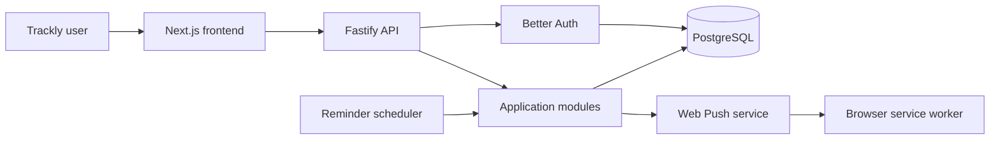

# Trackly Project Overview

## Purpose

This document introduces Trackly, its implemented scope, intended users, current
state, and repository-backed direction. For implementation details, see
[System Architecture](./02-system-architecture.md) and
[Technology Stack](./03-technology-stack.md).

## Status

Completed

## Project Introduction

Trackly is a personal productivity web application for organizing daily habits,
goals, reminders, preferences, and progress analytics. It is implemented as a
TypeScript pnpm workspace with a Next.js frontend, a Fastify API, and PostgreSQL
access through Drizzle ORM.

The application uses authenticated, user-scoped data throughout. Calendar-based
features resolve dates in the user's configured timezone, while derived values
such as completion rates, streaks, and goal progress are calculated rather than
persisted as separate aggregates.

## Project Goals

- Provide one application for daily habit execution, goal tracking, reminders,
  and progress review.
- Keep user-owned records isolated through authenticated, `user_id`-scoped
  database operations.
- Preserve calendar semantics by treating logical dates separately from
  timestamps and resolving "today" in the user's timezone.
- Maintain clear frontend, API, service, repository, and infrastructure
  boundaries.
- Offer a reproducible local environment through pnpm and Docker Compose.
- Keep the codebase extensible through versioned APIs, reusable components,
  schema validation, migrations, and automated tests.

## Scope

The implemented product scope covers:

- Email-and-password authentication and session-backed protected access.
- User preferences, including timezone and appearance settings.
- A Today dashboard with date navigation and daily progress.
- Habit creation, editing, archive/restore, scheduled occurrences, check-ins,
  and streak calculation.
- Goal creation, editing, ordered steps, completion, progress calculation, and
  dashboard integration.
- Analytics summary, history, deterministic insights, heatmap data, and
  habit-level rankings.
- Reminder management, eligibility evaluation, scheduler execution, durable
  notification delivery records, and browser Web Push subscriptions.
- Browser notification settings and a service worker for Web Push display and
  safe internal navigation.

The `/tasks` and standalone `/insights` routes remain reserved placeholders.
Trackly does not currently include deployment automation, external monitoring,
or a browser end-to-end test framework.

## Key Features Implemented

| Area             | Implemented capability                                                                                                             |
| ---------------- | ---------------------------------------------------------------------------------------------------------------------------------- |
| Authentication   | Registration, sign-in, sign-out, database sessions, protected routes, and email-verification policy                                |
| Today            | User-local date navigation, scheduled habits, goal progress, and daily completion aggregates                                       |
| Habits           | CRUD, categories, schedules, archive/restore, absolute-count check-ins, and streaks                                                |
| Goals            | CRUD, ordered steps, status transitions, derived progress, and Today integration                                                   |
| Analytics        | Summary cards, daily history, insights, heatmap data, rankings, and accessible visualizations                                      |
| Preferences      | Profile preferences, timezone handling, theme selection, and notification settings                                                 |
| Reminders        | CRUD, timezone-aware eligibility, scheduler runtime, occurrence deduplication, and delivery coordination                           |
| Notifications    | Durable lifecycle records, provider dispatch, Web Push delivery, subscription management, and invalid-subscription handling        |
| Platform quality | Standard API envelopes, centralized errors, request IDs, rate limiting, security headers, audit logs, graceful shutdown, and tests |

## High-Level Architecture Summary

Trackly has three primary runtime layers:

1. The Next.js App Router frontend renders authenticated pages primarily with
   React Server Components and uses focused Client Components for interaction.
2. The Fastify backend exposes infrastructure endpoints, Better Auth routes,
   and versioned application endpoints under `/api/v1`.
3. PostgreSQL stores authentication and application records. Drizzle owns typed
   schema access and forward migrations.

Docker Compose connects the frontend, backend, and PostgreSQL services on an
internal bridge network for local development. A backend scheduler process
reuses the reminder and notification application layers without placing
provider details in scheduling logic.

See [Repository Structure](./04-repository-structure.md) for where these
responsibilities live.

## Target Users

Trackly is designed for individuals who want to:

- Plan and complete recurring habits.
- Track multi-step personal goals.
- Review progress over user-selected calendar periods.
- Receive browser reminders for eligible habits.
- Use the same account across browser sessions while keeping data private from
  other users.

The repository does not currently define organizational workspaces,
administrator roles, or team collaboration features.

## Current Project Status

The codebase includes feature work through Phase 6 and the Phase 7 engineering
quality milestones. The active repository contains production builds, unit and
integration tests, database migrations, Docker development services, security
controls, audit logging, and graceful runtime shutdown.

The current branch follows the milestone naming convention, and release tags
exist through `v7.3.0`. No automated deployment or release pipeline is present
in the repository.

## Future Roadmap

Repository evidence identifies the following deferred work rather than a
committed delivery schedule:

- Implement the reserved Tasks and standalone Insights experiences.
- Add browser-level end-to-end and automated accessibility coverage.
- Establish production deployment, backup, recovery, and external monitoring
  procedures.
- Validate production Docker image startup in addition to the current
  development Compose topology.
- Define production latency budgets and load-test representative analytics
  datasets.
- Address remaining upstream transitive dependency advisories when compatible
  releases are available.
- Define operational budgets for Web Push delivery and scheduler execution.

The engineering process is documented in
[Development Workflow](./05-development-workflow.md).
