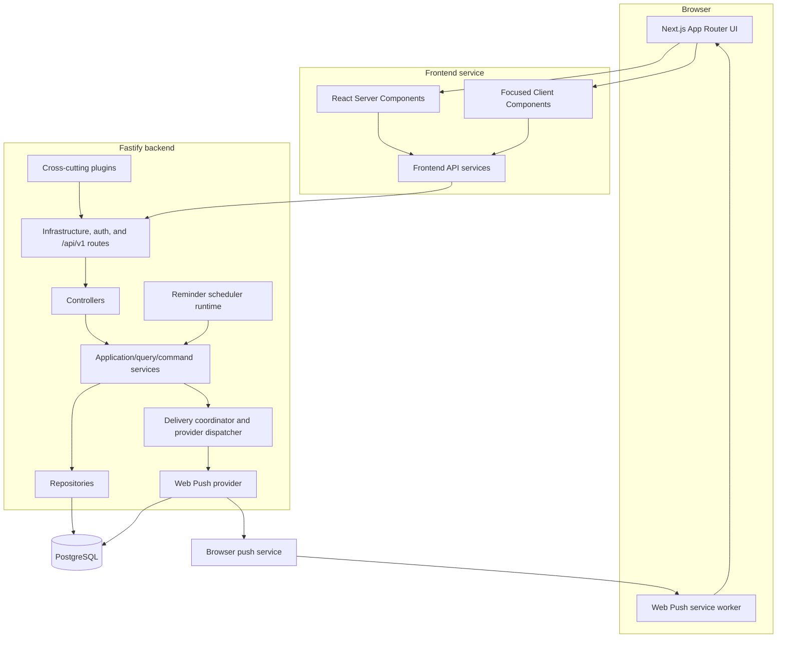
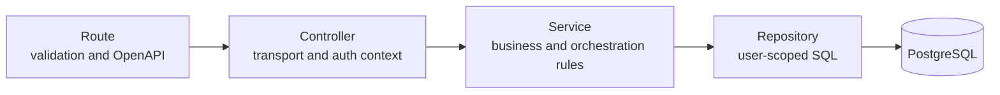
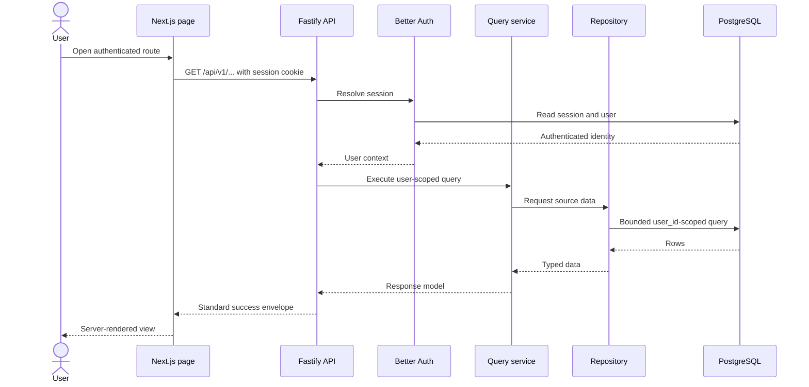

# Trackly System Architecture

## Purpose

This document describes Trackly's runtime boundaries, major components, and
request flow using the architecture implemented in the repository.

## Status

Completed

## Scope

The architecture covered here includes the Next.js frontend, Fastify backend,
PostgreSQL database, Better Auth integration, reminder scheduler, Web Push
delivery, and Docker development topology. Directory-level details are in
[Repository Structure](./04-repository-structure.md).

## Overall Architecture

Trackly is a TypeScript client-server application in a pnpm workspace:

- The frontend serves the user interface with Next.js App Router.
- The backend owns application APIs, authentication integration, validation,
  business orchestration, persistence, scheduling, and notification dispatch.
- PostgreSQL is the durable system of record.
- Better Auth owns authentication tables and session behavior.
- Drizzle ORM provides typed schema/query access and forward migrations.
- Docker Compose provides the supported multi-service development runtime.

Public application endpoints are versioned under `/api/v1`. Better Auth keeps
its own `/api/auth/*` contract, while `/health`, `/ready`, and conditionally
exposed API documentation remain infrastructure endpoints.

## Architecture Diagram

## Frontend

The frontend is located in `frontend/` and uses Next.js 16 with React 19:

- `src/app/` defines App Router layouts, route segments, loading states, and
  error states.
- Authenticated reads are server-rendered where practical.
- Interactive behavior is isolated in small Client Components.
- `src/services/` centralizes frontend API access and server request handling.
- `src/features/` groups feature-specific schemas and client services.
- `src/components/` contains feature components and shared design primitives.
- Shareable date, period, filter, sort, and pagination state is represented in
  URL query parameters.
- User-specific reads avoid shared static caching.

The browser authenticates through Better Auth cookies. Authentication tokens are
not stored in browser storage. The Web Push service worker receives notification
payloads but does not receive or store authentication credentials.

## Backend

The backend is located in `backend/` and uses Fastify 5. Its main composition
points are:

- `src/app.ts`, which builds and configures Fastify without opening a port.
- `src/server.ts`, which starts the HTTP server and participates in graceful
  shutdown.
- `src/plugins/`, which registers authentication, CORS, database access,
  centralized errors, request context, rate limiting, security, and Swagger.
- `src/routes/`, which registers infrastructure and versioned routes.
- `src/modules/`, which groups application behavior by domain.

Application modules follow this layered convention:

Read-heavy areas use query-oriented modules; write paths use command-oriented
services where appropriate. Controllers remain thin, and user ownership comes
from the authenticated session rather than client-supplied identifiers.

Cross-cutting backend behavior includes standard response envelopes, Zod
validation, request IDs, Pino logging with redaction, security headers, CORS,
rate limiting, audit events, and graceful resource shutdown.

## Database

PostgreSQL stores:

- Better Auth users, sessions, accounts, and verification records.
- User preferences.
- Categories, habits, schedules, and habit check-ins.
- Goals and ordered goal steps.
- Tasks schema from the existing migration history, although the frontend Tasks
  route remains a placeholder.
- Reminders, notification deliveries, and browser push subscriptions.

Drizzle schema definitions live in `backend/src/db/schema/`, and generated SQL
migrations live in `backend/src/db/migrations/`. Logical calendar days use
PostgreSQL `date`; instants use timezone-aware timestamps. Normal reads exclude
soft-deleted records unless a feature explicitly requests archived data.

Derived analytics, streaks, and progress values are computed from source data
and are not persisted as aggregate tables.

## Authentication

Better Auth provides email/password registration, login, logout, and
database-backed sessions through the Drizzle PostgreSQL adapter.

The backend mounts Better Auth separately from versioned application routes.
Protected controllers obtain the user from Better Auth's server session API.
A missing valid session produces the normal unauthenticated response; a session
service failure remains an internal dependency error.

Production configuration enforces stronger defaults, including secure cookies,
trusted HTTPS origins, a non-placeholder authentication secret, and the
configured email-verification policy. Registration initializes the
application-owned preference record without duplicating Better Auth's user
schema.

## Docker

The root `docker-compose.yml` defines:

- `postgres`: PostgreSQL 17 Alpine with a persistent volume and health check.
- `backend`: the backend Dockerfile's development target, dependent on healthy
  PostgreSQL and checked through `/ready`.
- `frontend`: the frontend Dockerfile's development target, dependent on the
  healthy backend.

All services join the `trackly_internal` bridge network. Named volumes preserve
database data and isolate container dependency/build directories, while source
directories are bind-mounted for development.

Both application Dockerfiles also contain builder and non-root production
stages. The checked-in Compose topology exercises development targets rather
than a production deployment topology.

## Component Interaction

Reminder delivery runs outside the HTTP request path: the scheduler resolves
eligible occurrences, the coordinator atomically claims durable delivery
records, and an explicitly registered provider sends or skips the notification.
Web Push details remain inside the Web Push provider.

## Related Documents

- [Project Overview](./01-project-overview.md)
- [Technology Stack](./03-technology-stack.md)
- [Repository Structure](./04-repository-structure.md)
- [Development Workflow](./05-development-workflow.md)
