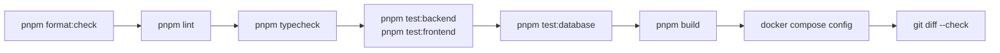

# Trackly Development Workflow

## Purpose

This document describes the development, database, validation, container, and
release practices observable in the Trackly repository.

## Status

Completed

## Scope

The workflow covers current pnpm scripts, Docker Compose, Drizzle migrations,
test suites, quality gates, and repository history. It does not define
deployment procedures that are not checked in.

## Branch Strategy

History shows milestone-oriented feature branches, for example:

```text
feature/milestone-7.4-performance-tests-docs
```

Completed milestone branches have been merged into `main`. Commit history uses
Conventional Commit-style subjects such as `feat(...)`, `fix(...)`, `test(...)`,
`docs(...)`, and `refactor(...)`; release tags exist through `v7.3.0`.

This is an observed convention rather than a fully documented policy.
`CONTRIBUTING.md` now documents the repository-backed contribution workflow.
No pull-request template or repository CI workflow was found, so contributors
should still confirm publishing expectations with the project owner.

## Local Development

The workspace pins pnpm `10.13.1`; containers use Node.js 24 Alpine.

1. Enable pnpm through Corepack.
2. Copy `.env.example` to `.env`, replace placeholders, and never commit it.
3. Install dependencies:

   ```bash
   pnpm install --frozen-lockfile
   ```

4. Ensure PostgreSQL is reachable through `DATABASE_URL`.
5. Apply migrations:

   ```bash
   pnpm db:migrate
   ```

6. Start both applications:

   ```bash
   pnpm dev
   ```

Default local endpoints are:

- Frontend: `http://localhost:3000`
- Backend: `http://localhost:4000`
- Health: `http://localhost:4000/health`
- Readiness: `http://localhost:4000/ready`

Swagger UI is available in development through its configured documentation
path and can be restricted by environment.

## Docker Workflow

Start the supported containerized development stack with:

```bash
docker compose up --build
```

Compose waits for PostgreSQL, then the backend `/ready` check, before starting
the frontend. Source bind mounts and named dependency/build volumes support
development reload behavior.

Useful commands are:

```bash
docker compose config
docker compose ps
docker compose logs backend
docker compose logs frontend
docker compose logs postgres
docker compose down
```

The `postgres_data` volume survives a normal shutdown. Deleting it is
destructive and is not part of the normal workflow.

The backend termination lifecycle stops accepting HTTP work and closes owned
server, scheduler, and database resources without duplicating shutdown.

## Database Migration Workflow

Schemas live under `backend/src/db/schema/`, with configuration in
`backend/drizzle.config.ts`.

For a reviewed schema change:

1. Update the TypeScript schema and relations.
2. Generate migration artifacts:

   ```bash
   pnpm db:generate
   ```

3. Review SQL and metadata under `backend/src/db/migrations/`.
4. Apply migrations:

   ```bash
   pnpm db:migrate
   ```

5. Run PostgreSQL integration tests:

   ```bash
   pnpm test:database
   ```

Additional commands are:

```bash
pnpm db:push
pnpm db:studio
pnpm db:seed
pnpm auth:schema
```

`db:push` supports synchronization and verification, while reviewed generated
migrations are the durable history. Migrations are forward-only; no automated
rollback workflow is defined. Better Auth remains the owner of its own schema.

## Testing Workflow

Run focused suites with:

```bash
pnpm test:backend
pnpm test:frontend
pnpm test:database
```

- Backend tests use Vitest and Fastify injection for modules, routes, plugins,
  errors, security, scheduling, logging, and lifecycle behavior.
- Frontend tests use Vitest, jsdom, and Testing Library for services,
  components, pages, browser APIs, and service-worker behavior.
- Database tests exercise schemas, repositories, ownership, analytics,
  reminders, and notifications against PostgreSQL.

`pnpm validate` runs formatting, linting, type checks, backend tests, frontend
tests, and production builds. It does not include `pnpm test:database`, so the
database suite remains a separate gate.

No browser end-to-end framework or repository-wide coverage threshold is
configured.

## Linting

```bash
pnpm lint
```

The frontend uses Next.js ESLint rules; the backend uses ESLint with TypeScript
ESLint.

## Formatting

```bash
pnpm format:check
pnpm format
```

Prettier configuration at the repository root applies to packages and
documentation. Run `git diff --check` before handoff to detect whitespace
errors.

## Type Checking

```bash
pnpm typecheck
```

Both packages use strict TypeScript, prohibit JavaScript source, and map `@/*`
to their respective `src/` directories.

## Build

```bash
pnpm build
```

This creates the Next.js production build and compiles the backend into
`backend/dist/`. Both Dockerfiles include builder and non-root production
stages. The root Compose file uses development targets, so Compose validation
does not replace production builds or production-image smoke tests.

## Full Validation Sequence



`pnpm validate` combines formatting, lint, type, non-database test, and build
stages. Database integration and Docker validation remain separate.

## Release Process

History shows milestone merges to `main`, semantic tags such as `v6.4.0` and
`v7.3.0`, and Conventional Commit-style messages.

No release automation, deployment workflow, or generated changelog process is
present. `CHANGELOG.md` provides a history-neutral release-note template, but
versioning, tagging, release notes, and deployment remain explicit
project-owner decisions.

## Related Documents

- [Project Overview](./01-project-overview.md)
- [System Architecture](./02-system-architecture.md)
- [Technology Stack](./03-technology-stack.md)
- [Repository Structure](./04-repository-structure.md)
