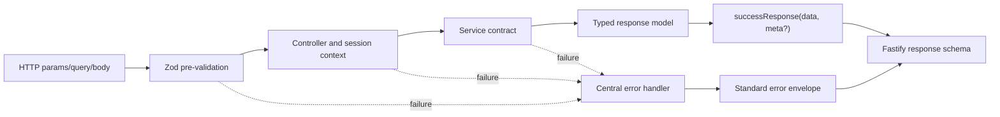

# Trackly API Design

## Purpose

Describe the conventions that keep Trackly's HTTP API consistent without
duplicating the endpoint-by-endpoint reference.

## Status

Completed

## Scope

This document covers API boundaries, REST conventions, versioning, response
envelopes, validation, authentication, errors, rate limiting, and OpenAPI.
Endpoint details belong in
[API Reference](../05-reference/api-reference.md).

## REST Philosophy

Trackly exposes resource-oriented HTTP routes. `GET` reads resources and
projections, `POST` creates resources or invokes explicit commands, `PATCH`
updates partial resource state, and `DELETE` performs the documented deletion
or idempotent unsubscribe behavior.

Routes remain transport-focused: validation and OpenAPI metadata are registered
at the route, controllers translate HTTP/session context, services apply domain
rules, and repositories own persistence. Public requests never supply the
authoritative user ID.

Collection query state uses explicit parameters for dates, periods, views,
search, sorting, ordering, and pagination. Ordering includes deterministic
tie-breakers.

## API Boundaries and Versioning

```text
/health         infrastructure liveness
/ready          infrastructure/database readiness
/docs           conditional Swagger UI
/api/auth/*     Better Auth-owned authentication contract
/api/v1/*       Trackly application contract
```

All public application endpoints use `/api/v1`. Better Auth routes are not
wrapped in that prefix because Better Auth owns their contract. Infrastructure
routes remain unversioned so orchestrators can use stable health paths.

## Success Response

Application endpoints use one success envelope:

```json
{
  "success": true,
  "data": {},
  "meta": {}
}
```

`data` is required and endpoint-specific. `meta` is optional and is used for
information such as pagination. Shared response helpers prevent each
controller from recreating the envelope.

Better Auth responses retain Better Auth's own response body and headers rather
than being rewritten into the Trackly envelope.

## Error Response

Application and infrastructure errors use:

```json
{
  "success": false,
  "error": {
    "code": "STABLE_ERROR_CODE",
    "message": "Safe public message",
    "details": {}
  }
}
```

`details` is optional and restricted to JSON-safe values. Stable codes allow
clients to distinguish validation, authentication, not-found, conflict,
rate-limit, dependency, and unexpected failures without parsing messages.

Unexpected errors return a generic HTTP 500 response. Stack traces, database
errors, credentials, connection strings, and internal causes remain in
redacted server logs only.

## Validation

Zod validates public params, query strings, and request bodies before they are
used. Fastify JSON schemas describe the HTTP contract and response shapes for
serialization and OpenAPI.

Validation failures return HTTP 400 in the standard error format. Malformed or
empty JSON is also mapped to a stable 400 response. Environment variables are
validated separately during process initialization.

## Authentication and Authorization

Protected endpoints resolve the Better Auth session from incoming cookie
headers through the server API. No valid session returns HTTP 401; a session
service failure returns HTTP 503 rather than masquerading as logged out.

Controllers pass the authenticated user ID to services. Repositories scope
every user-owned query or mutation by that ID. Foreign, deleted, and missing
resources can intentionally share a 404 response to avoid ownership
disclosure.

Browser application requests include credentials. Authentication tokens are not
accepted from frontend storage or embedded in service-worker state.

## Request Correlation and Logging

Every request has an `x-request-id`. Fastify accepts a valid incoming value or
generates a UUID, returns it in the response, and includes it in structured
completion, error, and audit logs.

The browser Axios client generates a request ID when possible. Server-rendered
requests forward cookies through the internal API path. Sensitive headers and
fields are redacted, and request bodies are not logged by default.

## Rate Limiting and Security

Fastify applies configurable general and mutation limits. Exceeded limits use a
stable HTTP 429 error envelope. Better Auth also applies its own global and
tighter sign-in/sign-up limits.

CORS uses an explicit comma-separated origin allowlist with credentials;
unrestricted wildcard origins are not used with cookies. Helmet supplies CSP
and other browser security headers. Health checks and trusted internal runtime
flows retain their intended availability.

## OpenAPI and Swagger

`@fastify/swagger` generates OpenAPI from registered route schemas. The document
declares Trackly API version `1.0.0`, a local development server, a Better Auth
cookie security scheme, and domain tags.

`@fastify/swagger-ui` serves the interactive UI at `/docs` when
`EXPOSE_API_DOCS` is true. Production configuration can disable documentation
and diagnostic routes. Health and readiness routes are included in the
generated contract.

Shared OpenAPI helpers define standard success and error envelopes. Route
schemas add endpoint-specific request, success, and relevant 4xx/5xx responses.

## Contract Flow



## API Reference Boundary

This document intentionally does not list every endpoint, parameter, or schema.
That material belongs in
[API Reference](../05-reference/api-reference.md), generated and reviewed
against the runtime OpenAPI document.

## Related Documents

- [Backend Architecture](./backend-architecture.md)
- [Frontend Architecture](./frontend-architecture.md)
- [Authentication Flow](./authentication-flow.md)
- [Database Design](./database-design.md)
- [Architecture Diagrams](./architecture-diagram.md)
