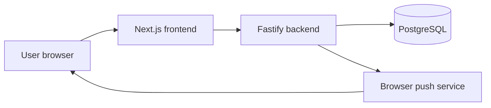
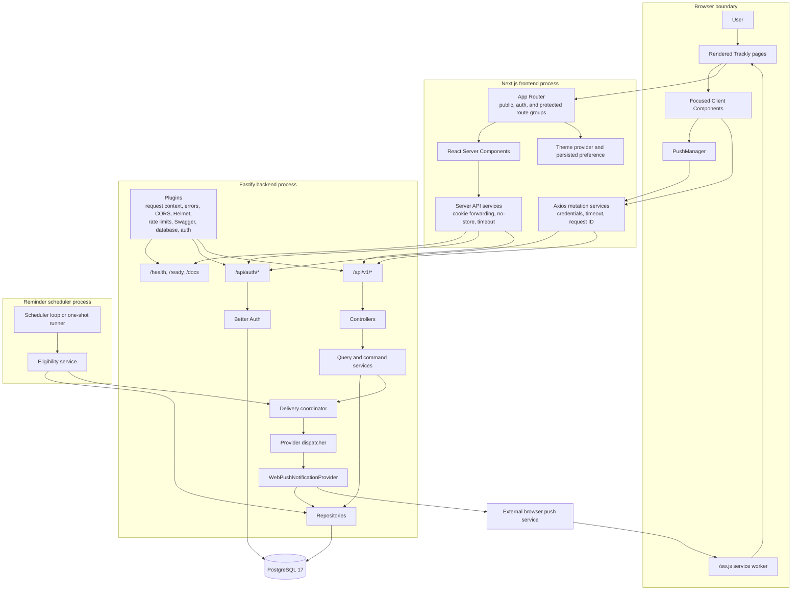
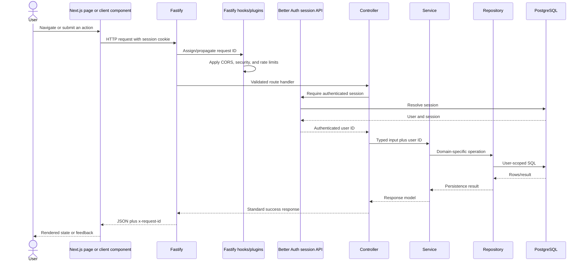

# Trackly Architecture Diagrams

## Purpose

Provide visual and narrative maps of Trackly's implemented system boundaries,
dependencies, data flow, and request lifecycle.

## Status

Completed

## Scope

This document connects the browser, Next.js application, Fastify API, Better
Auth, PostgreSQL, reminder scheduler, and Web Push delivery path. Package and
tool details are available in
[Technology Stack](../00-overview/03-technology-stack.md).

## High-Level Architecture

Trackly is a two-application pnpm workspace. The Next.js frontend renders the
product interface and calls a Fastify backend. Fastify exposes infrastructure
routes, Better Auth's API, and versioned application APIs. PostgreSQL is the
durable system of record, accessed through Drizzle repositories or Better
Auth's Drizzle adapter.

Reminder scheduling is a second backend entry point. It reuses application
services and the provider-neutral notification pipeline rather than sending
notifications directly.

## Simplified Architecture

## Complete Architecture

## Main Components

| Component             | Boundary and responsibility                                                                                |
| --------------------- | ---------------------------------------------------------------------------------------------------------- |
| Browser UI            | Displays server-rendered pages and runs only the client interactions that need browser APIs or local state |
| Next.js App Router    | Defines root, authentication, and protected application layouts plus route-level loading/error states      |
| Frontend services     | Separate server-side cookie-forwarding reads from credentialed Axios mutations                             |
| Fastify application   | Composes plugins and routes without opening a port, enabling injection tests                               |
| Better Auth           | Owns email/password authentication, session cookies, and authentication tables                             |
| Domain modules        | Group routes, controllers, services, repositories, schemas, and tests by application area                  |
| Drizzle/PostgreSQL    | Provide typed relational persistence, constraints, transactions, and migrations                            |
| Scheduler             | Resolves eligible reminder occurrences sequentially and invokes provider-neutral delivery                  |
| Notification pipeline | Claims durable occurrences, deduplicates delivery, dispatches an explicit provider, and records outcomes   |
| Web Push provider     | Loads active subscriptions, sends sanitized payloads, and updates subscription delivery state              |

## Data Flow

Server-rendered reads forward the incoming cookie from Next.js to the internal
backend URL and disable shared caching. Client mutations use one Axios instance
with credentials, a ten-second timeout, and generated request IDs. Backend
controllers obtain the authenticated identity from the session, services apply
domain rules, and repositories execute user-scoped queries.

The backend returns standard success or error envelopes. Frontend server
services validate the envelope shape before returning data to pages; client
services normalize Axios failures into safe application errors.

## Request Lifecycle

Validation or application failures are routed through the centralized error
handler. Unexpected errors are logged internally and mapped to a generic public
500 response.

## Service Boundaries and Repository Layers

Routes own registration, schema validation, rate-limit configuration, and
OpenAPI metadata. Controllers translate HTTP input and session context. Services
own business, schedule, date, timezone, aggregation, and orchestration rules.
Repositories own Drizzle/SQL access and always scope user-owned operations by
the authenticated user ID.

Cross-cutting infrastructure lives in Fastify plugins rather than domain
modules. Provider-specific Web Push behavior remains behind the notification
provider contract; the scheduler and delivery coordinator do not import Web
Push implementation details.

## External Dependencies

The production runtime depends on:

- PostgreSQL for durable application and authentication data.
- A browser push service when the `web_push` provider sends notifications.
- Browser support for service workers, notifications, and PushManager for the
  Web Push frontend.

No external queue, distributed cache, observability platform, or identity
provider is configured.

## Related Documents

- [Frontend Architecture](./frontend-architecture.md)
- [Backend Architecture](./backend-architecture.md)
- [Authentication Flow](./authentication-flow.md)
- [Docker Architecture](./docker-architecture.md)
- [Database Design](./database-design.md)
- [API Design](./api-design.md)
