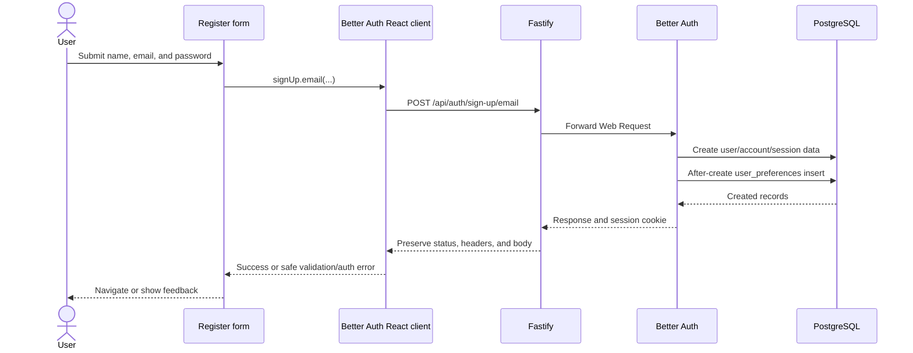
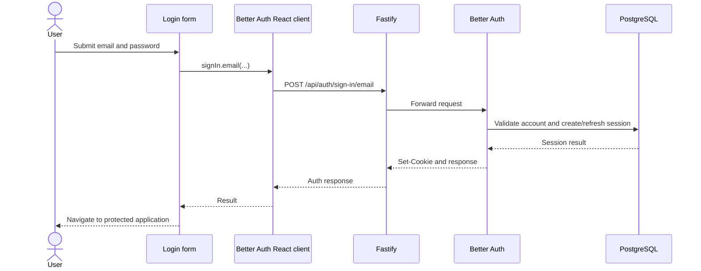
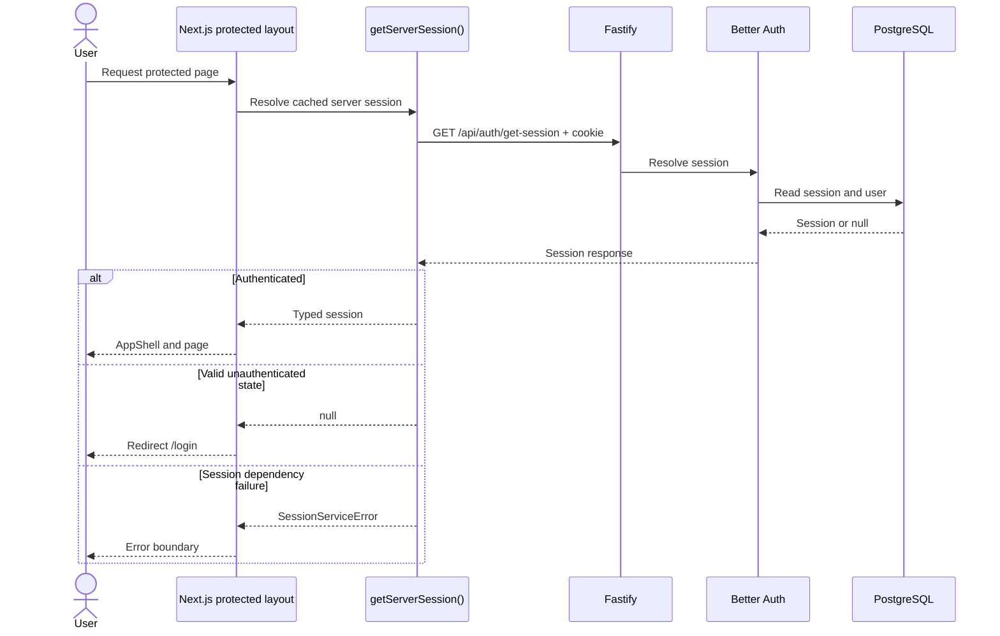
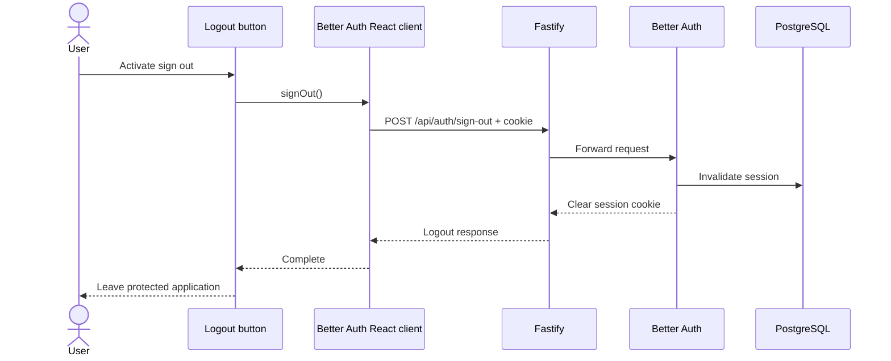

# Trackly Authentication Flow

## Purpose

Describe Trackly's implemented Better Auth lifecycle across the Next.js
frontend, Fastify backend, and PostgreSQL.

## Status

Completed

## Scope

This document covers registration, login, logout, cookies, sessions, protected
routes, authorization, user initialization, and authentication tables. It does
not reproduce Better Auth's complete endpoint reference.

## Integration Boundary

Better Auth is configured in `backend/src/auth/auth.ts` with the Drizzle
PostgreSQL adapter. Fastify bridges `GET` and `POST` requests under
`/api/auth/*` to `auth.handler()`, preserving Better Auth's response status,
headers, cookies, and body.

The frontend creates a Better Auth React client using the validated
`NEXT_PUBLIC_AUTH_URL` and `credentials: 'include'`. Server Components query
`/api/auth/get-session` through the internal backend URL while forwarding the
incoming cookie.

Better Auth owns credentials and session mechanics. Application APIs derive the
user ID from the server-side session and never accept ownership IDs from input.

## Registration and User Lifecycle

Email/password authentication is enabled with passwords from 8 to 128
characters. Registration is rate-limited more strictly than general auth
traffic. The email-verification requirement is controlled by validated
configuration; the repository's development Compose default is `false`, while
production validation applies the configured production policy.

After Better Auth creates a user, a database hook inserts the corresponding
application-owned `user_preferences` record with conflict-safe semantics.
Trackly does not recreate or manually manage Better Auth's user record.

Auth endpoints emit structured audit events for registration, login, logout,
profile changes, email changes, and account deletion.

## Login

The login form calls `signIn.email()` through the Better Auth React client.
Better Auth validates credentials against its database records and, on success,
returns a session cookie. The frontend does not store a token in local or
session storage.

Better Auth applies a configured global auth limit and tighter one-minute limits
of ten email sign-in requests and five email sign-up requests.

## Cookie and Session Lifecycle

The browser automatically sends the Better Auth session cookie because auth and
application clients use credentialed requests. Production uses secure cookies.
Session expiry and refresh/update age come from
`AUTH_SESSION_EXPIRES_IN` and `AUTH_SESSION_UPDATE_AGE`.

For backend application requests, `getSession()` converts Fastify headers for
Better Auth and caches the lookup per request in a `WeakMap`. A protected
controller calls `requireSession()` or `requireUserId()`:

- A valid session supplies `session.user.id` and records it on the request
  context.
- No session produces standardized HTTP 401.
- A session service/dependency failure produces standardized HTTP 503.

The distinction prevents infrastructure failures from appearing as ordinary
logout.

## Protected Frontend Routes

The `(app)` server layout calls `getServerSession()`. Missing sessions redirect
to `/login`; authenticated sessions render `AppShell` and load preferences.
Individual data-heavy pages also check sessions and handle API-level
unauthorized responses.

The `(auth)` layout performs the inverse: an authenticated user visiting login
or registration is redirected to `/today`.

There is no Next.js middleware/proxy authentication layer. Server layouts and
pages improve navigation behavior, while backend session checks remain the
security boundary.

## Authorization

Authentication establishes identity; repositories enforce authorization.
Controllers pass only the authenticated user ID into services, and every
user-owned query/mutation includes that identity in its database predicate.
Foreign, missing, and soft-deleted records commonly share the same not-found
response to avoid revealing ownership.

## Logout

The logout button calls Better Auth's `signOut()`. Better Auth invalidates the
server session and returns cookie-clearing headers. The frontend then leaves the
protected experience; subsequent protected loads resolve no session and
redirect to `/login`.

## Authentication Tables

The generated Better Auth schema defines:

| Table          | Role                                                            |
| -------------- | --------------------------------------------------------------- |
| `user`         | Identity, profile, verification state, and lifecycle timestamps |
| `session`      | Session token, expiry, client metadata, and user relationship   |
| `account`      | Provider/account credentials and related metadata               |
| `verification` | Verification identifiers, values, and expiry                    |

The application references `user.id` from user-owned tables. Detailed columns
and relations belong in
[Database Schema Reference](../05-reference/database-schema.md).

## Security Boundaries

- The Better Auth secret is backend-only and validated.
- Production cookies are secure.
- Trusted origins and CORS origins are explicit allowlists.
- Passwords, cookies, auth headers, session tokens, and verification values are
  redacted from logs.
- Authentication endpoints are rate-limited.
- User IDs never come from public request ownership fields.

## Related Documents

- [Backend Architecture](./backend-architecture.md)
- [Frontend Architecture](./frontend-architecture.md)
- [API Design](./api-design.md)
- [Database Design](./database-design.md)
