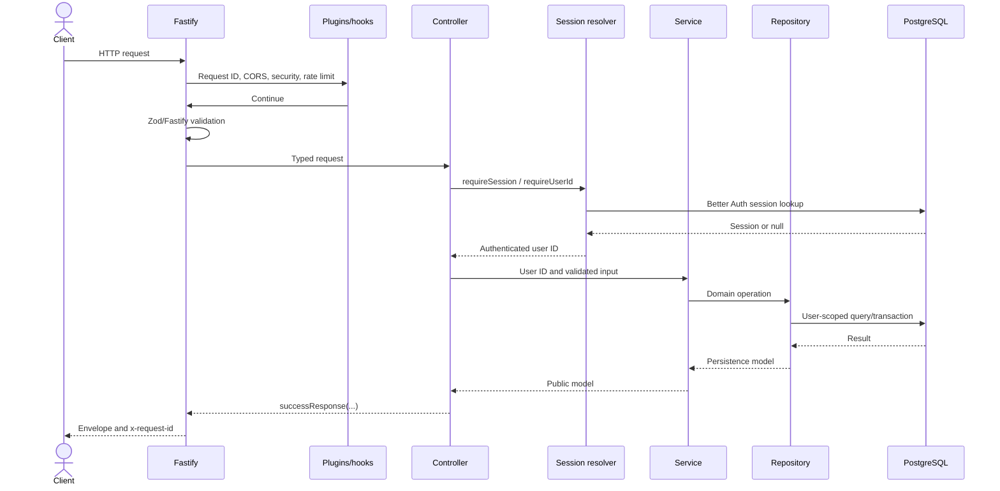
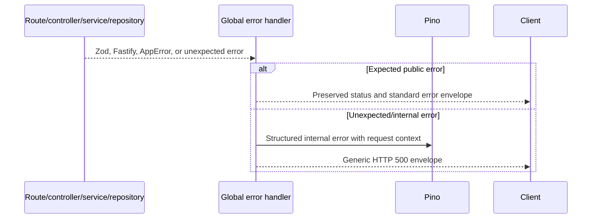

# Trackly Backend Architecture

## Purpose

Explain how the Fastify backend is composed and how requests move through
validation, authentication, application services, repositories, and PostgreSQL.

## Status

Completed

## Scope

This document covers `backend/src/`, including the HTTP application, modules,
plugins, persistence, logging, and graceful shutdown. See
[API Design](./api-design.md) for public contract conventions.

## Fastify Composition

`buildApp()` in `src/app.ts` constructs a Fastify instance without listening.
It configures request-ID generation, proxy trust, logging, plugins, and routes.
Tests can inject a database connection check and disable or replace the logger.

Plugins are registered in this order:

1. Request context
2. Central error handling
3. CORS
4. Security headers
5. Rate limiting
6. Swagger/OpenAPI
7. Database
8. Better Auth routes
9. Infrastructure and versioned application routes

This order ensures request context and errors are available to later plugins
and that database connectivity is verified during startup.

## Route Organization

`src/routes/index.ts` registers:

- `/health` and `/ready` as unversioned infrastructure routes.
- `/api/v1/*` as the public application namespace.

The auth plugin separately owns `/api/auth/*`, matching Better Auth's contract.
Swagger UI is mounted at `/docs` only when `EXPOSE_API_DOCS` is enabled.
The diagnostic validation route is registered only when
`ENABLE_DIAGNOSTICS` is enabled.

`src/routes/v1/index.ts` composes routes for Today, categories, habits,
analytics, goals, preferences, reminders, and push subscriptions.

## Module Layers

Domain code is grouped under `src/modules/<domain>/`. A typical module contains
route, controller, service, repository, schema, types, and focused tests.

| Layer       | Responsibility                                                         |
| ----------- | ---------------------------------------------------------------------- |
| Route       | URL, method, request schemas, OpenAPI metadata, and route-level limits |
| Controller  | HTTP translation and authenticated user context                        |
| Service     | Business rules, date/timezone logic, orchestration, and transactions   |
| Repository  | Drizzle queries, SQL, persistence constraints, and ownership filters   |
| Schema/type | Zod input contracts and typed service/API models                       |

Read and write paths use lightweight CQRS naming where it improves clarity.
Business logic does not belong in routes, and database queries do not belong in
controllers or services.

## Request Sequence



On failure, the normal return path is replaced by the centralized error flow:



## Database Access

`src/db/client.ts` creates one `postgres` client and one Drizzle instance. Pool
size is five outside production and twenty in production; prepared statements
are disabled. Drizzle is configured with schema exports and `snake_case`
casing.

The database plugin verifies connectivity at startup, decorates Fastify with the
database instance, and closes the PostgreSQL client during Fastify shutdown.
Repositories import the shared typed database rather than constructing
connections.

## Validation

Public params, query strings, and bodies are parsed through shared Zod request
utilities before use. Fastify JSON schemas additionally drive serialization and
OpenAPI documentation. Validation errors are standardized as HTTP 400
responses, including field paths and public messages where available.

Environment configuration is validated at startup. Production-specific checks
reject unsafe authentication, origin, diagnostics, proxy, and Web Push
configuration.

## Error Handling

`AppError` contains an HTTP status, stable error code, public message, optional
JSON-safe details, and an internal cause. The global handler covers:

- Zod validation errors.
- Fastify schema validation.
- Empty or malformed JSON.
- Application errors.
- Unknown routes.
- Unexpected errors.

Public responses never include stack traces or raw database errors. Internal
errors are logged with configured secret values redacted. Session lookup
failures become HTTP 503 application errors, while a valid missing session is
HTTP 401.

## Logging and Request Correlation

Fastify uses Pino. Development can use `pino-pretty`; production logs remain
structured JSON. Sensitive headers and fields are redacted by logger
configuration, and full request bodies are not logged by default.

Every request accepts a valid `x-request-id` or receives a generated UUID. The
ID is returned in the response header and appears in completion, error, and
audit logs. Completion logs include method, path without query parameters,
status, duration, and authenticated user ID when available.

Audit logging records important authentication and domain mutations with actor,
action, resource, outcome, request ID, and timestamp, without logging
credentials or sensitive payloads.

## Plugin System

| Plugin            | Responsibility                                             |
| ----------------- | ---------------------------------------------------------- |
| `request-context` | Correlation IDs and request completion logs                |
| `error-handler`   | Standard public errors and internal error logging          |
| `cors`            | Configured origin allowlist and credential support         |
| `security`        | Helmet headers and environment-aware CSP                   |
| `rate-limit`      | General and mutation abuse limits with stable 429 errors   |
| `swagger`         | OpenAPI document and conditional Swagger UI                |
| `database`        | Startup connectivity, Fastify decoration, and pool closure |
| `auth`            | Better Auth `/api/auth/*` bridge and auth audit events     |

## Versioned APIs

All Trackly application endpoints are under `/api/v1`. Infrastructure and
framework-owned contracts are deliberately separate:

```text
/health         process liveness
/ready          PostgreSQL-backed readiness
/docs           conditional Swagger UI
/api/auth/*     Better Auth
/api/v1/*       Trackly application API
```

## Scheduler Runtime

The reminder scheduler has its own TypeScript entry point and production script.
It supports a recurring loop and a one-shot mode. Eligibility logic uses
repositories and application services, then delegates to the delivery
coordinator. Provider registration is explicit; Web Push details do not leak
into scheduling or eligibility code.

## Graceful Shutdown

`src/server.ts` owns the listening socket and creates an idempotent shutdown
function with a ten-second deadline. It responds to `SIGINT`, `SIGTERM`,
uncaught exceptions, unhandled rejections, and startup failures.

Calling `app.close()` stops Fastify and runs registered `onClose` hooks,
including PostgreSQL pool shutdown and other owned resources. A failed or timed
out shutdown logs a structured failure and forces a non-zero exit.

## Related Documents

- [Architecture Diagrams](./architecture-diagram.md)
- [Database Design](./database-design.md)
- [API Design](./api-design.md)
- [Authentication Flow](./authentication-flow.md)
- [Docker Architecture](./docker-architecture.md)
