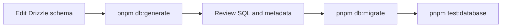

# Trackly Database Design

## Purpose

Describe Trackly's high-level persistence principles without duplicating the
table-by-table schema reference.

## Status

Completed

## Scope

This document covers the database choice, ORM boundary, migrations, naming,
relationships, deletion, timestamps, ownership, and derived-data strategy.
Detailed tables and columns belong in
[Database Schema Reference](../05-reference/database-schema.md).

## PostgreSQL

PostgreSQL 17 is Trackly's durable data store. The implementation depends on
relational constraints, indexes, transactions, enumerated values, date types,
timezone-aware timestamps, and deterministic SQL queries. The Docker
development stack uses the official Alpine image and a persistent volume.

## Drizzle ORM

Drizzle provides TypeScript schema definitions, typed relations, query
construction, and transactions while preserving explicit SQL-oriented
repositories. One `postgres` client and one Drizzle instance are exported from
`backend/src/db/client.ts`; application code does not create duplicate
connections.

Drizzle uses `snake_case` casing and imports the complete schema export. The
connection pool is environment-sized and closed through the Fastify lifecycle.

## Data Domains

The schema currently represents:

- Better Auth identities, accounts, sessions, and verification.
- User preferences.
- Categories, habits, schedules, and check-ins.
- Tasks.
- Goals and ordered goal steps.
- Reminders and durable notification deliveries.
- Browser push subscriptions.

Analytics, streaks, and progress are calculated from these source records. They
are not persisted as derived aggregate tables.

## Migration Strategy

TypeScript schema files live in `backend/src/db/schema/`. Drizzle Kit generates
forward SQL migrations and metadata under `backend/src/db/migrations/`.
`backend/src/db/migrate.ts` applies pending migrations, and PostgreSQL
integration tests verify schema and repository behavior.

The normal sequence is:

Every schema change requires a reviewed migration. `db:push` is available for
schema synchronization/verification, but generated migrations are the durable
history. No automated rollback/down-migration workflow is currently defined.

Better Auth schema generation is separate and must remain sourced from Better
Auth rather than hand-created application tables.

## Naming Conventions

Application schema helpers and existing definitions establish:

| Element                 | Convention                                      |
| ----------------------- | ----------------------------------------------- |
| Tables                  | `snake_case`                                    |
| Columns                 | `snake_case` at the PostgreSQL boundary         |
| Primary keys            | `id`, using UUIDs for application-owned records |
| Foreign keys            | `<entity>_id`                                   |
| Creation timestamp      | `created_at`                                    |
| Update timestamp        | `updated_at`                                    |
| Soft deletion timestamp | nullable `deleted_at`                           |

Better Auth-generated names follow Better Auth's schema contract and are not
renamed merely to match application conventions.

## Relationship Strategy

Drizzle relations in `schema/relations.ts` describe application navigation
between users, categories, habits, schedules, check-ins, tasks, goals, steps,
reminders, deliveries, and subscriptions. Foreign keys enforce core ownership
and parent-child relationships.

User-owned tables reference the Better Auth user. Repositories include the
authenticated user ID in reads and mutations, rather than trusting a public
request field. Parent-child records use foreign keys and appropriate cascade or
restriction behavior defined by their schema.

Uniqueness and indexes encode important invariants such as one logical
check-in/occurrence identity, endpoint ownership, ordered lookups, and active
user-scoped queries.

## Soft Delete Strategy

Application entities that support archival or revocation use nullable
`deleted_at`. Normal reads explicitly exclude deleted records. Archive/restore
behavior changes lifecycle state without erasing history, while hard deletion
is reserved for relationships whose schema explicitly cascades.

Inactive and soft-deleted are different concepts. For example, an inactive
habit can retain history, while a deleted habit is excluded from normal access.

## Timestamp and Calendar Strategy

Trackly distinguishes calendar dates from instants:

- Logical dates use PostgreSQL `date` and are interpreted in the authenticated
  user's configured timezone.
- Audit, creation, update, delivery, expiry, and other instants use
  timezone-aware timestamps.
- Shared helpers provide `created_at`, `updated_at`, and `deleted_at`.
- "Today" is never derived solely from the backend server timezone.

Schedule calculations include only eligible occurrences; future dates are
excluded where required. This strategy supports consistent Today, analytics,
streak, reminder, and goal behavior.

## Connection Lifecycle

The database plugin verifies connectivity during backend startup. `/ready`
performs a live database check. Fastify's `onClose` hook ends the PostgreSQL
client during graceful shutdown.

## Related Documents

- [Database Schema Reference](../05-reference/database-schema.md)
- [Backend Architecture](./backend-architecture.md)
- [Authentication Flow](./authentication-flow.md)
- [Docker Architecture](./docker-architecture.md)
