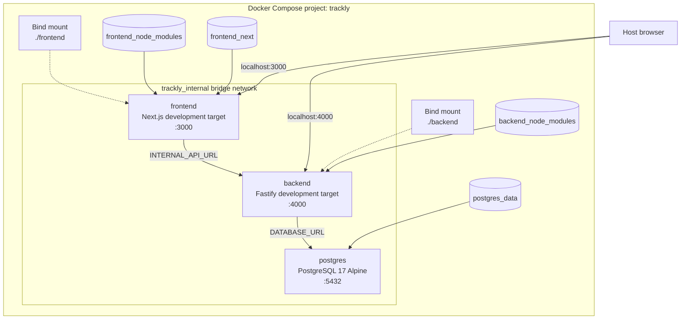
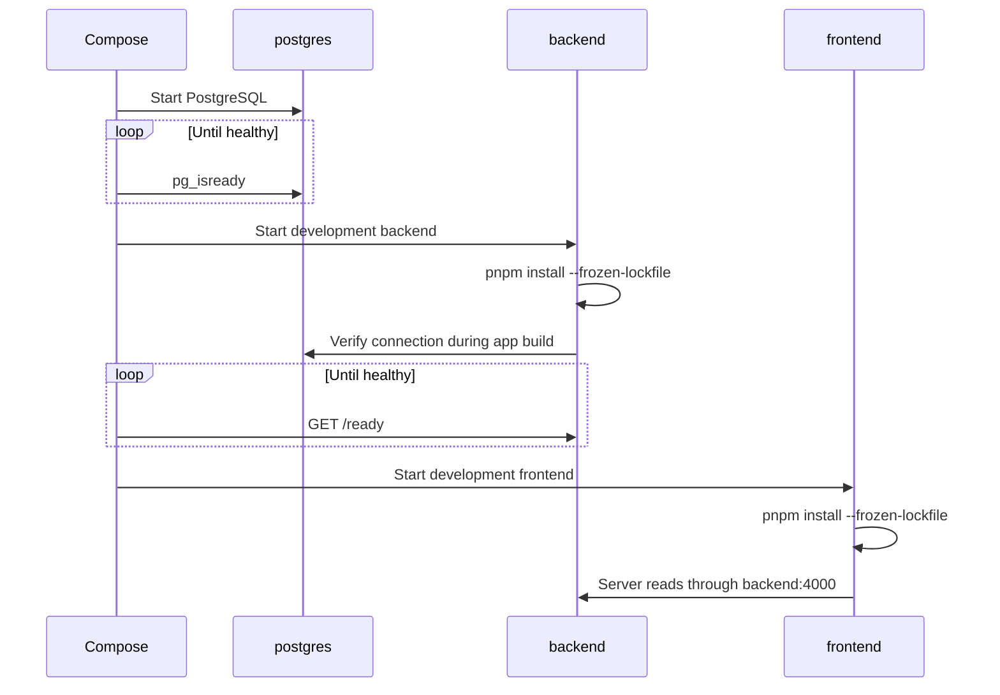

# Trackly Docker Architecture

## Purpose

Explain the checked-in Docker images and Docker Compose development topology.

## Status

Completed

## Scope

This document covers service composition, networking, volumes, startup order,
health checks, image stages, and local container development. It does not define
a production deployment topology.

## Compose Topology

The root `docker-compose.yml` defines three services on the
`trackly_internal` bridge network:

| Service    | Image/build target                   | Published port           | Responsibility              |
| ---------- | ------------------------------------ | ------------------------ | --------------------------- |
| `postgres` | `postgres:17-alpine`                 | `${POSTGRES_PORT:-5432}` | Durable relational database |
| `backend`  | `backend/Dockerfile`, `development`  | `${BACKEND_PORT:-4000}`  | Fastify API in watch mode   |
| `frontend` | `frontend/Dockerfile`, `development` | `${FRONTEND_PORT:-3000}` | Next.js development server  |

The browser reaches frontend and backend through published host ports. The
frontend server reaches the backend through `http://backend:4000`; the backend
reaches PostgreSQL through the Compose hostname `postgres`.

## Deployment Diagram



## Images

Both Dockerfiles use Node.js 24 Alpine and Corepack:

1. `base` enables Corepack and establishes `/app`.
2. `dependencies` copies workspace manifests and installs the frozen lockfile.
3. `development` selects the package working directory and starts `pnpm dev`.
4. `builder` copies package source and runs the production build.
5. `production` copies runtime output into a clean image and runs as a non-root
   user.

The frontend production stage copies Next.js standalone and static output and
runs as `nextjs`. The backend production stage copies `dist`, production
dependencies, and the package manifest and runs as `trackly`.

## Network and Service Boundaries

All three services share one bridge network. PostgreSQL is addressed by service
name from the backend; the backend is addressed by service name from
server-rendered frontend code. `NEXT_PUBLIC_API_URL` still points to
`localhost` because browser JavaScript runs outside the Docker network.

The configuration does not define a reverse proxy, TLS termination, public
production network, external scheduler service, or deployment platform.

## Volumes

| Volume/mount               | Purpose                                    |
| -------------------------- | ------------------------------------------ |
| `postgres_data`            | Persistent PostgreSQL data directory       |
| `backend_node_modules`     | Container-owned backend dependencies       |
| `frontend_node_modules`    | Container-owned frontend dependencies      |
| `frontend_next`            | Container-owned Next.js build/cache output |
| `./backend:/app/backend`   | Backend source bind mount                  |
| `./frontend:/app/frontend` | Frontend source bind mount                 |

A normal `docker compose down` preserves named volumes. Removing
`postgres_data` deletes local database state and is intentionally outside the
normal workflow.

## Startup Order



`depends_on` uses health conditions, so container creation order alone is not
treated as readiness.

## Health Checks

PostgreSQL runs `pg_isready` every five seconds with a five-second timeout and
ten retries. The backend container requests `/ready` every five seconds with a
five-second timeout and twenty retries.

`/health` proves that the API process is alive without querying PostgreSQL.
`/ready` verifies database connectivity and is therefore the correct Compose
dependency check.

The frontend has no Compose health check; successful process startup satisfies
its current runtime definition.

## Development Workflow

Start or rebuild all services:

```bash
docker compose up --build
```

Inspect configuration and runtime state:

```bash
docker compose config
docker compose ps
docker compose logs postgres
docker compose logs backend
docker compose logs frontend
```

Stop services without removing persistent data:

```bash
docker compose down
```

The Compose services install from the frozen lockfile on startup and then run
watch-mode development commands. Source edits are reflected through bind
mounts.

## Current Boundary

Compose validates the supported local development topology only. Although both
Dockerfiles contain production stages, the repository does not include a
production Compose file, reverse proxy, TLS configuration, production image
smoke workflow, backup job, or deployment automation.

## Related Documents

- [Architecture Diagrams](./architecture-diagram.md)
- [Frontend Architecture](./frontend-architecture.md)
- [Backend Architecture](./backend-architecture.md)
- [Development Workflow](../00-overview/05-development-workflow.md)
