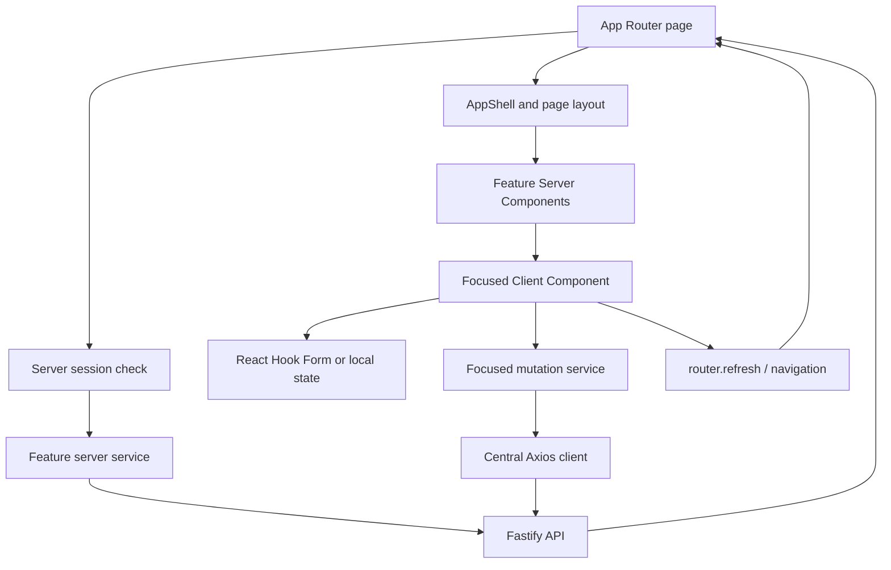

# Trackly Frontend Architecture

## Purpose

Explain how the Trackly frontend is organized, rendered, validated, and
connected to backend services for developers joining the project.

## Status

Completed

## Scope

This document covers `frontend/`. Product features are summarized in the
[Project Overview](../00-overview/01-project-overview.md); backend request
handling is covered in [Backend Architecture](./backend-architecture.md).

## Framework and Rendering Model

The frontend uses Next.js 16 App Router, React 19, and strict TypeScript.
React Server Components are the default for authenticated pages and initial
data. Client Components are introduced for forms, mutations, theme controls,
charts that need client rendering, and browser-only capabilities such as Web
Push.

User-specific requests use `cache: 'no-store'`; the application does not place
authenticated responses in shared or static caches.

## Folder Organization

```text
frontend/
├── public/                  # Static assets and /sw.js
├── src/
│   ├── app/
│   │   ├── (app)/          # Authenticated application routes and shell
│   │   ├── (auth)/         # Login and registration experience
│   │   ├── layout.tsx      # Root metadata, global styles, theme provider
│   │   ├── page.tsx        # Root route
│   │   ├── loading.tsx
│   │   ├── error.tsx
│   │   └── not-found.tsx
│   ├── components/
│   │   ├── analytics/
│   │   ├── auth/
│   │   ├── common/
│   │   ├── feedback/
│   │   ├── goals/
│   │   ├── habits/
│   │   ├── layout/
│   │   ├── navigation/
│   │   ├── preferences/
│   │   ├── reminders/
│   │   ├── theme/
│   │   ├── today/
│   │   └── ui/
│   ├── config/             # Navigation and validated configuration
│   ├── features/           # Feature schemas and focused client services
│   ├── hooks/              # Reusable React hooks
│   ├── lib/                # Auth, environment, formatting, and utilities
│   ├── services/           # Server reads, Axios mutations, error handling
│   ├── styles/             # Tailwind v4 global styles and design tokens
│   └── types/              # Frontend API and feature models
└── tests/                  # Vitest/jsdom/Testing Library suites
```

The `@/*` alias maps to `frontend/src/*`.

## Routing and Layout Structure

The root layout sets metadata, viewport theme colors, global CSS, and a
`next-themes` provider. Route groups organize the two main experiences:

- `(auth)` contains `/login` and `/register`. Its layout redirects an existing
  session to `/today`.
- `(app)` contains `/today`, `/habits`, `/goals`, `/analytics`, `/settings`,
  `/tasks`, and `/insights`. Its layout resolves the server session, redirects
  missing sessions to `/login`, loads preferences, and renders `AppShell`.

Habits and goals include list, create, detail, and edit segments. Feature routes
define loading and error boundaries where needed; habit detail also has a
specific not-found view. `/tasks` and `/insights` are currently placeholders.

There is no Next.js middleware/proxy file. Protection is performed by
server-rendered layouts/pages and independently enforced by backend endpoints.

## Layout and Components

`AppShell` supplies authenticated navigation and account context. Shared layout
components provide page headers, sections, top bars, sidebars, and mobile
navigation. Reusable feedback components cover loading, errors, and empty
states, while `components/ui/` contains locally owned shadcn/ui primitives.

Feature components receive typed data and callbacks; they do not perform raw
SQL or own backend domain rules. Components are extracted after demonstrated
reuse, and interactive elements remain semantic buttons, links, inputs, and
forms.

## Component Interaction



## Forms and Validation

Interactive forms use React Hook Form with `@hookform/resolvers` and
feature-specific Zod schemas under `src/features/`. The client validation
improves feedback but does not replace backend validation. Backend endpoints
validate the same request boundary independently.

Mutation components prevent duplicate submission, expose pending state, and
surface sanitized feedback. Browser GET forms and URL query parameters are used
where filters, periods, dates, sorting, or pagination should survive refresh.

## State Management

Trackly intentionally has no general-purpose global state library:

- Server Components own initial authenticated data.
- URL parameters own shareable collection and analytics state.
- React local state owns transient interactive state.
- React Hook Form owns form state.
- `next-themes` owns appearance state.
- Persisted user preferences are loaded from the backend.

After successful mutations, components update their visible state when the API
returns the authoritative value and/or refresh the server route.

## Data Fetching

Server-side reads use `requestServerApi()` and `fetchServer()`:

- The internal API base URL is resolved from validated server configuration.
- The incoming cookie header is forwarded to Fastify.
- Requests use `cache: 'no-store'`.
- A ten-second abort timeout maps unavailable and timeout cases to typed
  `ServerApiError` values.
- Standard API envelopes are validated with Zod before data is returned.

Browser mutations use the single Axios `httpClient`:

- `withCredentials: true` preserves Better Auth cookies.
- Base URL comes from validated public environment variables.
- The common timeout is ten seconds.
- A valid `x-request-id` is generated when available.
- Response failures are normalized into safe frontend API errors.

Better Auth browser operations use the dedicated client created in
`src/lib/auth-client.ts`, not the application Axios client.

## Theme Handling

The root `ThemeProvider` uses class-based themes, enables system preference, and
defaults to `system`. `PersistedTheme` applies the authenticated user's stored
theme preference inside the application layout. Tailwind v4 global styles
define the light and dark design tokens, and the root viewport defines matching
browser theme colors.

## Error Handling

The frontend separates:

- Route-level `error.tsx`, `loading.tsx`, and `not-found.tsx` boundaries.
- Typed `ServerApiError` failures for server reads.
- `SessionServiceError` for authentication dependency failures.
- Normalized client API errors for Axios mutations.
- Safe, feature-level empty, conflict, unavailable, and feedback states.

Valid unauthenticated sessions redirect to `/login`. Session-service failures
are not silently treated as logged-out users. Raw backend messages, credentials,
and stack traces are not displayed.

## Build Process

`pnpm --filter @trackly/frontend build` runs `next build`. The Docker builder
stage performs the same production build, and the production stage copies
Next.js standalone output and static assets into a non-root Node.js 24 Alpine
image.

Frontend quality commands are:

```bash
pnpm --filter @trackly/frontend lint
pnpm --filter @trackly/frontend typecheck
pnpm test:frontend
pnpm --filter @trackly/frontend build
```

See [Development Workflow](../00-overview/05-development-workflow.md) for the
repository-wide sequence.

## Related Documents

- [Architecture Diagrams](./architecture-diagram.md)
- [Authentication Flow](./authentication-flow.md)
- [API Design](./api-design.md)
- [Docker Architecture](./docker-architecture.md)
