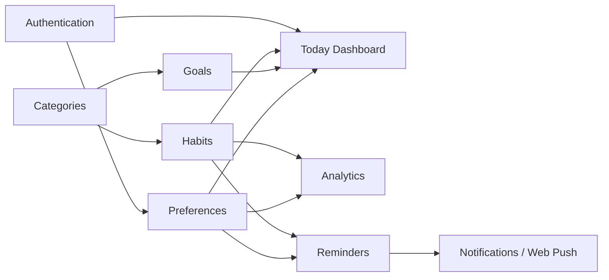

# Trackly Feature Summary

## Purpose

Provide developers, QA, and product stakeholders with an implementation-backed
index of Trackly's completed and placeholder features.

## Status

Completed

## Implemented Features

| Feature                    | User-facing entry point                       | Primary documentation                                                |
| -------------------------- | --------------------------------------------- | -------------------------------------------------------------------- |
| Authentication             | `/login`, `/register`, sign-out action        | [Authentication](./phase-1-authentication.md)                        |
| Today Dashboard            | `/today`                                      | [Today](./phase-2-today.md)                                          |
| Habits                     | `/habits`, create/detail/edit routes          | [Habits](./phase-3-habits.md)                                        |
| Analytics                  | `/analytics`                                  | [Analytics](./phase-4-analytics.md)                                  |
| Goals                      | `/goals`, create/detail/edit routes           | [Goals](./phase-5-goals.md)                                          |
| Categories                 | Habit/goal display and selectors; API listing | [Productivity](./phase-6-productivity.md#categories)                 |
| Preferences                | `/settings/preferences`                       | [Productivity](./phase-6-productivity.md#preferences)                |
| Reminders                  | Habit detail                                  | [Productivity](./phase-6-productivity.md#reminders)                  |
| Notifications and Web Push | Notification settings plus service worker     | [Productivity](./phase-6-productivity.md#notifications-and-web-push) |

The technical platform supporting these features is summarized in
[Foundation](./phase-0-foundation.md), and cross-cutting reliability/security
behavior is described in [Quality](./phase-7-quality.md).

## Feature Relationships

## Shared Product Rules

- Every user-owned read and mutation derives ownership from the authenticated
  session.
- Logical dates are interpreted in the user's timezone, not the server
  timezone.
- Soft-deleted records are excluded from normal access.
- Derived progress, streaks, and analytics are computed from source records.
- URL query parameters preserve shareable date, period, filtering, sorting, and
  pagination state.
- Server Components provide initial authenticated data; Client Components are
  limited to required interaction.

Detailed endpoint and table contracts are maintained in the
[API Reference](../05-reference/api-reference.md) and
[Database Schema](../05-reference/database-schema.md).

## Planned Features

### Tasks

`/tasks` exists as a `PlaceholderPage` and is present in desktop/mobile
navigation. A task schema and query repository exist, and task data contributes
to the Today projection. There is no public task CRUD API or task-management UI,
so Tasks are not an implemented standalone feature.

### Standalone Insights

`/insights` exists as a `PlaceholderPage`. Analytics already includes a
deterministic Insights section at `/analytics`, but there is no separate
standalone Insights product experience.

No other placeholder product pages were found.

## Current Product Boundaries

- Categories have a public list API but no management UI/API.
- Goal steps exist in persistence and legacy Today projection data, but there
  is no public step-management API.
- Notification delivery history has no user-facing page or endpoint.
- Reminders deliver through browser Web Push only; other channels are not
  implemented.
- Analytics supports fixed periods, not arbitrary custom ranges.

## Related Documentation

- [Project Overview](../00-overview/01-project-overview.md)
- [System Architecture](../01-design/architecture-diagram.md)
- [API Reference](../05-reference/api-reference.md)
- [Database Schema](../05-reference/database-schema.md)
