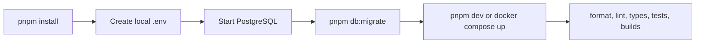

# Phase 0: Foundation

## Purpose

Document the implemented platform capabilities on which Trackly features run.

## Status

Completed

## Business Problem Solved

The foundation provides a consistent development and runtime environment so
feature work shares one frontend, backend, database, validation, error, and
container model rather than creating feature-specific infrastructure.

## Developer Workflow

The root pnpm workspace coordinates `frontend/` and `backend/`. Docker Compose
starts PostgreSQL, waits for health, starts Fastify, waits for `/ready`, and
then starts Next.js.

## UI Overview

The frontend foundation supplies the root theme provider, authenticated
application shell, desktop and mobile navigation, page headers, sections,
feedback states, and reusable UI primitives. It supports light, dark, and
system themes and responsive layouts.

## Backend Modules Involved

The Fastify composition includes request context, centralized errors, CORS,
security headers, rate limiting, Swagger, database connectivity, Better Auth,
infrastructure routes, and `/api/v1` route registration.

## Database Entities Involved

The foundation owns the shared Drizzle client, migration runner, timestamp/ID
helpers, schema exports, and seed connectivity check. Feature-specific entities
are documented in the [Database Schema](../05-reference/database-schema.md).

## API Endpoints Involved

- `GET /health`
- `GET /ready`
- Conditional Swagger UI at `/docs`
- Conditional validation diagnostic endpoint

See the [API Reference](../05-reference/api-reference.md).

## Validation

Environment variables are validated at process startup. Requests use shared
Zod parsing, and route JSON schemas drive response serialization and OpenAPI.
The root workflow includes Prettier, ESLint, strict TypeScript, Vitest,
PostgreSQL integration tests, production builds, and Docker configuration
validation.

## Permissions

Infrastructure health routes are public. Application access is enforced by
later feature modules through Better Auth sessions. Production configuration
can disable Swagger and diagnostics.

## Edge Cases

- Missing or invalid database configuration fails startup clearly.
- `/health` remains available without a database query; `/ready` returns 503
  when PostgreSQL is unavailable.
- Incoming invalid request IDs are replaced with generated UUIDs.
- Graceful shutdown is idempotent and has a finite deadline.

## Current Limitations

- Compose exercises development targets rather than production topology.
- No CI/CD, reverse proxy, backup, or external monitoring configuration exists.
- The seed command creates no business fixtures.

## Future Improvements

The quality baseline defers production deployment, backup/recovery, external
monitoring, production-image smoke testing, and representative load budgets to
later operational work.

## Related Documentation

- [Repository Structure](../00-overview/04-repository-structure.md)
- [Development Workflow](../00-overview/05-development-workflow.md)
- [Docker Architecture](../01-design/docker-architecture.md)
- [Backend Architecture](../01-design/backend-architecture.md)
