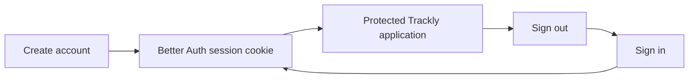

# Phase 1: Authentication

## Purpose

Document Trackly's implemented account, login, session, protected-access, and
logout experience.

## Status

Completed

## Business Problem Solved

Authentication gives each person a private Trackly workspace and provides the
identity used to isolate habits, goals, preferences, reminders, analytics, and
notifications.

## User Workflow

New users submit name, email, password, and matching password confirmation.
Existing users submit email and password. Successful authentication navigates
to Today or a validated internal callback destination. Signing out invalidates
the session.

## UI Overview

`/register` and `/login` share an authentication layout with Trackly branding
and theme control. Forms expose labels, autocomplete attributes, inline
field errors, a form-level alert, disabled pending buttons, and links between
the two flows. The auth layout redirects an already authenticated user to
`/today`.

Protected pages use the `(app)` server layout. It checks the session before
rendering `AppShell`; missing sessions redirect to `/login`.

## Backend Modules Involved

- Better Auth configuration and Drizzle adapter.
- Fastify `/api/auth/*` bridge.
- Cached per-request session resolver.
- `/api/v1/auth/me` Trackly projection.
- Authentication audit logging.

Full sequences are in
[Authentication Flow](../01-design/authentication-flow.md).

## Database Entities Involved

`user`, `session`, `account`, `verification`, and the post-registration
`user_preferences` row. Better Auth owns the authentication tables.

## API Endpoints Involved

- Email sign-up, email sign-in, sign-out, and session lookup under
  `/api/auth/*`.
- `GET /api/v1/auth/me`.

See the [API Reference](../05-reference/api-reference.md#authentication).

## Validation

Frontend Zod schemas validate name, email, password, and password confirmation.
Backend Better Auth enforces email/password rules and password length 8–128.
Email verification policy is environment-controlled.

## Permissions

Authentication endpoints establish identity. Protected controllers derive the
user ID from the session and repositories scope operations with that ID. No
feature accepts an ownership user ID from client input.

## Edge Cases

- Callback URLs are restricted to safe internal destinations.
- Invalid credentials produce safe user-facing errors.
- A valid missing session redirects or returns 401.
- A session dependency failure remains an error/503 and is not presented as
  normal logout.
- Duplicate registration and verification behavior remains owned by Better
  Auth.

## Current Limitations

- The repository contains no password-reset or account-management UI.
- No social/third-party provider is configured.
- Email delivery infrastructure is not present; production email verification
  depends on deployment configuration outside this repository.

## Future Improvements

No additional authentication feature is committed in the current repository
roadmap.

## Related Documentation

- [Authentication Flow](../01-design/authentication-flow.md)
- [API Reference](../05-reference/api-reference.md#authentication)
- [Database Schema](../05-reference/database-schema.md#database-tables)
