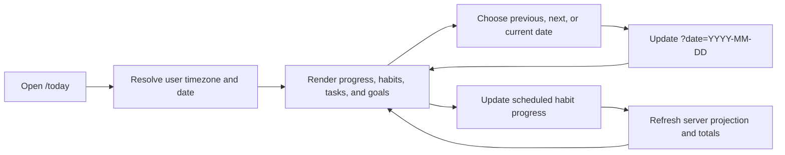

# Phase 2: Today Dashboard

## Purpose

Document the authenticated daily workspace that combines scheduled habits,
relevant tasks, active goals, and a derived progress summary.

## Status

Completed

## Business Problem Solved

Today gives users one calm starting point for the selected local calendar day
instead of requiring separate navigation through every productivity area.

## User Workflow

Without a date parameter, the backend resolves user-local today. Date
navigation writes `?date=YYYY-MM-DD`, making the selected day refresh-safe.
Habit check-in controls submit the displayed logical date.

## UI Overview

The server-rendered `/today` page contains:

- A personalized heading, formatted date, timezone, and date navigation.
- Daily Progress totals.
- Scheduled habit items with check-in controls.
- Task sections for overdue, due today, and completed today records.
- Active goal cards.
- A dedicated empty-account state.

The layout becomes a two-column habit/task grid at larger breakpoints. Invalid
date input renders a safe alert with a return-to-today action. Route loading and
error boundaries cover server transitions and failures.

## Backend Modules Involved

The Today controller and service coordinate preference, habit, task, and goal
repositories. Independent source reads run in parallel. The service resolves
the date/timezone and computes the daily summary without persisting it.

## Database Entities Involved

`user_preferences`, `habits`, `habit_schedules`, `habit_check_ins`, `tasks`,
`goals`, `goal_steps`, and `categories`.

## API Endpoints Involved

- `GET /api/v1/today`
- `POST /api/v1/habits/:id/check-in` for displayed habit progress

See the [API Reference](../05-reference/api-reference.md#today).

## Validation

The optional date must be a real `YYYY-MM-DD` calendar date. Check-in values
must be integers within the habit target. Frontend date parsing preserves only
a single string parameter and renders a controlled invalid-query state.

## Permissions

Authentication is required. Every contributing repository query uses the
session user ID. Foreign and soft-deleted records cannot enter the projection.

## Edge Cases

- An empty account returns empty collections and a zero summary.
- Unscheduled habits are absent from the daily habit list.
- Invalid stored timezones warn internally and safely fall back to UTC.
- An explicit historical/future date remains visible in the URL.
- Check-in success refreshes the visible habit and aggregate progress.
- Expired sessions redirect to login.

## Current Limitations

- Task data is visible, but task mutation controls are not implemented.
- Today has no check-in controls for goals or tasks.
- The summary is request-time data and has no historical cache.

## Future Improvements

The Tasks page is an existing placeholder and is the only repository-backed
planned expansion directly affecting the Today task workflow.

## Related Documentation

- [Habits](./phase-3-habits.md)
- [Goals](./phase-5-goals.md)
- [Preferences](./phase-6-productivity.md#preferences)
- [API Reference](../05-reference/api-reference.md#today)
