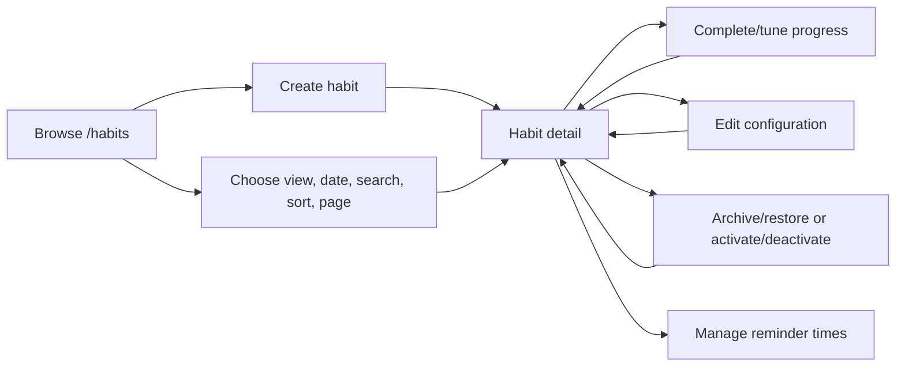

# Phase 3: Habits

## Purpose

Document habit discovery, configuration, scheduling, lifecycle, daily progress,
details, streaks, and reminder integration.

## Status

Completed

## Business Problem Solved

Habits let users define recurring activities, see which occurrences matter on a
logical day, record absolute progress, and retain historical context when a
routine is paused.

## User Workflow

## UI Overview

The server-rendered collection provides Today, All, and Archived views;
`inactive` remains a URL compatibility alias. Browser-native GET controls keep
date, search, sort, order, and pagination in the URL. Each row displays
category, schedule, target, date range, active state, and selected-date
progress.

Create and edit pages use the reusable habit form. Detail displays metadata,
current-date progress, streak statistics, lifecycle actions, and reminder
management. Target-one habits render a completion toggle; multi-target habits
render decrement/increment controls with textual progress.

Loading, empty, invalid-filter, error, and not-found states are route-specific.
Buttons disable while pending and announce success/errors through status or
alert regions.

## Backend Modules Involved

- Habit query service/repository for collection and detail.
- Habit command service/repository for CRUD, lifecycle, and check-in.
- Habit streak query service/repository.
- Shared scheduling and calendar utilities.
- Preference repository for user-local dates.
- Category and reminder integrations.

## Database Entities Involved

`habits`, `habit_schedules`, `habit_check_ins`, `categories`,
`user_preferences`, `reminders`, and linked `goals`.

## API Endpoints Involved

Habit list/detail/streak, create/update/delete, check-in, archive/restore, and
activate/deactivate endpoints under `/api/v1/habits`. Reminder endpoints are
nested below a habit.

See the [Habit API Reference](../05-reference/api-reference.md#habits).

## Validation

- Name is trimmed and limited to 160 characters.
- Description is nullable and limited to 10,000 characters.
- Frequency is daily, weekly, or custom.
- Target is a positive integer.
- Dates are valid, with end on/after start.
- Weekly/custom habits require unique weekdays from 1–7.
- Category IDs and route IDs must be UUIDs.
- Updates must contain at least one field.
- Check-ins require integer progress from zero through target.

Frontend forms use Zod and React Hook Form; backend Zod validation remains
authoritative.

## Permissions

All routes require a session. Queries and mutations scope habit and category
access by user ID. Missing, foreign, deleted, and otherwise inaccessible habit
details share safe 404 behavior.

## Business Rules

- Only scheduled occurrences participate in Today, check-ins, streaks, and
  analytics.
- Positive check-ins upsert one row per habit/date; zero deletes the row.
- Completion means `completedCount >= targetCount`.
- Check-in is allowed only for active, scheduled habits.
- Non-scheduled dates do not break streaks.
- Current streak ends at the latest eligible occurrence; future dates are
  ignored.
- Inactive habits remain readable and retain history.
- Creation and schedule replacement are transactional.
- Sorting has stable ID tie-breakers.

## Edge Cases

- Empty and out-of-range pages return an empty list rather than an error.
- Search with no matches has a dedicated state and clear action.
- Invalid collection query values render a recovery view.
- Repeated check-ins are idempotent.
- Repeated or invalid lifecycle transitions return conflict.
- Invalid stored timezone falls back to UTC.
- Daily frequency ignores weekday input.

## Current Limitations

- Collection rows are read-only because they have no date-specific mutation
  context; check-in controls appear on Today and detail.
- Habit detail projects only current user-local date, not a selected date.
- No bulk habit operations exist.
- Streaks are detail-only and have no dashboard/chart integration.

## Future Improvements

No additional habit feature is committed in the current repository roadmap.

## Related Documentation

- [Today Dashboard](./phase-2-today.md)
- [Analytics](./phase-4-analytics.md)
- [Productivity Features](./phase-6-productivity.md)
- [API Reference](../05-reference/api-reference.md#habits)
- [Database Schema](../05-reference/database-schema.md#habits)
