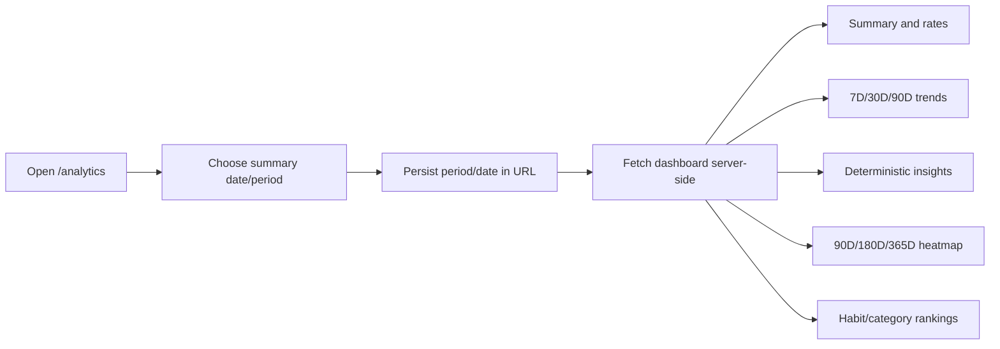

# Phase 4: Analytics

## Purpose

Document Trackly's derived habit analytics dashboard, history, insights,
heatmap, and rankings.

## Status

Completed

## Business Problem Solved

Analytics turns scheduled habit occurrences and absolute check-in progress into
understandable completion, effort, consistency, trend, and ranking information
without storing stale aggregate records.

## User Workflow

The default summary period is week, history is 30 days, and heatmap is 365
days. Direct URL loads and browser navigation preserve selections.

## UI Overview

`/analytics` is a force-dynamic Server Component page. It fetches the combined
dashboard contract once, then renders:

- Summary cards with icons, helper text, and completion/progress bars.
- Accessible Recharts history views for completion and progress rates.
- Best day, strongest weekday, consistency, recent trend, and lowest-day
  supporting information.
- A responsive contribution-style heatmap.
- Habit and category rankings.
- Historical totals and visible date ranges.

Controls are semantic URL-based forms/links. Charts retain textual labels and
summaries. The page has loading, route error, invalid-query, zero-activity, and
insufficient-data states.

## Backend Modules Involved

The analytics query repository loads owned habits, schedules, check-ins, and
categories. The service shares those source rows across dashboard projections
and owns occurrence expansion, timezone resolution, rate calculations,
insights, heatmap levels, streaks, and deterministic ranking.

## Database Entities Involved

`user_preferences`, `habits`, `habit_schedules`, `habit_check_ins`, and
`categories`. No analytics table exists.

## API Endpoints Involved

- Dashboard
- Summary
- History
- Insights
- Heatmap
- Habit rankings
- Category rankings

All are under `/api/v1/analytics`. See the
[Analytics API Reference](../05-reference/api-reference.md#analytics).

## Validation

- Summary period: day, week, or month.
- History/ranking/insight period: 7d, 30d, or 90d.
- History granularity: day only.
- Heatmap period: 90d, 180d, or 365d.
- Selected date must be a valid ISO calendar date.
- Unsupported/extra query values produce a standardized 400 response.

## Permissions

Every endpoint requires authentication. Repository reads use the session user
ID, and tests verify cross-user data does not affect any metric.

## Business Rules

- Completion rate is completed scheduled occurrences divided by scheduled
  occurrences.
- An occurrence completes when count meets/exceeds target.
- Progress rate is capped completed-count total divided by target-count total.
- History and heatmap include zero-activity calendar days.
- Future occurrences are ignored.
- Week summaries use Monday–Sunday boundaries.
- Insights exclude days without scheduled occurrences.
- Best/lowest tied days select the most recent date.
- Weekday ties use deterministic Monday–Sunday order.
- Fully completed days have every scheduled occurrence completed.
- Trend compares equal-sized current/previous windows and supports
  insufficient data.
- Analytics values are computed at request time and never persisted.

## Edge Cases

- No scheduled activity produces zero summaries and explicit empty states.
- Insights return nullable values when no active days exist.
- Trend can return `insufficient-data`.
- Multi-target completion and progress rates can legitimately differ.
- Invalid stored timezones warn and fall back to UTC.
- Direct invalid URLs render a recovery state without exposing backend errors.

## Current Limitations

- Periods are fixed; custom date ranges are unavailable.
- History granularity is daily only.
- No export, forecasting, persisted cache, or category filter exists.
- Production performance budgets and representative load tests are not
  defined.

## Future Improvements

The quality baseline defers representative production dataset measurements and
explicit latency budgets. No additional analytics product feature is committed.

## Related Documentation

- [Habits](./phase-3-habits.md)
- [Preferences](./phase-6-productivity.md#preferences)
- [API Reference](../05-reference/api-reference.md#analytics)
- [Database Schema](../05-reference/database-schema.md)
