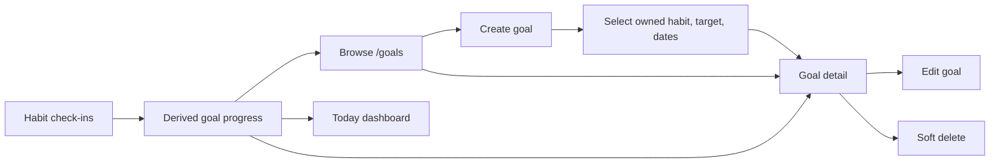

# Phase 5: Goals

## Purpose

Document goal creation, editing, lifecycle, habit-linked progress, and dashboard
presentation.

## Status

Completed

## Business Problem Solved

Goals let users turn repeated habit activity into a bounded outcome with a
target count and date range. Progress is derived from the linked habit rather
than manually synchronized.

## User Workflow

## UI Overview

The Goals page groups cards into current/upcoming and completed/ended states.
Cards display linked habit, target dates, status, and a textual/visual progress
indicator. Dedicated create, detail, and edit pages use reusable components.
Delete is an explicit client action.

The Today dashboard also displays active goal projections. Goal pages provide
loading and error states, responsive card grids, visible focus, and semantic
progress text.

## Backend Modules Involved

The goal route/controller/service/repository stack handles CRUD and progress.
The preference repository supplies timezone context. Today reuses the goal
repository for its active projection.

## Database Entities Involved

`goals`, `habits`, `habit_check_ins`, `categories`, `goal_steps`,
`user_preferences`, and `user`.

## API Endpoints Involved

- List, detail, create, update, and soft delete under `/api/v1/goals`.
- Today consumes goal projections through `/api/v1/today`.

See the [Goal API Reference](../05-reference/api-reference.md#goals).

## Validation

- IDs are UUIDs.
- Name is trimmed, non-empty, and at most 200 characters.
- Target count is an integer of at least one.
- Start/end are valid ISO dates; end cannot precede start.
- Status is active, completed, or cancelled.
- Update bodies must contain at least one field.
- A linked habit must exist, be owned, and be accessible.

## Permissions

Authentication is required. Goal and linked-habit operations are user-scoped.
Foreign, missing, and deleted goals are not exposed.

## Business Rules

- Goal progress is the linked habit's owned check-in count within the goal
  range.
- Current count is capped for rate presentation against the target.
- Remaining count never becomes negative.
- Progress and target-reached state are derived, not stored.
- Goal deletion is soft deletion.
- Replacing the linked habit requires ownership.

## Edge Cases

- Empty accounts receive a dedicated goal state.
- Partial goal updates validate the final resolved date range.
- A goal can be completed/cancelled independently of the linked habit state.
- Check-ins outside the goal's logical range do not contribute.
- Deleted/foreign linked resources do not leak ownership information.

## Current Limitations

- No public goal-step management API or UI is implemented.
- The physical schema retains legacy/display goal fields alongside the current
  habit-linked model.
- Goal lists are not paginated and expose limited filtering in the UI.
- Progress is count-based only; no alternative goal measurement type exists.

## Future Improvements

No additional goal feature is committed in the current repository roadmap.

## Related Documentation

- [Today Dashboard](./phase-2-today.md)
- [Habits](./phase-3-habits.md)
- [Goal API](../05-reference/api-reference.md#goals)
- [Goals Table](../05-reference/database-schema.md#goals)
