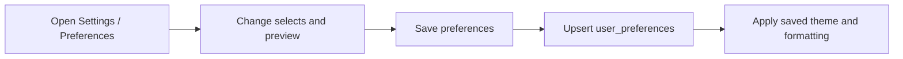
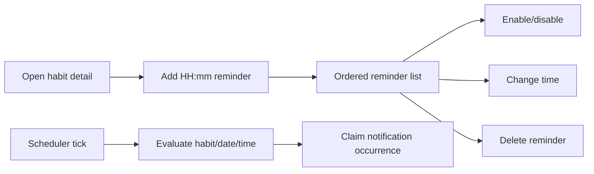
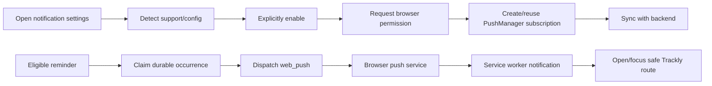

# Phase 6: Productivity Features

## Purpose

Document the implemented Categories, Preferences, Reminders, and Notifications
features that support the core habit workflow.

## Status

Completed

# Categories

## Categories Purpose and Business Problem

Categories provide reusable visual labels for organizing habits and goals and
for grouping analytics. The task schema can also reference categories.

## Categories Workflow and UI

Users select an existing category while configuring supported resources.
Category badges appear in Today, habit, goal, and analytics presentations.
There is no category management page; the frontend consumes the authenticated
active-category list for selectors and display.

## Categories Backend, Database, and API

The category service/repository exposes `GET /api/v1/categories`. It reads
`categories`; habits, tasks, and goals hold optional category foreign keys.
See [Categories API](../05-reference/api-reference.md#categories) and
[Database Schema](../05-reference/database-schema.md#categories).

## Categories Validation and Permissions

Listing requires authentication and returns only non-deleted categories owned
by the session user. Habit/goal forms accept nullable category UUIDs, and
services verify ownership before association.

## Categories Edge Cases

- Deleting a category at the database level sets linked category fields to
  null.
- An inaccessible category cannot be attached to another user's resource.
- Empty category lists remain valid; resources can be uncategorized.

## Categories Limitations

No public create, update, delete, ordering, color, or icon management workflow
is registered.

## Categories Future Improvements

No category-management milestone is committed in the current repository.

# Preferences

## Preferences Purpose and Business Problem

Preferences let users control timezone, week start, date/time presentation, and
theme. The timezone is also a domain input for Today, schedules, streaks,
analytics, and reminders.

## Preferences Workflow

## Preferences UI

`/settings/preferences` is server-rendered with a client form. It presents
timezone, week-start, date-format, time-format, and theme selects beside a live
preview. Saving disables the action, applies the returned theme, and announces
success or a safe error.

The same page includes device-specific notification settings described below.

## Preferences Backend, Database, and API

The preference service/repository resolves defaults and performs conflict-safe
updates against `user_preferences`. The APIs are `GET` and `PATCH
/api/v1/preferences`.

## Preferences Validation

- Timezone must be a supported IANA identifier, trimmed, and at most 64
  characters.
- Week start is Monday or Sunday.
- Date format is one of three implemented formats.
- Time format is 12h or 24h.
- Theme is system, light, or dark.
- Updates must be non-empty and reject unknown fields.

## Preferences Permissions

Both endpoints require authentication and address only the current user's
unique preference row.

## Preferences Edge Cases

- Missing preference rows resolve documented defaults.
- Legacy invalid timezone values fall back to UTC in dependent features.
- Theme changes apply immediately after a successful save.
- The timezone selector uses runtime-supported values with a small fallback
  list where `Intl.supportedValuesOf` is unavailable.

## Preferences Limitations

- Analytics week boundaries remain Monday-first even when the presentation
  preference says Sunday.
- Preferences do not include locale, notification channel, or per-feature
  customization.

## Preferences Future Improvements

No additional preference field is committed in the repository.

# Reminders

## Reminders Purpose and Business Problem

Reminders associate one or more local times with an owned habit so eligible
scheduled occurrences can enter the notification pipeline.

## Reminders Workflow

## Reminders UI

Reminder management is embedded on habit detail. The client component lists
times using the user's display format and provides create, edit, enable/disable,
and delete interactions. Pending controls are disabled and feedback is
announced.

## Reminders Backend Modules

- Reminder CRUD service/repository.
- Reminder scheduling repository and eligibility service.
- Scheduler runner/loop.
- Preference repository for timezone.
- Notification delivery coordinator.

## Reminders Database Entities and APIs

`reminders` belongs to both a user and habit. Eligible sends create
`notification_deliveries`. CRUD uses the four nested reminder endpoints under
`/api/v1/habits/:habitId/reminders`.

## Reminders Validation

Habit/reminder IDs are UUIDs. Time uses strict 24-hour `HH:mm`; enabled is
boolean; update bodies must be non-empty and strict.

## Reminders Permissions

All CRUD routes require authentication and scope both the reminder and parent
habit. The scheduler operates on repository-selected eligible records rather
than public user input.

## Reminders Business Rules and Edge Cases

- Multiple distinct times per habit are supported.
- Duplicate active time for the same user/habit returns conflict, including
  concurrent creation.
- Soft deletion permits later recreation of the same time.
- Disabled/deleted reminders and inactive/deleted/unscheduled habits are not
  eligible.
- Archived habits remain readable for reminder management.
- User-local time and safe UTC fallback determine eligibility.
- The scheduler processes occurrences sequentially and continues after an
  individual failure.

## Reminders Limitations

- The scheduler is a separate backend command and is not a Compose service.
- No snooze, retry policy, queue, distributed lock, or reminder history UI
  exists.
- Reminder times do not support per-reminder days independent from habit
  scheduling.

## Reminders Future Improvements

Operational scheduler/Web Push time budgets are deferred in the quality
baseline. No additional reminder product workflow is committed.

# Notifications and Web Push

## Notifications Purpose and Business Problem

Notifications turn eligible reminders into deduplicated delivery attempts and
let a user opt the current browser/device into standard VAPID Web Push.

## Notifications Workflow

## Notifications UI

Notification settings show device-specific states: checking, unsupported,
insecure, configuration unavailable, blocked, disabled, or enabled. Permission
is requested only after the user activates Enable. Disable removes the backend
endpoint before local unsubscribe. A refresh action reconciles an existing
local subscription without requesting permission or creating a new one.

The `/sw.js` service worker safely parses payloads, displays notifications, and
routes known habit reminders to an internal Today/habit destination. It never
uses arbitrary external payload URLs.

## Notifications Backend Modules

- Push-subscription service/repository.
- Notification occurrence mapping, durable delivery repository, coordinator,
  provider dispatcher, and provider contract.
- Explicit `noop` and `web_push` providers.
- Reminder scheduler integration.

## Notifications Database Entities and APIs

`push_subscriptions` stores device endpoints/keys and delivery health.
`notification_deliveries` stores provider-neutral occurrence lifecycle.
Authenticated list, subscribe/upsert, and unsubscribe APIs are under
`/api/v1/push-subscriptions`.

## Notifications Validation

Endpoints must be HTTPS and at most 4096 characters. Push keys are trimmed and
16–2048 characters. User agent is optional and capped at 512. Frontend support
checks require a secure context, service workers, PushManager, Notification,
and a public VAPID key.

## Notifications Permissions

Subscription APIs require a session and never accept user ID. Browser
notification permission requires explicit user action. The VAPID private key is
backend-only. Subscription endpoints and key material are not shown in UI or
logs.

## Notifications Business Rules and Edge Cases

- Existing local subscriptions are synchronized rather than recreated.
- The device UI represents only the current browser, not every user device.
- Active endpoint ownership cannot move silently between users.
- Backend unsubscribe is idempotent.
- A local unsubscribe failure after backend deletion produces a partial-cleanup
  message.
- No active subscriptions yields a skipped delivery.
- At least one accepted subscription yields delivered; all failures yield
  failed.
- HTTP 404/410 invalidates a subscription; transient errors increment failure
  metadata.
- One device failure does not block other devices or later reminders.
- Occurrence uniqueness prevents duplicate sending.

## Notifications Limitations

- Web Push is the only real delivery provider; `noop` is for safe/test runtime.
- Permission cannot be reset programmatically.
- No delivery-history UI/API, retry queue, offline cache, background sync, or
  per-reminder channel selection exists.
- Browser support and HTTPS/localhost are required.

## Notifications Future Improvements

Only operational timeout/tick budgets are identified in the quality baseline;
no additional notification channel is planned in the repository.

## Related Documentation

- [Preferences API](../05-reference/api-reference.md#preferences)
- [Reminders API](../05-reference/api-reference.md#reminders)
- [Push Subscriptions API](../05-reference/api-reference.md#push-subscriptions)
- [Database Schema](../05-reference/database-schema.md)
- [Authentication](./phase-1-authentication.md)
- [Habits](./phase-3-habits.md)
