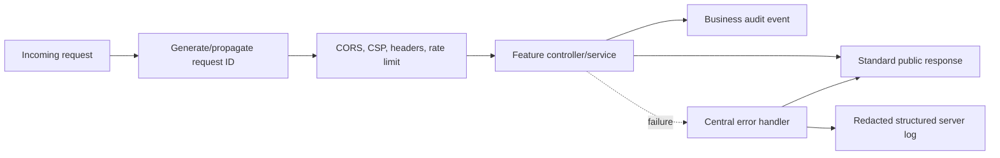

# Phase 7: Quality Baseline and Hardening

## Purpose

Document the implemented cross-cutting quality behavior that protects product
features without changing their business contracts.

## Status

Completed

## Business Problem Solved

Phase 7 makes failures predictable, reduces accidental exposure, improves
operational diagnosis, protects mutation paths from abuse, removes redundant
analytics reads, and establishes repeatable repository-wide quality gates.

## Developer and Operator Workflow

## UI Overview

Phase 7 did not redesign product pages. Frontend changes consolidated
server-side request parsing, cookie forwarding, timeouts, safe API errors, and
session-service failure handling. Existing pages retain loading, empty, error,
not-found, redirect, and mutation feedback behavior.

## Backend Modules Involved

- `errors/` and `http/` for JSON-safe public contracts.
- Request-context and error-handler plugins.
- Helmet/CSP, CORS, and rate-limit plugins.
- Authentication/session error separation.
- Structured Pino logging and audit logger.
- Runtime resource ownership and graceful shutdown.
- Consolidated analytics repository/service paths.

## Database Entities Involved

No Phase 7 database migration was required. Existing repositories and
PostgreSQL integration tests were strengthened. Audit events are structured
logs, not database rows.

## API Endpoints Involved

All application endpoints benefit from the standard response/error,
request-ID, security, rate-limit, and logging behavior. `/health`, `/ready`,
Swagger, diagnostics, and Better Auth retain their intentional boundaries.

## Validation

The quality workflow includes repository formatting, ESLint, TypeScript,
backend/frontend tests, PostgreSQL integration tests, production builds, Docker
Compose validation, targeted security/logging/shutdown tests, and
`git diff --check`.

## Permissions and Security

- Authenticated and unauthenticated session states are distinct from dependency
  failure.
- CSP and other Helmet headers are environment-aware.
- CORS uses explicit credentialed origins.
- General and mutation rate limits return stable 429 errors.
- Production configuration fails fast for unsafe secrets, origins,
  authentication URLs, diagnostics, and Web Push settings.
- Logs redact credentials, cookies, tokens, secrets, and sensitive endpoint/key
  material.

## Edge Cases

- Error details are converted to JSON-safe values.
- Concurrent push-subscription registration resolves predictably.
- Invalid request IDs are replaced rather than propagated.
- Unexpected errors expose a generic public 500 but retain server-side
  diagnostics.
- Shutdown runs once, closes owned resources, and forces failure after its
  deadline.
- The analytics dashboard preserves all existing metric contracts while
  sharing source queries.

## Current Limitations

The current quality baseline still identifies:

- No browser E2E, automated accessibility, or coverage-threshold platform.
- Upstream transitive dependency advisories awaiting compatible releases.
- No external logging/monitoring platform or distributed tracing.
- In-memory/IP-local rate limiting rather than distributed enforcement.
- No production latency budgets or representative load suite.
- Development-only Compose topology and no production image smoke workflow.
- No backup/recovery or deployment automation.

## Future Improvements

The quality baseline explicitly defers deployment, backups, external
monitoring, distributed rate limiting, browser E2E/accessibility infrastructure,
production performance budgets, and upstream-dependent advisory resolution to
later work.

## Related Documentation

- [Quality Baseline](../quality-baseline.md)
- [Backend Architecture](../01-design/backend-architecture.md)
- [API Design](../01-design/api-design.md)
- [Development Workflow](../00-overview/05-development-workflow.md)
