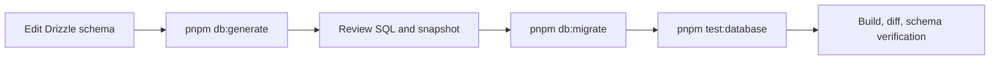

# Database Migrations

## Purpose

Document schema generation, migration review/application, seed behavior,
verification, and recovery limitations.

## Status

Completed

## Source of Truth

Drizzle schema definitions live in `backend/src/db/schema/`. The aggregate
export `schema/index.ts` is the input configured by
`backend/drizzle.config.ts`. Generated SQL and snapshot metadata are stored in
`backend/src/db/migrations/`.

See the [Database Schema Reference](../05-reference/database-schema.md) for the
implemented model.

## Prerequisites

- A valid `DATABASE_URL` using `postgresql://` or `postgres://`.
- PostgreSQL reachable from the process running the command.
- Workspace dependencies installed.
- Existing committed migrations applied before generating a new change.

Host commands use `localhost`; commands inside Compose use `postgres`.

## Migration Workflow



### Generate

```bash
pnpm db:generate
```

This runs Drizzle Kit in strict/verbose PostgreSQL mode with snake-case casing.
Review every generated SQL statement and metadata change. A schema edit without
a reviewed migration is incomplete.

### Apply

```bash
pnpm db:migrate
```

The TypeScript migration runner applies pending files from
`src/db/migrations`, reports success/failure, sets a failing exit code on error,
and closes the PostgreSQL client.

### Verify

```bash
pnpm test:database
pnpm db:generate
git diff --check
```

After an intentional migration, a subsequent generation should not reveal an
unrepresented schema change. Inspect generated output rather than accepting it
blindly.

## `db:push`

```bash
pnpm db:push
```

This directly synchronizes schema for local development/verification. It is not
the production migration mechanism and must not replace a committed migration.

## Drizzle Studio

```bash
pnpm db:studio
```

Studio uses the same `DATABASE_URL` and schema configuration. Treat displayed
authentication tokens, Web Push material, and user data as sensitive.

## Better Auth Schema

Better Auth owns `user`, `session`, `account`, and `verification`. After an
intentional Better Auth version/configuration change:

```bash
pnpm auth:schema
pnpm db:generate
```

Review the regenerated TypeScript schema before generating/reviewing the SQL.
Do not manually recreate Better Auth tables.

## Seed Strategy

```bash
pnpm db:seed
```

The current seed verifies connectivity and inserts no rows. It always closes
the database client. There is no development or production business seed.

PostgreSQL integration tests do not use the seed command. They create a unique
temporary database, apply committed migrations, create per-test fixtures, and
drop the database afterward.

## Forward-Only Strategy

The repository contains forward migrations only. There are no down migrations
or rollback scripts.

If an unapplied migration is wrong, correct it before review. If a migration
has been applied to a shared environment, create another reviewed forward
migration. Data restoration and deployment rollback procedures are not
implemented in this repository.

## Transaction Strategy

Drizzle's migration runner controls migration application. Feature repositories
use transactions for dependent multi-row operations such as habit/schedule
creation and replacement and push-subscription reconciliation. Schema
migrations should preserve constraints and data explicitly during transformations.

## Common Mistakes

- Generating against an out-of-date database.
- Running host commands with the Compose-only hostname `postgres`.
- Committing a schema edit without its migration or migration metadata.
- Using `db:push` in place of reviewed migrations.
- Editing generated snapshot JSON manually.
- Adding application-owned replacements for Better Auth tables.
- Expecting `db:seed` to create demo users or feature data.
- Assuming a rollback command exists.

## Recovery and Troubleshooting

- Configuration error: validate `DATABASE_URL` protocol and reachability.
- Connection refused: start PostgreSQL and verify host/port.
- Migration failure: read the named SQL statement, preserve the failing
  database for diagnosis, and correct through a reviewed forward change.
- Integration database creation failure: confirm the test role can create/drop
  databases and `DATABASE_ADMIN_URL` targets an administrative database.
- Unexpected generated migration: compare schema exports, migration snapshots,
  and the current database before accepting it.

## Useful Commands

| Command              | Purpose                                   |
| -------------------- | ----------------------------------------- |
| `pnpm db:generate`   | Generate SQL/snapshot changes             |
| `pnpm db:migrate`    | Apply committed migrations                |
| `pnpm db:push`       | Direct local schema synchronization       |
| `pnpm db:studio`     | Open Drizzle Studio                       |
| `pnpm db:seed`       | Verify seed connectivity                  |
| `pnpm auth:schema`   | Regenerate Better Auth TypeScript schema  |
| `pnpm test:database` | Run isolated PostgreSQL integration tests |

## Related Documentation

- [Database Design](../01-design/database-design.md)
- [Database Schema Reference](../05-reference/database-schema.md)
- [Testing](./testing.md)
- [Docker Development](./docker.md)
