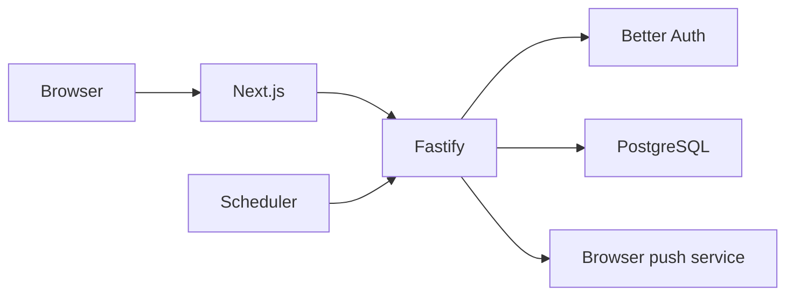

# Debugging and Troubleshooting

## Purpose

Provide safe, repeatable techniques for diagnosing frontend, backend, database,
Docker, authentication, date, reminder, and Web Push behavior.

## Status

Completed

## Start with the Boundary

Identify which boundary is failing before changing code:



Check the closest observable contract first: page state/browser network,
Fastify response/request ID, structured logs, readiness, then database rows or
constraints.

## Frontend Debugging

1. Confirm `NEXT_PUBLIC_API_URL` and `NEXT_PUBLIC_AUTH_URL` are absolute and
   browser-reachable.
2. For Server Component failures, confirm `INTERNAL_API_URL` reaches Fastify
   from the frontend process.
3. Inspect browser Network for status, safe response envelope, and
   `x-request-id`.
4. Check console output for hydration or client exceptions.
5. Reproduce direct URL query state after refresh.
6. Run the focused frontend test and `next build`.

The frontend server request utility has a ten-second timeout and maps timeout,
unavailable, invalid-envelope, and API failures to typed errors. Axios
mutations use the same timeout and normalize errors.

Do not add ad hoc Axios instances or expose raw backend errors as a debugging
shortcut.

## Backend Debugging

Start with:

```bash
pnpm --filter @trackly/backend dev
```

Then query:

```bash
curl http://localhost:4000/health
curl http://localhost:4000/ready
```

When Swagger is enabled, inspect `/docs` for registered schemas. Use
`x-request-id` to correlate a response with Pino completion, error, and audit
events.

Development logs use `pino-pretty`. Non-development logs are structured JSON.
Request completion logs include method, path, status, duration, request ID, and
authenticated user ID when resolved.

Expected application errors do not always produce error-level logs. Unexpected
and server-side application failures include sanitized internal context.

## Logging Safety

Logger redaction covers:

- Authorization and cookie headers.
- Set-Cookie responses.
- Password, token, secret, and private-key fields.
- Push endpoint, `p256dh`, and auth material.

Full request bodies are not logged by default. Do not bypass redaction with
temporary `console.log` statements or paste secrets into issue reports.

Migration and seed command-line scripts use `console.info/error`; their output
should still be treated as potentially sensitive when failures contain driver
causes.

## Database Debugging

Validate configuration and connectivity:

```bash
pnpm db:migrate
pnpm db:seed
pnpm db:studio
pnpm test:database
```

`db:seed` is a safe connectivity check because it inserts no data.
`/ready` verifies the application connection with `SELECT 1`.

When a repository operation fails:

- Confirm migrations `0000`–`0007` are applied.
- Identify PostgreSQL codes such as foreign-key `23503` or unique `23505`.
- Check ownership and `deleted_at IS NULL` predicates.
- Check partial unique indexes for categories, reminders, and push endpoints.
- Check calendar `date` values separately from timestamp values.

Do not “fix” a constraint failure by deleting migration history or using
`db:push` against shared/production data.

## Authentication Debugging

- Confirm browser requests include cookies.
- Confirm CORS and Better Auth trusted origins both include the frontend origin.
- Confirm `BETTER_AUTH_URL` matches the backend origin.
- Use `/api/auth/get-session` for the native session and `/api/v1/auth/me` for
  the Trackly envelope.
- Treat 401 as no session; treat 503 as a session dependency failure.
- Confirm production uses HTTPS and secure-cookie-compatible topology.

If a protected Server Component redirects unexpectedly, inspect its forwarded
cookie and internal backend URL before changing authorization logic.

## Date and Timezone Debugging

Trackly distinguishes logical dates from instants:

- Logical dates are `YYYY-MM-DD`.
- “Today” comes from `user_preferences.timezone`.
- Reminder times are user-local `HH:mm`.
- Instants use timezone-aware timestamps in application tables.

Use explicit dates and ISO instants in tests. A warning about an invalid stored
timezone means the service used UTC fallback. Do not substitute the host or
container timezone.

## Reminder and Notification Debugging

The scheduler is separate from the API process. For one safe evaluation:

```bash
pnpm --filter @trackly/backend scheduler:reminders:once
```

Check in order:

1. Reminder enabled and not deleted.
2. Habit active, not deleted, within date range, and scheduled for local date.
3. User timezone and local time match.
4. Unique occurrence was claimed.
5. Provider is explicitly registered.
6. Active Web Push subscriptions exist.
7. Delivery/subscription lifecycle metadata changed as expected.

Do not send real Web Push during automated diagnosis. Use mocked provider calls
or the noop provider.

## Browser Web Push Debugging

- The page must run on HTTPS or localhost.
- `NEXT_PUBLIC_WEB_PUSH_VAPID_PUBLIC_KEY` must be present.
- Permission is requested only from the Enable action.
- A denied permission must be reset manually in browser/site settings.
- Confirm `/sw.js` registered at the expected scope.
- Confirm the PushManager subscription is synchronized through the
  authenticated API.
- Never print endpoint or encryption keys.

The settings status describes only the current browser/device.

## Docker Debugging

```bash
docker compose config
docker compose ps
docker compose logs --follow postgres
docker compose logs --follow backend
docker compose logs --follow frontend
```

Common address error:

| Caller                             | Correct default database/API host |
| ---------------------------------- | --------------------------------- |
| Host backend/Drizzle command       | `localhost`                       |
| Compose backend to PostgreSQL      | `postgres`                        |
| Browser to backend                 | `localhost:4000`                  |
| Compose frontend server to backend | `backend:4000`                    |

See [Docker Development](./docker.md) for volume and rebuild guidance.

## Build and Type Failures

- Run `pnpm format:check`, then `pnpm lint`, then `pnpm typecheck` to narrow the
  failure before a full build.
- Backend build emits from `src/` only; tests are type-checked but not emitted.
- Frontend Next build generates types under `.next`; do not commit or manually
  repair generated output.
- Check exact optional properties when backend code passes explicit
  `undefined`.
- Use type-only imports where backend ESLint requires them.

## Common Developer Mistakes

- Diagnosing `/health` as proof that PostgreSQL is ready.
- Treating an unauthenticated session and auth-service failure as identical.
- Testing a container-only URL in the browser.
- Logging raw request bodies, session cookies, or push material.
- Querying soft-deleted rows without explicit lifecycle intent.
- Omitting `user_id` from repository predicates.
- Treating a date-only value as UTC midnight.
- Running multiple continuous scheduler processes.
- Assuming Tasks has a public CRUD API.
- Modifying application code before reproducing the failing contract.

## Escalation Data

When reporting a defect, include:

- Reproduction steps and affected URL/command.
- Expected and actual behavior.
- HTTP status, stable error code, and request ID.
- Sanitized structured log event.
- Runtime mode and host-versus-Compose topology.
- Relevant logical date/timezone.
- Focused test result.

Never include secrets, cookies, tokens, complete push endpoints, private keys,
or production user data.

## Related Documentation

- [Local Development](./local-development.md)
- [Environment Variables](./environment-variables.md)
- [Testing](./testing.md)
- [Database Migrations](./database-migrations.md)
- [API Reference](../05-reference/api-reference.md)
