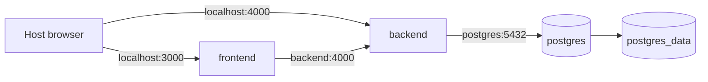

# Docker Development

## Purpose

Document the supported Docker Compose workflow, images, persistent state, and
common container problems.

## Status

Completed

## Topology



All services use the `trackly_internal` bridge network.

| Service    | Development target                      | Health dependency                                 |
| ---------- | --------------------------------------- | ------------------------------------------------- |
| `postgres` | `postgres:17-alpine`                    | `pg_isready`                                      |
| `backend`  | `backend/Dockerfile` development stage  | Healthy PostgreSQL; exposes `/ready` health check |
| `frontend` | `frontend/Dockerfile` development stage | Healthy backend                                   |

See [Docker Architecture](../01-design/docker-architecture.md) for image-stage
details.

## Starting the Stack

```bash
docker compose up --build
```

Detached mode:

```bash
docker compose up --build --detach
```

Start selected services:

```bash
docker compose up postgres
docker compose up postgres backend
```

The services run `pnpm install --frozen-lockfile` before their development
commands. First startup and dependency changes can therefore take longer.

## Startup Order

1. PostgreSQL starts and passes `pg_isready`.
2. Backend installs dependencies, starts Fastify, verifies the database, and
   passes `/ready`.
3. Frontend installs dependencies and starts Next.js.

`depends_on` uses health conditions rather than process-start order.

## Ports and URLs

| Component  | Default host URL/port                     |
| ---------- | ----------------------------------------- |
| Frontend   | `http://localhost:3000`                   |
| Backend    | `http://localhost:4000`                   |
| Health     | `http://localhost:4000/health`            |
| Readiness  | `http://localhost:4000/ready`             |
| Swagger    | `http://localhost:4000/docs` when enabled |
| PostgreSQL | `localhost:5432`                          |

Browser variables must use host-reachable URLs. Server-side frontend requests
use `INTERNAL_API_URL=http://backend:4000`.

## Volumes and Bind Mounts

| Mount                      | Purpose                                  |
| -------------------------- | ---------------------------------------- |
| `postgres_data`            | Persistent PostgreSQL data               |
| `backend_node_modules`     | Container-owned backend dependencies     |
| `frontend_node_modules`    | Container-owned frontend dependencies    |
| `frontend_next`            | Container-owned Next.js build/cache data |
| `./backend:/app/backend`   | Live backend source                      |
| `./frontend:/app/frontend` | Live frontend source                     |

Normal shutdown preserves all named volumes:

```bash
docker compose down
```

Do not remove `postgres_data` unless local data loss is intentional.

## Inspecting the Stack

```bash
docker compose config
docker compose config --quiet
docker compose ps
docker compose logs postgres
docker compose logs backend
docker compose logs frontend
docker compose logs --follow backend
```

Run a command inside a running service:

```bash
docker compose exec backend pnpm db:migrate
docker compose exec backend pnpm db:seed
```

The repository's root database scripts are designed for host execution; inside
the backend container use its package scripts as shown.

## Rebuilding

Rebuild after Dockerfile or dependency-manifest changes:

```bash
docker compose build
docker compose up
```

Or rebuild one service:

```bash
docker compose build backend
docker compose up backend
```

Source changes normally do not require rebuilding because source is
bind-mounted.

## Development Versus Production Images

Each application Dockerfile has dependency, development, builder, and
production stages. Production stages run as non-root users. The frontend copies
standalone Next.js output; the backend copies compiled `dist` output.

The root Compose file explicitly selects development targets. It does not
validate a production topology, reverse proxy, TLS, external scheduler, backup,
or monitoring setup.

## Scheduler

Compose does not declare a scheduler service. Run the scheduler from the host
or an explicit backend command when testing reminders:

```bash
pnpm --filter @trackly/backend scheduler:reminders:once
```

Avoid accidentally running multiple continuous schedulers against the same
development database.

## Troubleshooting

### Backend cannot connect to PostgreSQL

- Check `docker compose ps`.
- Inspect PostgreSQL logs.
- Inside Compose use hostname `postgres`, not `localhost`.
- From the host use `localhost`, not `postgres`.
- Confirm the database, role, password, and published port agree.

### Frontend cannot reach backend

- Browser URL: `NEXT_PUBLIC_API_URL=http://localhost:4000`.
- Server URL inside Compose: `INTERNAL_API_URL=http://backend:4000`.
- Confirm backend `/ready` is healthy before debugging the frontend.
- Check `CORS_ORIGINS` and `BETTER_AUTH_TRUSTED_ORIGINS`.

### Dependency state appears stale

Rebuild the affected image. If a dependency volume is deliberately replaced,
target only that named volume and preserve `postgres_data`.

### Port is already allocated

Change `POSTGRES_PORT`, `BACKEND_PORT`, or `FRONTEND_PORT` in `.env`, then
validate the resolved Compose configuration.

### Swagger or diagnostics return 404

Check `EXPOSE_API_DOCS` and `ENABLE_DIAGNOSTICS`. Production defaults restrict
them.

## Useful Commands

| Command                                       | Purpose                               |
| --------------------------------------------- | ------------------------------------- |
| `docker compose up --build`                   | Build/start full development stack    |
| `docker compose down`                         | Stop services, preserve named volumes |
| `docker compose ps`                           | Inspect state and health              |
| `docker compose logs --follow <service>`      | Follow logs                           |
| `docker compose config --quiet`               | Validate interpolation/configuration  |
| `docker compose exec backend pnpm db:migrate` | Apply migrations inside backend       |

## Related Documentation

- [Environment Variables](./environment-variables.md)
- [Local Development](./local-development.md)
- [Database Migrations](./database-migrations.md)
- [Docker Architecture](../01-design/docker-architecture.md)
