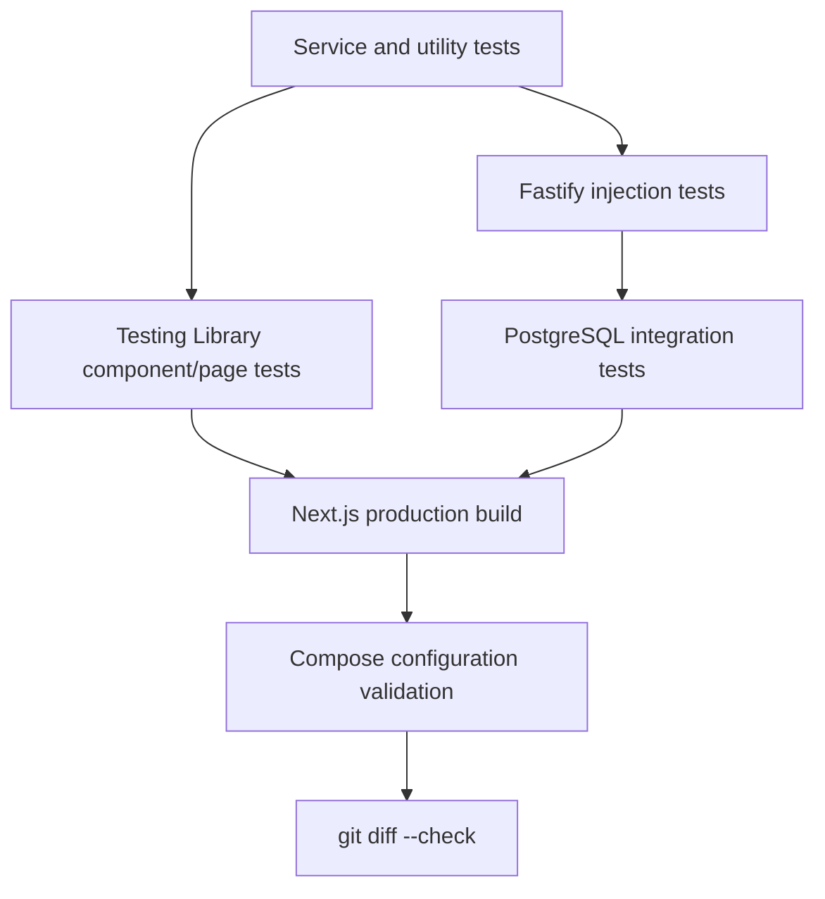

# Testing and Validation

## Purpose

Describe Trackly's implemented test layers, commands, environments, and
pre-review validation sequence.

## Status

Completed

## Strategy

Trackly tests behavior at three primary levels:

1. Backend unit and Fastify injection tests.
2. Frontend service/component/page tests in jsdom.
3. PostgreSQL integration tests against an isolated migrated database.

Production builds, lint, strict TypeScript, formatting, Docker configuration,
and whitespace checks supplement behavioral tests.



## Vitest

Both packages use Vitest.

### Backend

Backend tests use the Node environment, restore mocks after tests, and include
`tests/**/*.test.ts` under the backend package. Tests cover services,
repositories with mocked dependencies, route injection, authentication,
security, logging, scheduling, notification providers, errors, and shutdown.

```bash
pnpm test:backend
pnpm --filter @trackly/backend test:watch
```

The backend config defines text, JSON, and HTML coverage reporters, but no root
coverage script or minimum threshold is configured.

### Frontend

Frontend tests use jsdom, Testing Library, jest-dom matchers, user-event, a
shared setup file, and restored mocks. Test environment scripts inject local
public API/auth URLs.

```bash
pnpm test:frontend
pnpm --filter @trackly/frontend test:watch
```

The suite covers forms, loading/error/empty states, authenticated service
handling, analytics presentation, habit/goal mutations, notification browser
APIs, and service-worker logic. Browser APIs are mocked; tests do not contact
real push endpoints.

## Fastify Injection

Backend route tests call the built Fastify application through injection
instead of listening on a port. `buildApp()` permits a test logger and injected
database connection check. Injection exercises routing, hooks, validation,
authentication behavior, errors, headers, rate limits, and serialization while
remaining deterministic.

## PostgreSQL Integration Tests

```bash
pnpm test:database
```

The database Vitest configuration:

- Includes `tests/database/**/*.integration.ts`.
- Disables file parallelism.
- Uses a 15-second test timeout and 30-second hook timeout.
- Reads `DATABASE_ADMIN_URL` and creates a uniquely named test database.
- Applies all committed migrations.
- Exercises real schemas, constraints, indexes, repositories, transactions,
  ownership isolation, analytics, reminders, notifications, and concurrency.
- Drops the temporary database after the suite.

The default script expects PostgreSQL on `localhost:5432` with the checked-in
local credentials. PostgreSQL must be running, and the role must be able to
create/drop test databases.

## Focused Test Selection

Vitest accepts additional filters through package commands. From a package:

```bash
pnpm --filter @trackly/backend vitest run path/to/file.test.ts
pnpm --filter @trackly/frontend vitest run tests/path.test.tsx
```

Use focused tests during implementation, then run the package and release
sequences before review.

## Linting

```bash
pnpm lint
```

Both package scripts use `--max-warnings=0`. A warning therefore fails the
command.

## Formatting

```bash
pnpm format:check
pnpm format
```

Prettier applies repository rules and Tailwind class ordering.
`frontend/next-env.d.ts`, generated/build/dependency paths, coverage, and the
lockfile are ignored by Prettier.

## Type Checking

```bash
pnpm typecheck
```

Frontend uses strict no-emit TypeScript with Next.js integration. Backend uses
NodeNext, strict mode, unchecked-index protection, exact optional properties,
and no emit for validation.

## Production Builds

```bash
pnpm build
```

This runs `next build` and backend `tsc -p tsconfig.build.json`. Build success
is a separate check from no-emit type checking because Next.js and backend
emit/packaging exercise additional paths.

## Full Validation

```bash
pnpm validate
pnpm test:database
docker compose config --quiet
git diff --check
```

`pnpm validate` expands to:

1. `pnpm format:check`
2. `pnpm lint`
3. `pnpm typecheck`
4. `pnpm test:backend`
5. `pnpm test:frontend`
6. `pnpm build`

Database and Docker checks are deliberately separate because they require
external runtime/configuration.

## Security Audit

```bash
pnpm audit:security
```

This audits production dependencies and fails at high severity. Existing
upstream/transitive advisories must be reported accurately rather than hidden
through unrelated upgrades.

## What Is Not Automated

- No browser E2E framework.
- No automated axe/accessibility suite.
- No repository-wide coverage threshold.
- No production image smoke test.
- No CI workflow checked into the repository.
- No performance/load-test command or latency budget.

Manual browser validation remains appropriate for responsive layout, keyboard
focus, themes, browser history, hydration/console behavior, and real
frontend/backend integration.

## Writing Tests

- Place behavior tests with the package's established pattern.
- Prefer Fastify injection for routes.
- Mock external Web Push calls and browser push APIs.
- Use real PostgreSQL only in the database integration suite.
- Assert ownership isolation and sanitized errors for user-owned behavior.
- Avoid low-value snapshots; test visible outcomes and domain rules.
- Keep dates/instants explicit and deterministic.
- Clean up fixtures and never depend on execution order.

## Common Failures

- `test:database` cannot connect: start PostgreSQL and check admin credentials.
- Frontend environment validation fails: ensure test scripts or local env
  provide both public URLs.
- Snapshot/type output changes after Next build: do not hand-edit generated
  Next files.
- Rate-limit tests affect later requests: isolate app instances and request
  keys.
- Date tests differ by machine timezone: pass explicit instants and expected
  user timezones.

## Related Documentation

- [Local Development](./local-development.md)
- [Database Migrations](./database-migrations.md)
- [Debugging](./debugging.md)
- [Quality Features](../02-features/phase-7-quality.md)

## Documentation Screenshot Workflow

Publication screenshots use a dedicated Playwright configuration and
deterministic `@trackly.local` account. With the development stack running and
Chromium installed, generate the complete desktop/mobile inventory from the
repository root:

```bash
pnpm exec playwright install chromium
pnpm docs:screenshots
```

The workflow validates frontend, backend health/readiness, and PostgreSQL
availability before seeding only fixed records owned by the documentation
account. It does not reset the developer database. Configuration, database
safety, expected images, and troubleshooting are documented in the
[screenshot asset guide](../assets/README.md).
