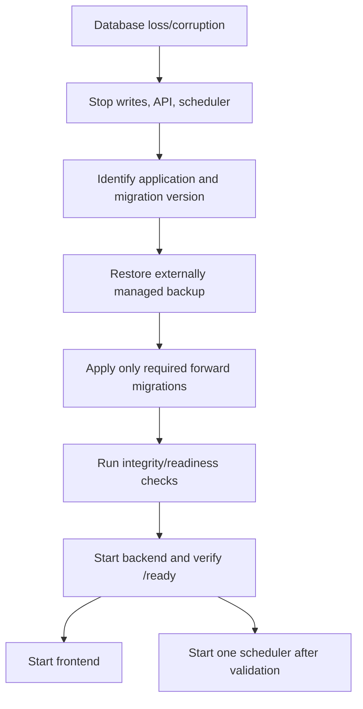

# Backup and Recovery

## Purpose

Record Trackly's current persistence boundary, the absence of automated backup
implementation, and the minimum recovery considerations imposed by the data
model and forward-only migrations.

## Status

Completed

## Current Backup Strategy

Trackly does not implement automated database backups, retention, encryption,
off-site storage, point-in-time recovery, or restore verification.

Development Docker Compose stores PostgreSQL data in the `postgres_data` named
volume. A persistent volume is not a backup: deletion, corruption, host loss,
or an incorrect migration can still destroy or invalidate it.

Production backup tooling must be supplied by the selected PostgreSQL hosting
and deployment environment.

## Data Requiring Protection

PostgreSQL is the only durable application data store. It contains:

- Better Auth users, account credentials, sessions, and verification data.
- Preferences.
- Categories, habits, schedules, and check-ins.
- Tasks.
- Goals and goal steps.
- Reminders and durable notification-delivery history.
- Browser Web Push endpoints and encryption key material.

The frontend and backend containers are replaceable build artifacts. No
user-upload storage is implemented.

The following secrets are configuration, not database records, and require a
separate protected recovery process:

- Better Auth secret.
- VAPID private/public key pair and subject.
- Database credentials.

Restoring a database without the matching Better Auth/VAPID configuration may
invalidate sessions or prevent delivery to existing subscriptions.

## Development Data Preservation

Normal shutdown preserves the named database volume:

```bash
docker compose down
```

Do not use volume-removal options when local data must be retained. The
repository does not provide a script to export or import the volume.

## Production Backup Requirements

Before production, the operator must establish an external procedure that
defines:

- Backup method supported by the PostgreSQL platform.
- Schedule and retention.
- Encryption in transit and at rest.
- Access controls and auditability.
- Storage in a failure domain separate from the primary database.
- Point-in-time objectives if supported.
- Routine restore verification.
- Ownership and escalation.

These are requirements/recommendations, not implemented Trackly components.

## Recovery Strategy

No automated recovery workflow exists. Recovery must use the chosen
PostgreSQL platform's verified restore mechanism.

The logical sequence is:



Do not run the scheduler while restoring because it can create delivery records
or send notifications against incomplete state.

## Restore Verification

At minimum, verify:

- PostgreSQL accepts connections.
- All committed migrations expected by the application are present.
- Foreign keys, enums, indexes, and unique constraints exist.
- Better Auth can resolve a controlled test session.
- Ownership-scoped API reads return only expected data.
- `/ready` returns 200.
- Notification delivery occurrence uniqueness remains intact.
- Push-subscription records remain protected and are not printed.
- Scheduler one-shot behavior is tested safely before recurring mode resumes.

The integration test suite creates a disposable database and verifies schema
behavior, but it is not a production backup restoration test.

## Upgrade Protection

Before applying schema changes:

1. Confirm a recent external backup exists.
2. Confirm the restore procedure has been tested.
3. Record current application image and migration state.
4. Stop or coordinate scheduler execution.
5. Apply reviewed forward migrations.
6. Start the matching application version and verify readiness.

## Rollback Considerations

Trackly migrations are forward-only and have no down scripts. Reverting an
application image is safe only when it remains compatible with the migrated
schema. Otherwise recovery requires:

- A new forward corrective migration, or
- An externally managed database restore and compatible application image.

Never emulate rollback by deleting migration metadata, removing migration
files, running `db:push`, or manually dropping production objects without a
reviewed recovery plan.

## Incident Response Recommendations

If data integrity is suspected:

1. Stop incoming mutations and the scheduler.
2. Preserve database/log evidence.
3. Record timestamps, request IDs, application version, and last applied
   migration.
4. Determine whether the incident is data loss, unauthorized access,
   configuration mismatch, or application defect.
5. Rotate exposed secrets separately from database recovery.
6. Restore into an isolated environment first.
7. Verify ownership isolation and sensitive fields before reopening traffic.
8. Document the recovery result and update the external runbook.

Do not include session tokens, account credentials, verification values,
database URLs, or push key material in incident tickets.

## Known Limitations

- No backup or restore scripts.
- No retention or recovery objectives.
- No point-in-time recovery configuration.
- No external secret-store backup/rotation integration.
- No automated restore drill.
- No production storage topology.
- No database rollback migrations.

## Related Documentation

- [Production Deployment](./production.md)
- [Database Migrations](../03-development/database-migrations.md)
- [Database Schema](../05-reference/database-schema.md)
- [Monitoring and Incident Response](./monitoring.md)
