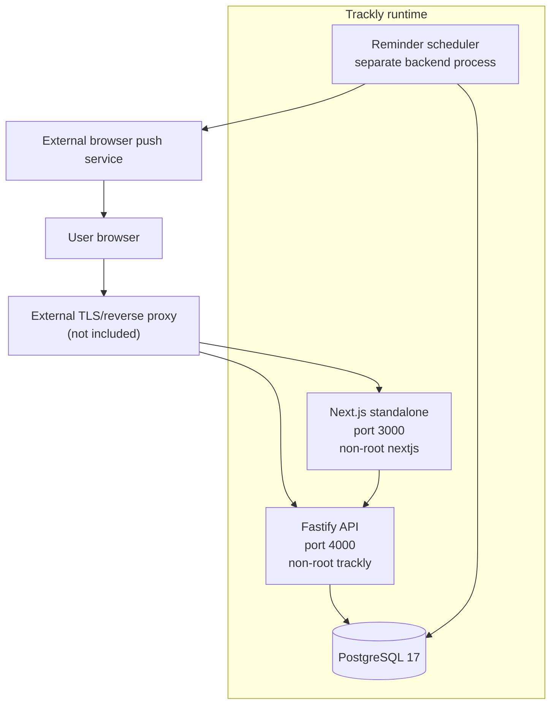
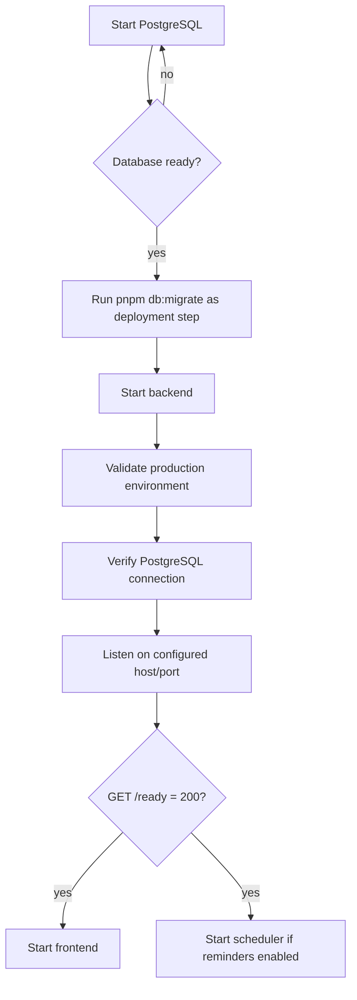
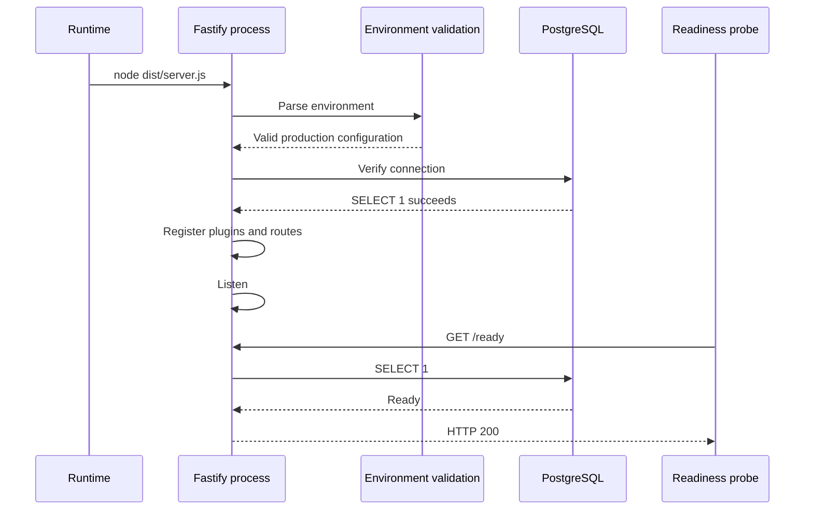

# Trackly Production Deployment

## Purpose

Document the production-capable artifacts and operational requirements that
exist in the Trackly repository, while distinguishing them from infrastructure
that has not been implemented.

## Status

Completed

## Deployment Overview

Trackly consists of:

- A Next.js standalone frontend process.
- A compiled Fastify backend process.
- PostgreSQL 17.
- An optional separate reminder scheduler process using the backend build.
- An external browser push service used only when Web Push is configured.

The repository contains production stages for both application images, strict
production environment validation, liveness/readiness endpoints, structured
logs, request correlation, graceful shutdown, migrations, and security headers.

It does not contain a production Compose file, orchestrator manifests, reverse
proxy, TLS automation, backup jobs, external monitoring, CI/CD, or deployment
scripts. Those must be supplied and validated by the target environment.

## Deployment Topology



The proxy box is an operational prerequisite, not a checked-in component. See
[Reverse Proxy Requirements](./reverse-proxy.md).

## Development Deployment

The root `docker-compose.yml` is the supported development deployment. It
starts PostgreSQL, backend, and frontend development targets on an internal
bridge network with source bind mounts and persistent PostgreSQL data.

```bash
docker compose up --build
```

It does not run production image stages or the scheduler. Detailed development
behavior is in [Docker Development](../03-development/docker.md).

## Production Images

Both Dockerfiles use multi-stage Node.js 24 Alpine builds.

### Frontend

The builder runs `pnpm build`. The production image:

- Sets `NODE_ENV=production`.
- Copies `public`, Next.js standalone output, and static assets.
- Runs as the non-root `nextjs` user.
- Exposes port 3000.
- Starts `node frontend/server.js`.

### Backend

The builder runs TypeScript compilation. The production image:

- Sets `NODE_ENV=production`.
- Copies `dist`, backend dependencies, and the package manifest.
- Runs as the non-root `trackly` user.
- Exposes port 4000.
- Starts `node dist/server.js`.

The backend image also contains the compiled scheduler entry point, invoked
with `node dist/scheduler/reminder-scheduler.main.js`.

## Container and Application Startup



Production migrations are not run automatically by either application image.
The deployment must execute the migration command before exposing the new
application version. The current backend production image does not copy
`src/db/migrations`, while the runner resolves that source path, so migrations
must run from a release workspace or another purpose-built environment that
contains the checked-in migration files.

## Application Startup Sequence



Invalid environment or database connectivity prevents startup.

## Container Dependencies

The checked-in development Compose uses health-conditioned dependencies:
PostgreSQL → backend → frontend. A production platform should preserve the same
logical ordering but must not rely only on process start. The frontend's server
requests require a ready backend, and both backend/scheduler require the
migrated database.

## Health and Readiness

- `GET /health` proves the Fastify process is alive and performs no database
  query.
- `GET /ready` executes the database connection check and returns 503 when
  unavailable.

Use liveness and readiness separately. Do not use `/health` to route traffic
when PostgreSQL is unavailable. The current frontend has no dedicated health
endpoint configured in Compose.

## Scheduler Deployment

The reminder scheduler must run as a separate process:

```bash
node dist/scheduler/reminder-scheduler.main.js
node dist/scheduler/reminder-scheduler.main.js --once
```

Recurring mode aligns ticks to minute boundaries. If a previous tick is still
running, the next is skipped. Eligible reminders are processed sequentially;
individual failures do not stop later reminders. Durable occurrence uniqueness
prevents duplicate sends.

The scheduler:

- Verifies PostgreSQL before starting.
- Uses Web Push when all VAPID values exist; otherwise uses `noop` outside
  production.
- Handles `SIGINT` and `SIGTERM`, stops its loop, waits for the active tick,
  closes PostgreSQL, and flushes logs.

Production environment validation requires VAPID configuration, so production
scheduler composition selects `web_push`. The repository does not define
replica leadership or distributed locking; operate one recurring scheduler
unless an explicitly validated ownership model is added.

## Environment Variables and Secrets

Use [Environment Variables](../03-development/environment-variables.md) as the
complete contract. Production requires:

- A PostgreSQL URL.
- HTTPS Better Auth URL and HTTPS CORS/trusted origins.
- A non-placeholder Better Auth secret of at least 32 characters.
- Email verification enabled.
- VAPID public key, private key, and `mailto:`/HTTPS subject.
- Diagnostics disabled.

Secrets must be injected by the deployment environment and never baked into
images, committed files, command output, or `NEXT_PUBLIC_*` variables. Only the
VAPID public key belongs in frontend public configuration.

No secret manager integration is implemented. Selection, rotation, audit, and
access control for a secret store are deployment responsibilities.

## Networking

The applications bind to configurable ports; the backend defaults to
`0.0.0.0:4000` and frontend to port 3000. Browser-visible API/auth URLs and the
server-only `INTERNAL_API_URL` may differ.

Credentialed CORS uses an explicit origin allowlist. Better Auth maintains a
separate trusted-origin allowlist. `TRUST_PROXY` defaults to false and should be
enabled only for a known proxy topology.

PostgreSQL does not need public exposure for application operation. The
development Compose publishes it for local tools; production exposure policy is
not defined by the repository.

## Volumes

Development Compose persists PostgreSQL in `postgres_data` and uses separate
dependency/build volumes. Production storage definitions are not included.
PostgreSQL must use durable storage appropriate to the deployment platform.

No application upload volume is required. The frontend serves checked-in
`public` assets and compiled Next.js static output from its image.

## Database Startup and Migrations

Run committed forward migrations before the new application serves traffic:

```bash
pnpm db:migrate
```

The migration runner closes its database connection and returns a non-zero exit
code on failure. `db:push` is for local synchronization and is not a production
migration method. The checked-in backend production image is not currently a
self-contained migration image. There are no down migrations; see
[Database Migrations](../03-development/database-migrations.md).

## Static Assets

Next.js standalone production output serves:

- Assets copied from `frontend/public`, including `/sw.js`.
- Compiled `.next/static` assets.
- Server-rendered application routes.

No CDN or external object-storage integration is configured. Cache policy at a
proxy/CDN must preserve user-specific, no-store server responses.

## Logging and Request IDs

Production uses machine-readable Pino JSON at `LOG_LEVEL`. Each request:

- Accepts a valid `x-request-id` or receives a generated UUID.
- Returns the ID in the response.
- Logs method, path without query, status, duration, and user ID when known.

Unexpected errors are logged with sanitized name/message/stack and return a
generic public error. Audit events record actor, action, resource, outcome,
timestamp, and request ID.

Logger redaction covers authorization/cookie headers, passwords, tokens,
secrets, private keys, Web Push endpoints, and subscription keys. No external
log collector or retention policy exists.

## Security Considerations

- Both production images run as non-root users.
- Frontend and backend emit CSP and related security headers.
- Production CSP upgrades insecure requests.
- Better Auth uses secure cookies in production.
- Production authentication and allowed origins require HTTPS.
- API mutations and reads are rate-limited; Better Auth has additional limits.
- Swagger defaults off in production; diagnostics must be off.
- VAPID private keys remain backend-only.

The configured API rate limiter is process-local. Multi-replica enforcement is
not coordinated.

## Performance Considerations

- Backend PostgreSQL pool maximum is 20 in production.
- Analytics dashboard shares one source-data snapshot rather than issuing
  overlapping panel queries.
- Scheduler processing is sequential and skips overlapping minute ticks.
- Next.js produces standalone output.
- No production latency budget, autoscaling policy, distributed cache, CDN, or
  load-test profile is implemented.

## Pre-Deployment Checklist

- [ ] Run `pnpm validate`.
- [ ] Run `pnpm test:database` against an isolated PostgreSQL environment.
- [ ] Run `pnpm audit:security` and record unresolved upstream advisories.
- [ ] Build both production image stages.
- [ ] Validate all production environment values without printing secrets.
- [ ] Confirm HTTPS API/auth/frontend origins and cookie topology.
- [ ] Confirm diagnostics and unintended Swagger exposure are disabled.
- [ ] Confirm migrations and database restore plan have been reviewed.
- [ ] Provide a migration runner environment containing
      `backend/src/db/migrations`.
- [ ] Confirm only one recurring scheduler owner.
- [ ] Confirm logging destination, retention, and alert ownership externally.

## Post-Deployment Verification

- [ ] Confirm frontend responds and static assets/service worker load.
- [ ] Confirm backend `/health` and `/ready` return 200.
- [ ] Confirm the applied migration state.
- [ ] Confirm registration/login/session/logout policy.
- [ ] Confirm an authenticated `/api/v1` read and mutation.
- [ ] Confirm CORS rejects an unauthorized origin.
- [ ] Confirm request IDs appear in responses and logs.
- [ ] Confirm Swagger/diagnostic exposure matches policy.
- [ ] Run a safe scheduler one-shot and inspect its structured summary.
- [ ] Verify Web Push only with an explicitly approved test subscription.

## Upgrade Checklist

- [ ] Review application, lockfile, schema, and environment-contract changes.
- [ ] Back up PostgreSQL using the external procedure before schema changes.
- [ ] Apply forward migrations before incompatible application code.
- [ ] Replace backend/frontend images with matching source versions.
- [ ] Restart scheduler from the same backend version.
- [ ] Repeat post-deployment verification.
- [ ] Monitor error, readiness, latency, auth, and scheduler signals.

## Rollback Considerations

Application images can be reverted only when the previous version is compatible
with the migrated schema. The repository has no automated image rollback or
down migrations. Data rollback requires an externally managed, verified
PostgreSQL restore.

Do not attempt rollback with `db:push`, deleted migration files, or destructive
manual SQL. See [Backup and Recovery](./backup.md).

## Known Operational Limitations

- No production orchestrator or Compose topology.
- No reverse proxy/TLS implementation.
- No automated migration job.
- Production backend image is not self-contained for migration execution.
- No backup, retention, or restore automation.
- No external metrics, traces, alerts, or log aggregation.
- No frontend health check.
- No distributed scheduler ownership or rate limiter.
- No production image smoke test or performance budget.
- No CI/CD or release automation.

## Related Documentation

- [Reverse Proxy Requirements](./reverse-proxy.md)
- [Backup and Recovery](./backup.md)
- [Monitoring and Incident Response](./monitoring.md)
- [Docker Architecture](../01-design/docker-architecture.md)
- [Environment Variables](../03-development/environment-variables.md)
