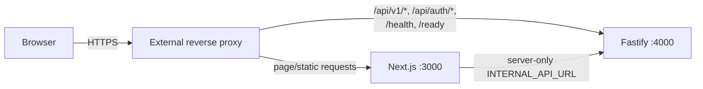

# Reverse Proxy Requirements

## Purpose

Document the requirements a production reverse proxy must satisfy for Trackly's
existing frontend, backend, authentication, security, and Web Push behavior.

## Status

Completed

## Current Implementation Boundary

No reverse proxy configuration is checked into the repository. Trackly does not
select Nginx, Caddy, Traefik, a cloud load balancer, or another proxy.

This document describes requirements imposed by the current application. It is
not a deployable proxy configuration.

## Routing Topology



A deployment may use separate frontend and API origins, as supported by the
environment configuration, or one origin with path routing. The selected
topology must be reflected consistently in browser URLs, CORS, Better Auth,
cookies, and frontend CSP.

## TLS

Production environment validation requires:

- `BETTER_AUTH_URL` to use HTTPS.
- Every CORS origin to use HTTPS.
- Every Better Auth trusted origin to use HTTPS.

The frontend and backend production CSP also upgrade insecure requests. TLS
termination is therefore required externally, but certificate issuance and
renewal are not implemented by Trackly.

Browser Web Push requires a secure context. HTTPS is required outside localhost.

## Required Routes

The proxy must preserve access to the routes selected for the deployment:

| Route                         | Upstream                           |
| ----------------------------- | ---------------------------------- |
| Frontend pages and `/_next/*` | Next.js                            |
| `/sw.js` and public assets    | Next.js                            |
| `/api/v1/*`                   | Fastify                            |
| `/api/auth/*`                 | Fastify/Better Auth                |
| `/health` and `/ready`        | Fastify                            |
| `/docs`                       | Fastify only if explicitly exposed |

The proxy must not send `/api/auth/*` to Next.js; Better Auth is mounted by
Fastify.

## Forwarded Headers and Proxy Trust

Fastify uses `TRUST_PROXY`, which defaults to false. If enabled, the deployment
must trust only its known proxy boundary so request IPs and rate-limit keys
cannot be spoofed.

Preserve:

- `Host`.
- Scheme/forwarded protocol needed to reconstruct HTTPS origin.
- Client IP forwarding appropriate to the chosen trusted-proxy setup.
- `Cookie` and `Set-Cookie`.
- `Origin`.
- `x-request-id`.
- Content type and accepted encodings.

The exact proxy-specific header syntax is outside the repository.

## Request IDs

Trackly accepts incoming IDs matching:

```text
^[A-Za-z0-9][A-Za-z0-9._:-]{0,127}$
```

Invalid or absent values are replaced with a UUID. The proxy may generate an ID
within this format, but must not overwrite a valid application response
`x-request-id`.

## Authentication and Cookies

Better Auth owns cookie issuance. Production uses secure cookies. The proxy
must:

- Preserve `Set-Cookie` unchanged unless cookie rewriting is explicitly tested.
- Forward browser cookies to Fastify.
- Keep frontend/API origin and SameSite/domain behavior compatible.
- Avoid caching authentication responses.
- Avoid logging cookie headers.

For separate frontend/backend domains, verify browser credentialed CORS and
cookie behavior in the actual deployment. Trackly does not provide automatic
cookie-domain rewriting.

## CORS and Trusted Origins

Every browser frontend origin must appear in:

- `CORS_ORIGINS`.
- `BETTER_AUTH_TRUSTED_ORIGINS`.

Do not use `*` with credentials. Fastify rejects unauthorized origins with a
standard 403 error. Requests without Origin remain available for health checks,
server-to-server requests, and CLI tools.

## Security Headers

Next.js and Fastify both set security headers. The proxy should preserve them
and must not weaken:

- Content Security Policy.
- `X-Content-Type-Options`.
- `X-Frame-Options`/frame ancestors.
- Referrer Policy.
- Permissions Policy.

Swagger requires inline script/style allowances only when exposed. Avoid adding
global wildcard source directives.

## Static Assets and Caching

Next.js serves `/_next/static`, `public` assets, and `/sw.js`. A proxy/CDN may
cache immutable hashed assets if configured externally.

Do not cache authenticated pages or `/api/v1` user data. Frontend server
services explicitly use `no-store`, and user-specific content must not enter a
shared cache.

Service-worker caching/offline behavior is not implemented. `/sw.js` exists only
for push display/click handling.

## Timeouts and Body Handling

The frontend's backend clients use a ten-second request timeout. The backend
graceful shutdown deadline is ten seconds. The repository does not define proxy
timeouts or body-size limits; these must be selected and validated by the
deployment without truncating legitimate JSON requests or holding stale
connections indefinitely.

No file-upload API exists.

## Rate Limiting

Fastify's application limiter keys requests by IP, method, and route. Correct
client IP behavior therefore depends on safe proxy-trust configuration. The
limiter is process-local; multiple backend replicas do not share counters.

Do not add a second proxy rate limit without documenting how it interacts with
Better Auth and application limits.

## Health Probes

Route liveness to `/health` and traffic readiness to `/ready`. Health probes
should not require cookies and should not traverse a cached response.

The repository has no frontend health endpoint. A proxy may check that the
Next.js root responds, but that policy is external and must account for its
redirect behavior.

## Web Push

The service worker must remain reachable at `/sw.js` with a root-compatible
scope. Security headers must allow same-origin workers. Arbitrary external
notification click URLs are not supported.

Web Push delivery originates from the scheduler to browser push services; it
does not pass through the inbound reverse proxy.

## Validation Checklist

- [ ] HTTPS is active and redirects do not break auth callbacks.
- [ ] Frontend pages and `/_next/static` load.
- [ ] `/sw.js` loads from the expected scope.
- [ ] `/api/v1/*` and `/api/auth/*` route to Fastify.
- [ ] Cookies and Set-Cookie survive proxying.
- [ ] CORS accepts only configured origins.
- [ ] Security headers remain present.
- [ ] Valid request IDs correlate through proxy and backend logs.
- [ ] Client IPs are correct only when `TRUST_PROXY` is safely enabled.
- [ ] Authenticated responses are not cached.
- [ ] `/health` and `/ready` retain distinct behavior.
- [ ] Swagger and diagnostics are not accidentally exposed.

## Known Limitations

- No checked-in proxy choice or configuration.
- No certificate automation.
- No documented multi-origin cookie deployment validated by automation.
- No shared rate-limit store.
- No CDN policy or production cache tests.

## Related Documentation

- [Production Deployment](./production.md)
- [Environment Variables](../03-development/environment-variables.md)
- [Authentication Flow](../01-design/authentication-flow.md)
- [Monitoring](./monitoring.md)
