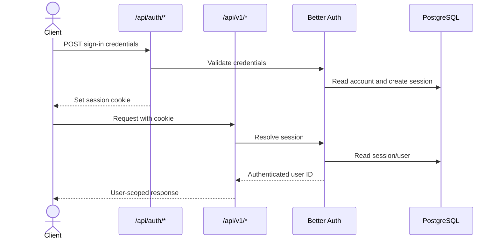

# Trackly API Reference

## Purpose

Document the HTTP API implemented by the current Fastify routes, Better Auth
integration, Zod schemas, controllers, services, OpenAPI schemas, and tests.

## Status

Completed

# API Overview

The local backend base URL is `http://localhost:4000`. Trackly application
routes use `/api/v1`; Better Auth owns `/api/auth/*`; health, readiness, and
Swagger are infrastructure routes.

All application data is scoped to the authenticated Better Auth user.
Calendar dates use `YYYY-MM-DD` and are resolved in the user's stored timezone,
with the implemented safe UTC fallback for invalid legacy values.

## Versioning

| Namespace                    | Versioning                                                  |
| ---------------------------- | ----------------------------------------------------------- |
| `/api/v1/*`                  | Trackly application API version 1                           |
| `/api/auth/*`                | Better Auth-owned contract; intentionally outside `/api/v1` |
| `/health`, `/ready`, `/docs` | Unversioned infrastructure endpoints                        |

Breaking application contract changes require a new API version. The current
OpenAPI document reports API version `1.0.0`.

## Authentication for API Consumers

Trackly uses Better Auth database sessions and an HTTP cookie. Browser clients
must send requests with credentials. The frontend does not store bearer tokens.



Use `GET /api/v1/auth/me` to obtain the Trackly-standard current-session
response. A missing valid session returns `401`; a session-service failure
returns `503`.

## Common Headers

| Header                           | Direction | Required                   | Description                                      |
| -------------------------------- | --------- | -------------------------- | ------------------------------------------------ |
| `Content-Type: application/json` | Request   | For JSON bodies            | JSON request encoding                            |
| `Accept: application/json`       | Request   | Recommended                | Expected representation                          |
| Better Auth session cookie       | Request   | Protected routes           | Browser-managed authentication                   |
| `Origin`                         | Request   | Browser cross-origin calls | Must match configured CORS origins               |
| `x-request-id`                   | Request   | Optional                   | Valid caller correlation ID; otherwise generated |
| `x-request-id`                   | Response  | Always                     | Request correlation ID                           |

## Common Success Format

Trackly application and infrastructure endpoints return:

```json
{
  "success": true,
  "data": {},
  "meta": {}
}
```

`data` is required. `meta` is optional. Better Auth endpoints preserve Better
Auth's native response rather than wrapping it.

## Common Error Format

```json
{
  "success": false,
  "error": {
    "code": "VALIDATION_ERROR",
    "message": "Request validation failed.",
    "details": [
      {
        "path": "date",
        "message": "date must be a valid calendar date in YYYY-MM-DD format."
      }
    ]
  }
}
```

`details` is optional and JSON-safe. Common statuses are:

| Status | Meaning                                               |
| ------ | ----------------------------------------------------- |
| `400`  | Invalid params, query, body, or JSON                  |
| `401`  | No valid authenticated session                        |
| `403`  | Origin rejected by CORS                               |
| `404`  | Route/resource missing, deleted, or inaccessible      |
| `409`  | Valid request conflicts with resource/domain state    |
| `429`  | Configured request limit exceeded                     |
| `500`  | Unexpected internal error with generic public message |
| `503`  | Database/session/provider dependency unavailable      |

## Shared Response Models

The endpoint sections reference these models:

- **Category:** `{ id, name, color: string|null, icon: string|null }`.
- **HabitMutation:** `{ id, name, description, categoryId, frequencyType,
targetCount, startDate, endDate, isActive, weekdays }`.
- **HabitProjection:** `{ date, isScheduled, completedCount, isCompleted }`.
- **HabitListItem:** habit identity/configuration, Category, schedule weekdays,
  timestamps, position, and `selectedDate: HabitProjection`.
- **Goal:** `{ id, userId, habitId, habitName, name, targetCount, startDate,
endDate, status, createdAt, updatedAt, progress }`; progress contains
  `currentCount`, `targetCount`, `remainingCount`, `progressRate`, and
  `isTargetReached`.
- **Reminder:** `{ id, habitId, timeOfDay, isEnabled, createdAt, updatedAt }`.
- **Preferences:** `{ timezone, weekStartsOn, dateFormat, timeFormat, theme,
createdAt, updatedAt }`.
- **PushSubscription:** `{ id, endpointIdentifier, userAgent, isEnabled,
createdAt, updatedAt }`; full endpoint and keys are never returned.
- **Analytics rates:** numeric percentages from `0` to `100`, rounded according
  to the analytics service.

# Health and Infrastructure

## Health and Infrastructure Overview

These endpoints support process and container diagnostics. Authentication is
not required. They are unversioned.

### `GET /health`

- **Description:** Confirms the backend process is running; does not query the
  database.
- **Authentication:** None.
- **Request parameters/body:** None.
- **Headers:** Common optional request ID; no cookie required.
- **Validation rules:** None.
- **Success response:** `200`, standard envelope containing `status:
"healthy"`, `service: "trackly-api"`, and an ISO timestamp.
- **Error responses:** Only unexpected `500`.
- **Business rules:** Liveness is independent from PostgreSQL.
- **Related database tables:** None.
- **Related services:** `health.controller`.
- **Notes:** Used for process liveness, not dependency readiness.

```json
{
  "success": true,
  "data": {
    "status": "healthy",
    "service": "trackly-api",
    "timestamp": "2026-07-30T10:00:00.000Z"
  }
}
```

### `GET /ready`

- **Description:** Confirms that the API can query PostgreSQL.
- **Authentication:** None.
- **Request parameters/body:** None.
- **Headers:** Common headers.
- **Validation rules:** None.
- **Success response:** `200`, the system-status envelope.
- **Error responses:** `503` when the connection check fails; unexpected `500`.
- **Business rules:** Executes the configured database connection check.
- **Related database tables:** None; runs `SELECT 1`.
- **Related services:** Database plugin/client and `health.controller`.
- **Notes:** Used by Docker Compose as the backend health check.

### `GET /docs`

- **Description:** Swagger UI for the generated OpenAPI document.
- **Authentication:** None when exposed.
- **Request parameters/body:** None.
- **Headers:** Browser headers.
- **Validation rules:** Not applicable.
- **Success response:** Swagger UI HTML/assets.
- **Error responses:** `404` when `EXPOSE_API_DOCS=false`.
- **Business rules:** Registered only when API documentation is enabled.
- **Related database tables/services:** None; Swagger plugin.
- **Notes:** Production configuration can disable this endpoint.

### `POST /api/v1/diagnostics/validation`

- **Description:** Temporary validation-pipeline diagnostic.
- **Authentication:** None.
- **Version:** v1; conditional.
- **Request parameters:** No path or query parameters.
- **Headers:** JSON common headers.
- **Request body:** `{ "value": "text" }`.
- **Validation rules:** Trimmed string, length 1–100; no documented extra
  fields.
- **Success response:** `200`, `{ "success": true, "data": { "value": "text" } }`.
- **Error responses:** `400` validation error.
- **Business rules:** Echoes the validated value.
- **Related database tables:** None.
- **Related services:** Diagnostic controller and shared request validator.
- **Notes:** Registered only when `ENABLE_DIAGNOSTICS=true`; production
  configuration is expected to disable it. It is exempt from application rate
  limiting.

# Authentication

## Authentication Overview

Better Auth provides the framework-owned authentication contract at
`/api/auth/*`; Trackly adds one v1 session projection. Registration, login,
logout, and session lookup are public in the sense that they do not require an
already authenticated session. Cookie issuance and invalidation are owned by
Better Auth.

### `POST /api/auth/sign-up/email`

- **Description:** Register with email and password.
- **Authentication:** None.
- **Version:** Better Auth contract.
- **Path/query parameters:** None.
- **Headers:** JSON headers; credentialed browser request.
- **Request body:** `{ "name", "email", "password" }`.
- **Validation rules:** Better Auth email rules; password length 8–128; email
  verification requirement is environment-configured.
- **Success response:** Better Auth native user/session response and session
  cookie.
- **Error responses:** Better Auth native validation/conflict/rate-limit
  responses; unexpected service errors remain internal.
- **Business rules:** Creates `user_preferences` after user creation using a
  conflict-safe hook.
- **Related database tables:** `user`, `account`, `session`,
  `user_preferences`, and potentially `verification`.
- **Related services:** Better Auth and Drizzle adapter.
- **Notes:** Limited to five requests per 60 seconds by Better Auth.

```json
{
  "name": "Ada",
  "email": "ada@example.com",
  "password": "correct-horse-battery-staple"
}
```

### `POST /api/auth/sign-in/email`

- **Description:** Authenticate with email/password.
- **Authentication:** None.
- **Version:** Better Auth contract.
- **Path/query parameters:** None.
- **Headers:** JSON headers; credentialed browser request.
- **Request body:** `{ "email", "password" }`.
- **Validation rules:** Better Auth credential validation.
- **Success response:** Better Auth native response plus session cookie.
- **Error responses:** Better Auth native invalid-credential, verification, and
  rate-limit responses.
- **Business rules:** Valid credentials create or update session state.
- **Related database tables:** `user`, `account`, `session`, `verification`.
- **Related services:** Better Auth.
- **Notes:** Limited to ten requests per 60 seconds by Better Auth.

### `POST /api/auth/sign-out`

- **Description:** End the current Better Auth session.
- **Authentication:** Uses the current cookie; safe when session state is
  absent according to Better Auth behavior.
- **Version:** Better Auth contract.
- **Parameters/body:** No Trackly-defined parameters or body.
- **Headers:** Session cookie.
- **Validation rules:** Better Auth contract.
- **Success response:** Better Auth native response and cookie invalidation.
- **Error responses:** Better Auth native errors.
- **Business rules:** Invalidates the current session.
- **Related database tables:** `session`.
- **Related services:** Better Auth.
- **Notes:** Authentication operations emit audit events.

### `GET /api/auth/get-session`

- **Description:** Resolve the native Better Auth session.
- **Authentication:** Cookie optional; no session returns `null`.
- **Version:** Better Auth contract.
- **Parameters/body:** None.
- **Headers:** Session cookie when available.
- **Validation rules:** Better Auth contract.
- **Success response:** Better Auth session/user object or `null`.
- **Error responses:** Native Better Auth service failures.
- **Business rules:** Used by Next.js server layouts and pages.
- **Related database tables:** `session`, `user`.
- **Related services:** Better Auth.
- **Notes:** Not wrapped in the Trackly envelope.

### `GET /api/v1/auth/me`

- **Description:** Return the current user and session in the Trackly envelope.
- **Authentication:** Required.
- **Version:** v1.
- **Parameters/body:** None.
- **Headers:** Session cookie and common headers.
- **Validation rules:** Valid session required.
- **Success response:** `200`, `{ user: { id, name, email, image }, session: {
expiresAt } }`.
- **Error responses:** `401` unauthenticated; `503` session service unavailable.
- **Business rules:** Response omits tokens and internal session metadata.
- **Related database tables:** `user`, `session`.
- **Related services:** Session resolver and auth controller.
- **Notes:** Session lookup is cached once per Fastify request.

# Today

## Today Overview

The Today API returns one authenticated, timezone-aware dashboard projection.
Version v1; authentication required.

### `GET /api/v1/today`

- **Description:** Return scheduled habits, relevant tasks, active goals, and
  daily totals.
- **Authentication:** Required.
- **Path parameters/body:** None.
- **Query parameters:** `date` optional `YYYY-MM-DD`; defaults to user-local
  today.
- **Headers:** Session cookie and common headers.
- **Validation rules:** Date must be a real calendar date; unknown query fields
  are rejected by the route schema.
- **Success response:** `200`, `{ date, timezone, habits, tasks: { overdue,
dueToday, completedToday }, goals, summary }`. Summary contains habit/task
  counts, active goals, completed/total items, and completion percentage.
- **Error responses:** `400`, `401`, `429`, `500`.
- **Business rules:** Habits include absolute progress and derived completion;
  empty accounts return empty arrays. Independent habit/task/goal reads run in
  parallel.
- **Related database tables:** `user_preferences`, `habits`,
  `habit_schedules`, `habit_check_ins`, `tasks`, `goals`, `goal_steps`,
  `categories`.
- **Related services:** Today service plus preference, habit, task, and goal
  repositories.
- **Notes:** Invalid stored timezones log a warning and fall back to UTC.

```json
{
  "success": true,
  "data": {
    "date": "2026-07-30",
    "timezone": "Asia/Jakarta",
    "habits": [],
    "tasks": { "overdue": [], "dueToday": [], "completedToday": [] },
    "goals": [],
    "summary": {
      "habitsTotal": 0,
      "habitsCompleted": 0,
      "tasksDueToday": 0,
      "tasksCompletedToday": 0,
      "overdueTasks": 0,
      "activeGoals": 0,
      "completedItems": 0,
      "totalItems": 0,
      "completionPercentage": 0
    }
  }
}
```

# Categories

## Categories Overview

Categories provide reusable user-owned labels. Only active listing exists;
there is no public category mutation API. Version v1; authentication required.

### `GET /api/v1/categories`

- **Description:** List active categories owned by the session user.
- **Authentication:** Required.
- **Parameters/body:** None.
- **Headers:** Session cookie and common headers.
- **Validation rules:** None beyond authentication.
- **Success response:** `200`, array of Category models.
- **Error responses:** `401`, `429`, and unexpected `500`.
- **Business rules:** Excludes soft-deleted categories; deterministic name/ID
  ordering is applied by the repository.
- **Related database tables:** `categories`.
- **Related services:** Category service and repository.
- **Notes:** No pagination; intended for selectors.

# Habits

## Habits Overview

Habit routes cover collection/detail reads, streaks, CRUD, lifecycle state, and
date-specific check-ins. Version v1; every endpoint requires authentication and
uses ownership-scoped repositories.

### `GET /api/v1/habits`

- **Description:** Return a filtered, sorted, paginated habit collection.
- **Authentication:** Required.
- **Path/body:** None.
- **Query parameters:** `view=today|all|archived|inactive` (default `today`);
  optional `date`; trimmed `search` (default empty); `sort=position|name|
createdAt|updatedAt`; `order=asc|desc`; positive `page` default 1; `limit`
  1–100 default 20.
- **Headers:** Common authenticated headers.
- **Validation rules:** Calendar date must be valid; numeric pagination values
  are coerced; unknown fields rejected.
- **Success response:** `200`, `{ items: HabitListItem[], pagination, query }`.
- **Error responses:** `400`, `401`, `429`, `500`.
- **Business rules:** `inactive` is a compatibility alias for `archived`;
  archived means inactive but non-deleted. Empty/out-of-range pages return an
  empty list. Ordering always has stable tie-breakers.
- **Related database tables:** `habits`, `habit_schedules`,
  `habit_check_ins`, `categories`, `user_preferences`.
- **Related services:** Habit query service/repository and preference
  repository.
- **Notes:** `today` uses the resolved selected/user-local date.

### `GET /api/v1/habits/:id`

- **Description:** Get an owned active or archived habit with today's
  projection.
- **Authentication:** Required.
- **Path parameters:** `id`, UUID.
- **Query/body:** None.
- **Headers:** Common authenticated headers.
- **Validation rules:** Valid UUID.
- **Success response:** `200`, habit configuration plus Category, schedule,
  timestamps, `today: HabitProjection`, and `timezone`.
- **Error responses:** `400`, `401`, `404`, `429`, `500`.
- **Business rules:** Missing, foreign, and soft-deleted habits return the same 404.
- **Related database tables:** `habits`, `habit_schedules`,
  `habit_check_ins`, `categories`, `user_preferences`.
- **Related services:** Habit query service/repository.
- **Notes:** Inactive habits remain readable.

### `GET /api/v1/habits/:id/streak`

- **Description:** Derive current and longest scheduled-occurrence streaks.
- **Authentication:** Required.
- **Path parameters:** `id`, UUID.
- **Query/body:** None.
- **Headers:** Common authenticated headers.
- **Validation rules:** Valid UUID.
- **Success response:** `200`, `{ habitId, currentStreak, longestStreak,
lastCompletedDate }`.
- **Error responses:** `400`, `401`, `404`, `429`, `500`.
- **Business rules:** Only completed scheduled occurrences through user-local
  today participate; future/non-scheduled dates do not break streaks. Inactive
  habits retain history.
- **Related database tables:** `habits`, `habit_schedules`,
  `habit_check_ins`, `user_preferences`.
- **Related services:** Habit streak query service/repository.
- **Notes:** Values are derived, not stored.

### `POST /api/v1/habits`

- **Description:** Create a habit and schedule atomically.
- **Authentication:** Required.
- **Path/query:** None.
- **Request body:** `name`, `frequencyType`, `startDate` required;
  `description`, `categoryId`, `targetCount`, `endDate`, `weekdays`,
  `isActive` optional.
- **Headers:** JSON authenticated headers.
- **Validation rules:** Name 1–160 trimmed; description ≤10,000; UUID category;
  target integer ≥1; real dates with end ≥ start; unique weekdays 1–7.
  Non-daily schedules require at least one weekday; daily ignores weekdays.
- **Success response:** `201`, HabitMutation.
- **Error responses:** `400`, `401`, `404` for inaccessible category, `429`,
  `500`.
- **Business rules:** Habit and weekday rows commit together.
- **Related database tables:** `habits`, `habit_schedules`, `categories`.
- **Related services:** Habit command service/repository and preference
  repository.
- **Notes:** Emits `habit.create` audit event.

```json
{
  "name": "Read",
  "frequencyType": "weekly",
  "startDate": "2026-07-01",
  "weekdays": [1, 3, 5],
  "targetCount": 1
}
```

### `PATCH /api/v1/habits/:id`

- **Description:** Partially update an owned habit.
- **Authentication:** Required.
- **Path parameters:** `id`, UUID.
- **Query:** None.
- **Request body:** Any non-empty subset of habit creation fields.
- **Headers:** JSON authenticated headers.
- **Validation rules:** Same field rules as creation; at least one field.
- **Success response:** `200`, HabitMutation.
- **Error responses:** `400`, `401`, `404`, `429`, `500`.
- **Business rules:** Schedule replacement is transactional; ownership and
  non-deleted state are required.
- **Related database tables:** `habits`, `habit_schedules`, `categories`.
- **Related services:** Habit command service/repository.
- **Notes:** Emits `habit.update`.

### `DELETE /api/v1/habits/:id`

- **Description:** Soft-delete an owned habit.
- **Authentication:** Required.
- **Path parameters:** `id`, UUID.
- **Query/body:** None.
- **Headers:** Common authenticated headers.
- **Validation rules:** Valid UUID.
- **Success response:** `200`, `{ "id": "<uuid>", "deleted": true }`.
- **Error responses:** `400`, `401`, `404`, `429`, `500`.
- **Business rules:** Sets `deleted_at`; schedule rows remain physically
  present.
- **Related database tables:** `habits`.
- **Related services:** Habit command service/repository.
- **Notes:** Emits `habit.delete`.

### `POST /api/v1/habits/:id/check-in`

- **Description:** Set absolute progress for one logical date.
- **Authentication:** Required.
- **Path parameters:** `id`, UUID.
- **Request body:** `{ "date": "YYYY-MM-DD"?, "completedCount": integer }`.
- **Headers:** JSON authenticated headers.
- **Validation rules:** Count ≥0 and may not exceed the habit target; date must
  be real. Omitted date means user-local today.
- **Success response:** `200`, `{ habitId, date, completedCount, targetCount,
isCompleted }`.
- **Error responses:** `400`, `401`, `404`, `409` inactive/unscheduled, `429`,
  `500`.
- **Business rules:** Habit must be active, owned, non-deleted, and scheduled.
  Positive values upsert; zero deletes the row. Repeated values are idempotent.
- **Related database tables:** `habits`, `habit_schedules`,
  `habit_check_ins`, `user_preferences`.
- **Related services:** Habit command service/repository.
- **Notes:** Emits `habit.check_in`.

### Habit state commands

The following endpoints share one contract:

| Method and path                      | Effect                    |
| ------------------------------------ | ------------------------- |
| `POST /api/v1/habits/:id/archive`    | Set active state to false |
| `POST /api/v1/habits/:id/restore`    | Set active state to true  |
| `POST /api/v1/habits/:id/activate`   | Set active state to true  |
| `POST /api/v1/habits/:id/deactivate` | Set active state to false |

- **Description:** Perform an explicit habit lifecycle transition.
- **Authentication:** Required.
- **Path parameters:** `id`, UUID; no query or body.
- **Headers:** Common authenticated headers.
- **Validation rules:** Valid UUID.
- **Success response:** `200`, `{ id, isActive }`.
- **Error responses:** `400`, `401`, `404`, `409` invalid/repeated transition,
  `429`, `500`.
- **Business rules:** Does not soft-delete or recreate the habit; check-in does
  not auto-activate it.
- **Related database tables:** `habits`.
- **Related services:** Habit command service/repository.
- **Notes:** Each command emits its corresponding audit action.

# Goals

## Goals Overview

Goal endpoints provide authenticated CRUD and derived habit-based progress.
Version v1.

### `GET /api/v1/goals`

- **Description:** List owned, non-deleted goals.
- **Authentication:** Required.
- **Query parameters:** Optional `status=active|completed|cancelled`,
  `habitId` UUID, `startDate`, and `endDate`.
- **Path/body:** None.
- **Headers:** Common authenticated headers.
- **Validation rules:** Dates are ISO dates and end must be on/after start.
- **Success response:** `200`, Goal array.
- **Error responses:** `400`, `401`, `404`, `409`, `429`, `500`.
- **Business rules:** Filters are combined; progress is derived from owned habit
  check-ins and capped by goal target.
- **Related database tables:** `goals`, `habits`, `habit_check_ins`.
- **Related services:** Goal service/repository and preference repository.
- **Notes:** No pagination.

### `GET /api/v1/goals/:id`

- **Description:** Get one owned, non-deleted goal.
- **Authentication:** Required.
- **Path parameters:** `id`, UUID.
- **Query/body:** None.
- **Headers:** Common authenticated headers.
- **Validation rules:** Valid UUID.
- **Success response:** `200`, Goal.
- **Error responses:** `400`, `401`, `404`, `409`, `429`, `500`.
- **Business rules:** Foreign/deleted/missing goals are inaccessible.
- **Related database tables:** `goals`, `habits`, `habit_check_ins`.
- **Related services:** Goal service/repository.
- **Notes:** Progress is request-time data.

### `POST /api/v1/goals`

- **Description:** Create a habit-linked goal.
- **Authentication:** Required.
- **Request body:** Required `habitId`, `name`, `targetCount`, `startDate`,
  `endDate`; optional `status` default `active`.
- **Path/query:** None.
- **Headers:** JSON authenticated headers.
- **Validation rules:** UUID habit; trimmed name 1–200; integer target ≥1; ISO
  dates with end ≥ start; status enum.
- **Success response:** `201`, Goal.
- **Error responses:** `400`, `401`, `404` inaccessible habit, `409`, `429`,
  `500`.
- **Business rules:** Goal and habit must belong to the same authenticated user.
- **Related database tables:** `goals`, `habits`.
- **Related services:** Goal service/repository.
- **Notes:** Emits `goal.create`.

```json
{
  "habitId": "11111111-1111-4111-8111-111111111111",
  "name": "Read 20 sessions",
  "targetCount": 20,
  "startDate": "2026-07-01",
  "endDate": "2026-08-31"
}
```

### `PATCH /api/v1/goals/:id`

- **Description:** Partially update an owned goal.
- **Authentication:** Required.
- **Path parameters:** `id`, UUID.
- **Request body:** Non-empty subset of goal creation fields and/or `status`.
- **Query:** None.
- **Headers:** JSON authenticated headers.
- **Validation rules:** Field validation matches create. The service validates
  the resolved date range when only one bound changes.
- **Success response:** `200`, Goal.
- **Error responses:** `400`, `401`, `404`, `409`, `429`, `500`.
- **Business rules:** A replacement habit must be owned.
- **Related database tables:** `goals`, `habits`, `habit_check_ins`.
- **Related services:** Goal service/repository.
- **Notes:** Emits `goal.update`.

### `DELETE /api/v1/goals/:id`

- **Description:** Soft-delete an owned goal.
- **Authentication:** Required.
- **Path parameters:** `id`, UUID.
- **Query/body:** None.
- **Headers:** Common authenticated headers.
- **Validation rules:** Valid UUID.
- **Success response:** `200`, `{ id, deleted: true }`.
- **Error responses:** `400`, `401`, `404`, `409`, `429`, `500`.
- **Business rules:** Sets `deleted_at`; does not erase habit check-ins.
- **Related database tables:** `goals`.
- **Related services:** Goal service/repository.
- **Notes:** Emits `goal.delete`.

# Preferences

## Preferences Overview

Preferences control timezone and display behavior. Version v1; authentication
required.

### `GET /api/v1/preferences`

- **Description:** Return persisted or resolved default preferences.
- **Authentication:** Required.
- **Parameters/body:** None.
- **Headers:** Common authenticated headers.
- **Validation rules:** None beyond session.
- **Success response:** `200`, Preferences.
- **Error responses:** `400`, `401`, `429`, `500`.
- **Business rules:** Missing rows resolve to UTC, Monday, `yyyy-MM-dd`, `24h`,
  and `system`.
- **Related database tables:** `user_preferences`.
- **Related services:** Preference service/repository.
- **Notes:** Timestamps are null for unresolved defaults.

### `PATCH /api/v1/preferences`

- **Description:** Upsert a partial preference change.
- **Authentication:** Required.
- **Request body:** At least one of `timezone`, `weekStartsOn`, `dateFormat`,
  `timeFormat`, `theme`.
- **Path/query:** None.
- **Headers:** JSON authenticated headers.
- **Validation rules:** Valid IANA timezone ≤64 characters;
  `monday|sunday`; `dd/MM/yyyy|MM/dd/yyyy|yyyy-MM-dd`; `12h|24h`;
  `system|light|dark`; unknown fields rejected.
- **Success response:** `200`, Preferences.
- **Error responses:** `400`, `401`, `429`, `500`.
- **Business rules:** Omitted values are preserved; operation uses conflict
  update on user ID.
- **Related database tables:** `user_preferences`.
- **Related services:** Preference service/repository.
- **Notes:** Emits `preference.update`.

# Reminders

## Reminders Overview

Reminder endpoints are nested under an owned habit. Version v1;
authentication required.

### `GET /api/v1/habits/:habitId/reminders`

- **Description:** List active reminders in local-time order.
- **Authentication:** Required.
- **Path parameters:** `habitId`, UUID.
- **Query/body:** None.
- **Headers:** Common authenticated headers.
- **Validation rules:** Valid UUID.
- **Success response:** `200`, `{ timezone, items: Reminder[] }`.
- **Error responses:** `400`, `401`, `404`, `409`, `429`, `500`.
- **Business rules:** Archived habits remain readable; deleted/foreign/missing
  habits return 404.
- **Related database tables:** `habits`, `reminders`, `user_preferences`.
- **Related services:** Reminder service/repository and preference repository.
- **Notes:** Soft-deleted reminders are excluded.

### `POST /api/v1/habits/:habitId/reminders`

- **Description:** Create a reminder.
- **Authentication:** Required.
- **Path parameters:** `habitId`, UUID.
- **Request body:** `{ "timeOfDay": "HH:mm", "isEnabled": true? }`.
- **Query:** None.
- **Headers:** JSON authenticated headers.
- **Validation rules:** Strict 24-hour `HH:mm`; boolean enabled; unknown fields
  rejected.
- **Success response:** `201`, Reminder.
- **Error responses:** `400`, `401`, `404`, `409` duplicate active time, `429`,
  `500`.
- **Business rules:** Active `(user, habit, time)` must be unique.
- **Related database tables:** `habits`, `reminders`.
- **Related services:** Reminder service/repository.
- **Notes:** Emits `reminder.create`.

### `PATCH /api/v1/habits/:habitId/reminders/:reminderId`

- **Description:** Update reminder time and/or enabled state.
- **Authentication:** Required.
- **Path parameters:** `habitId` and `reminderId`, UUIDs.
- **Request body:** Non-empty subset of `timeOfDay`, `isEnabled`.
- **Query:** None.
- **Headers:** JSON authenticated headers.
- **Validation rules:** Same field rules as create; unknown/empty bodies
  rejected.
- **Success response:** `200`, Reminder.
- **Error responses:** `400`, `401`, `404`, `409`, `429`, `500`.
- **Business rules:** Reminder and parent habit must both be owned; duplicate
  active time conflicts.
- **Related database tables:** `habits`, `reminders`.
- **Related services:** Reminder service/repository.
- **Notes:** Emits `reminder.update`.

### `DELETE /api/v1/habits/:habitId/reminders/:reminderId`

- **Description:** Soft-delete a reminder.
- **Authentication:** Required.
- **Path parameters:** `habitId` and `reminderId`, UUIDs.
- **Query/body:** None.
- **Headers:** Common authenticated headers.
- **Validation rules:** Valid UUIDs.
- **Success response:** `200`, `{ id, deleted: true }`.
- **Error responses:** `400`, `401`, `404`, `409`, `429`, `500`.
- **Business rules:** Deletion permits later recreation of the same active
  time.
- **Related database tables:** `habits`, `reminders`.
- **Related services:** Reminder service/repository.
- **Notes:** Emits `reminder.delete`.

# Push Subscriptions

## Push Subscriptions Overview

These endpoints manage the current user's browser/device Web Push
subscriptions. Version v1; authentication required. Notification delivery
history has no public API.

### `GET /api/v1/push-subscriptions`

- **Description:** List the user's active subscriptions.
- **Authentication:** Required.
- **Parameters/body:** None.
- **Headers:** Common authenticated headers.
- **Validation rules:** None beyond session.
- **Success response:** `200`, `{ items: PushSubscription[] }`.
- **Error responses:** `400`, `401`, `409`, `429`, `500`, `503`.
- **Business rules:** Only enabled, non-deleted subscriptions for the user are
  returned.
- **Related database tables:** `push_subscriptions`.
- **Related services:** Push-subscription service/repository.
- **Notes:** Endpoint and encryption keys are not returned.

### `POST /api/v1/push-subscriptions`

- **Description:** Create, synchronize, or reactivate a browser subscription.
- **Authentication:** Required.
- **Request body:** HTTPS `endpoint`; `keys.p256dh`; `keys.auth`; optional
  `userAgent`.
- **Path/query:** None.
- **Headers:** JSON authenticated headers.
- **Validation rules:** Endpoint valid HTTPS URL, ≤4096; keys trimmed 16–2048;
  user agent trimmed 1–512; strict objects.
- **Success response:** `201` when created or `200` when updated/reactivated;
  PushSubscription.
- **Error responses:** `400`, `401`, `409` endpoint owned by another user,
  `429`, `500`, `503`.
- **Business rules:** Existing owned endpoint is updated, not duplicated.
  Concurrent registration resolves against active endpoint uniqueness.
- **Related database tables:** `push_subscriptions`.
- **Related services:** Push-subscription service/repository.
- **Notes:** Never log or return endpoint/key material.

```json
{
  "endpoint": "https://push.example.test/subscription/device",
  "keys": {
    "p256dh": "base64-public-key-material",
    "auth": "base64-auth-material"
  },
  "userAgent": "Example Browser"
}
```

### `DELETE /api/v1/push-subscriptions`

- **Description:** Disable and soft-delete an owned endpoint.
- **Authentication:** Required.
- **Request body:** `{ "endpoint": "https://..." }`.
- **Path/query:** None.
- **Headers:** JSON authenticated headers.
- **Validation rules:** Valid HTTPS URL ≤4096; strict body.
- **Success response:** `200`, `{ "unsubscribed": true }`.
- **Error responses:** `400`, `401`, `409`, `429`, `500`, `503`.
- **Business rules:** Idempotent and does not reveal another user's endpoint.
- **Related database tables:** `push_subscriptions`.
- **Related services:** Push-subscription service/repository.
- **Notes:** Browser-side local unsubscribe is a separate frontend action.

# Analytics

## Analytics Overview

Analytics endpoints are authenticated, read-only, timezone-aware derived
projections. No analytics aggregates are persisted. Version v1.

### `GET /api/v1/analytics/dashboard`

- **Description:** Return all dashboard analytics from one bounded source-data
  snapshot.
- **Authentication:** Required.
- **Query parameters:** `period=day|week|month` default `week`; optional `date`;
  `historyPeriod=7d|30d|90d` default `30d`; `heatmapPeriod=90d|180d|365d`
  default `365d`.
- **Path/body:** None.
- **Headers:** Common authenticated headers.
- **Validation rules:** Enum values and ISO calendar date.
- **Success response:** `200`, `{ summary, history, insights, heatmap, habits,
categories }`, using the same contracts as the individual endpoints.
- **Error responses:** `400`, `401`, `429`, `500`.
- **Business rules:** Reuses one set of habit, schedule, and check-in reads.
- **Related database tables:** `user_preferences`, `habits`,
  `habit_schedules`, `habit_check_ins`, `categories`.
- **Related services:** Analytics query service/repository.
- **Notes:** Preferred frontend dashboard endpoint.

### `GET /api/v1/analytics/summary`

- **Description:** Summarize a local day, Monday–Sunday week, or month.
- **Authentication:** Required.
- **Query parameters:** Required `period=day|week|month`; optional selected
  `date`, default user-local today.
- **Path/body:** None.
- **Headers:** Common authenticated headers.
- **Validation rules:** Valid enum and calendar date.
- **Success response:** `200`, `{ period, startDate, endDate, scheduledCount,
completedCount, completionRate, totalTargetCount, totalCompletedCount,
progressRate }`.
- **Error responses:** `400`, `401`, `429`, `500`.
- **Business rules:** Completion counts completed scheduled occurrences;
  progress caps each count at target.
- **Related database tables:** Preferences, habits, schedules, check-ins.
- **Related services:** Analytics service/repository.
- **Notes:** Future occurrences are excluded where the selected range reaches
  the future.

### `GET /api/v1/analytics/history`

- **Description:** Return gap-free daily analytics history.
- **Authentication:** Required.
- **Query parameters:** `period=7d|30d|90d` default `30d`;
  `granularity=day` default `day`.
- **Path/body:** None.
- **Headers:** Common authenticated headers.
- **Validation rules:** Supported period and literal granularity.
- **Success response:** `200`, `{ period, granularity, startDate, endDate,
summary, history[] }`; every point has occurrence and progress totals/rates.
- **Error responses:** `400`, `401`, `429`, `500`.
- **Business rules:** Includes every date, including zero-activity days.
- **Related database tables:** Preferences, habits, schedules, check-ins.
- **Related services:** Analytics service/repository.
- **Notes:** Ends on user-local today.

### `GET /api/v1/analytics/insights`

- **Description:** Return deterministic insights for a history period.
- **Authentication:** Required.
- **Query parameters:** `period=7d|30d|90d`, default `30d`.
- **Path/body:** None.
- **Headers:** Common authenticated headers.
- **Validation rules:** Supported period.
- **Success response:** `200`, `{ period, startDate, endDate, hasActivity,
insights: { bestDay, lowestDay, mostProductiveWeekday, consistency, trend } }`.
- **Error responses:** `400`, `401`, `429`, `500`.
- **Business rules:** Excludes inactive calendar days from insight
  calculations; ties are deterministic; trend can be `up`, `down`, `flat`, or
  `insufficient-data`.
- **Related database tables:** Preferences, habits, schedules, check-ins.
- **Related services:** Analytics history/insight service.
- **Notes:** Nullable insight values represent no activity.

### `GET /api/v1/analytics/heatmap`

- **Description:** Return a gap-free contribution-style daily heatmap.
- **Authentication:** Required.
- **Query parameters:** `period=90d|180d|365d`, default `365d`.
- **Path/body:** None.
- **Headers:** Common authenticated headers.
- **Validation rules:** Supported period.
- **Success response:** `200`, `{ period, startDate, endDate, days, summary }`;
  days contain date, scheduled/completed count, completion rate, and level 0–4.
- **Error responses:** `400`, `401`, `429`, `500`.
- **Business rules:** Ends on user-local today; empty dates are included.
- **Related database tables:** Preferences, habits, schedules, check-ins.
- **Related services:** Analytics service/repository.
- **Notes:** Heatmap levels are derived, not stored.

### `GET /api/v1/analytics/habits`

- **Description:** Rank individual habit performance.
- **Authentication:** Required.
- **Query parameters:** `period=7d|30d|90d`, default `30d`.
- **Path/body:** None.
- **Headers:** Common authenticated headers.
- **Validation rules:** Supported period.
- **Success response:** `200`, `{ period, startDate, endDate, hasActivity,
habits[] }`; each row includes identity/category, occurrence/progress rates,
  current streak, and longest streak.
- **Error responses:** `400`, `401`, `429`, `500`.
- **Business rules:** Only habits with scheduled activity are ranked; ordering
  is deterministic.
- **Related database tables:** Preferences, habits, schedules, check-ins,
  categories.
- **Related services:** Analytics ranking service/repository.
- **Notes:** Streaks are calculated from the same source records.

### `GET /api/v1/analytics/categories`

- **Description:** Rank performance grouped by category.
- **Authentication:** Required.
- **Query parameters:** `period=7d|30d|90d`, default `30d`.
- **Path/body:** None.
- **Headers:** Common authenticated headers.
- **Validation rules:** Supported period.
- **Success response:** `200`, `{ period, startDate, endDate, hasActivity,
categories[] }`; each row includes occurrence/progress totals/rates and
  `activeHabitCount`.
- **Error responses:** `400`, `401`, `429`, `500`.
- **Business rules:** Derived from owned scheduled activity and deterministic
  category grouping.
- **Related database tables:** Preferences, habits, schedules, check-ins,
  categories.
- **Related services:** Analytics ranking service/repository.
- **Notes:** Uncategorized behavior follows the implemented ranking projection;
  no category filter parameter exists.

```json
{
  "success": true,
  "data": {
    "period": "week",
    "startDate": "2026-07-27",
    "endDate": "2026-08-02",
    "scheduledCount": 4,
    "completedCount": 1,
    "completionRate": 25,
    "totalTargetCount": 8,
    "totalCompletedCount": 4,
    "progressRate": 50
  }
}
```

# Pagination, Filtering, and Sorting

## Pagination

Only the habit collection implements public pagination:

- `page` is one-based and defaults to `1`.
- `limit` defaults to `20` and is capped at `100`.
- The response returns `totalItems`, `totalPages`, `hasPreviousPage`, and
  `hasNextPage`.
- Out-of-range pages return `items: []`; they are not errors.

Other current collections are bounded by domain size or fixed analytics periods
and do not expose pagination.

## Filtering

- Habits filter by view, selected date, and trimmed case-insensitive search
  according to repository behavior.
- Goals filter by status, habit, and intersecting date bounds.
- Analytics filter by fixed period choices and optional summary/dashboard date.
- Reminders and categories filter ownership and non-deleted state implicitly.

Unknown query fields are rejected where route JSON schemas set
`additionalProperties: false`.

## Sorting

Habit sorting supports `position`, `name`, `createdAt`, and `updatedAt`, in
ascending or descending order. Repositories append stable ID tie-breakers.
Reminder, category, goal, analytics ranking, and push-subscription repositories
define deterministic internal ordering but do not expose public sort parameters.

# Rate Limiting

The Fastify rate-limit plugin applies only to `/api/v1/*`, excluding the
diagnostic route:

- Read methods use `API_RATE_LIMIT_MAX`.
- `POST`, `PUT`, `PATCH`, and `DELETE` use
  `API_MUTATION_RATE_LIMIT_MAX`.
- The window is `API_RATE_LIMIT_WINDOW_MS`.
- Keys combine client IP, method, and registered route.
- Exceeded requests return standardized `429 RATE_LIMIT_EXCEEDED`.

The development Compose defaults are 120 reads and 30 mutations per 60 seconds.
Better Auth separately limits its routes, including sign-in and sign-up.
Health, readiness, Swagger, diagnostics, and Better Auth are not governed by the
application plugin.

# OpenAPI and Swagger

`@fastify/swagger` derives OpenAPI from route JSON schemas. Shared helpers define
the standard success/error envelopes. The document declares cookie
authentication, a local server, and tags for system and domain groups.

`@fastify/swagger-ui` serves `/docs` when `EXPOSE_API_DOCS=true`. Routes that
declare `security: [{ cookieAuth: [] }]` show the cookie requirement in
OpenAPI. Runtime authentication is still enforced by controllers even where a
route's current OpenAPI metadata omits the `security` declaration.

# Security Headers and CORS

`@fastify/helmet` supplies CSP and browser security headers:

- Default, base, connect, font, form, image, script, style, worker, object, and
  frame-ancestor directives are explicitly configured.
- Frames and object sources are disabled.
- Development Swagger permits the inline script/style behavior it requires.
- Production upgrades insecure requests.
- Referrer policy is `strict-origin-when-cross-origin`.

CORS allows credentialed requests only from configured origins. Requests
without an Origin header are accepted for server-to-server/CLI use. Allowed
methods are `GET`, `HEAD`, `POST`, `PATCH`, `DELETE`, and `OPTIONS`.

# Known API Limitations

- Tasks have database/repository support and appear in Today, but no public task
  CRUD routes are registered.
- Categories are read-only through the public API.
- Goal steps appear in database/Today projections, but no public step-management
  routes are registered.
- Notification delivery history and scheduler controls have no public API.
- Habit detail always projects the current user-local date; it has no date
  query parameter.
- Only habits expose pagination and client-selectable sorting.
- Swagger tag descriptions for some implemented modules still say “future,”
  and several authenticated routes omit the OpenAPI `security` marker even
  though runtime authentication is enforced.
- Better Auth's wildcard exposes the installed Better Auth contract beyond the
  four consumer operations documented here; consult the runtime OpenAPI/Better
  Auth version before using additional framework endpoints.
- The conditional diagnostic endpoint is intentionally non-business and should
  be disabled in production.
- No custom date-range analytics endpoint exists.

# Related Documentation

- [API Design](../01-design/api-design.md)
- [Authentication Flow](../01-design/authentication-flow.md)
- [Database Schema](./database-schema.md)
- [Backend Architecture](../01-design/backend-architecture.md)
