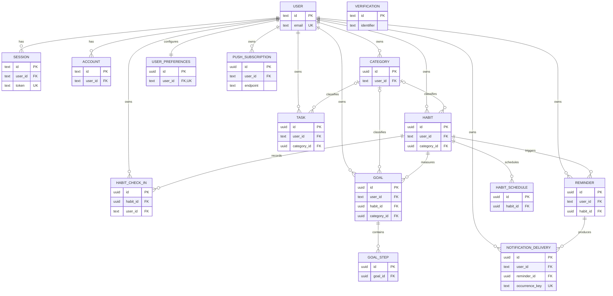

# Trackly Database Schema Reference

## Purpose

Provide a complete reference for the database model implemented by Trackly's
Drizzle schemas and migrations.

## Status

Completed

# Database Overview

Trackly uses PostgreSQL 17 and Drizzle ORM with the `postgres` driver. The
database client is configured once in `backend/src/db/client.ts`, exported as a
single Drizzle instance, and shared by repositories. Drizzle uses
`casing: 'snake_case'`, so TypeScript properties such as `userId` map to
PostgreSQL columns such as `user_id`.

Application-owned primary keys are UUIDs generated with `gen_random_uuid()`.
Better Auth owns the text identifiers used by `user`, `session`, `account`, and
`verification`.

Schema changes are generated into `backend/src/db/migrations/` and applied
forward with Drizzle's PostgreSQL migrator. Normal reads exclude rows whose
nullable `deleted_at` is set. Logical calendar values use PostgreSQL `date`;
application instants use `timestamp with time zone`. Better Auth-generated
timestamp columns are `timestamp without time zone`.

Transactions are used where multiple dependent writes must remain atomic,
including habit/schedule creation and replacement and push-subscription
registration/reactivation. Other concurrency-sensitive paths use database
constraints and conflict handling, including habit check-in upserts and durable
notification occurrence claims.

# Entity Relationship Diagram

The diagram follows physical foreign keys. Optional relationships are shown
where the foreign key is nullable.



`verification` has no foreign key; Better Auth associates verification records
through `identifier`.

# Database Tables

## `user`

Better Auth identity and profile record. Better Auth owns its lifecycle.
Application-owned tables reference this table through `user_id`.

| Column           | Type        | Nullable | Default | Description                 |
| ---------------- | ----------- | -------- | ------- | --------------------------- |
| `id`             | `text`      | No       | —       | Better Auth user identifier |
| `name`           | `text`      | No       | —       | Display name                |
| `email`          | `text`      | No       | —       | Unique login email          |
| `email_verified` | `boolean`   | No       | `false` | Email verification state    |
| `image`          | `text`      | Yes      | —       | Optional profile image      |
| `created_at`     | `timestamp` | No       | `now()` | Creation time               |
| `updated_at`     | `timestamp` | No       | `now()` | Last update time            |

- **Primary key:** `id`
- **Foreign keys:** None
- **Indexes:** Unique index backing `user_email_unique`
- **Unique constraints:** `user_email_unique (email)`
- **Check constraints:** None
- **Related tables:** `session`, `account`, and every application-owned table
  with `user_id`

## `session`

Better Auth database session. Owned by one `user`.

| Column       | Type        | Nullable | Default | Description                    |
| ------------ | ----------- | -------- | ------- | ------------------------------ |
| `id`         | `text`      | No       | —       | Session identifier             |
| `expires_at` | `timestamp` | No       | —       | Session expiry                 |
| `token`      | `text`      | No       | —       | Sensitive unique session token |
| `created_at` | `timestamp` | No       | `now()` | Creation time                  |
| `updated_at` | `timestamp` | No       | —       | Last update time               |
| `ip_address` | `text`      | Yes      | —       | Optional client address        |
| `user_agent` | `text`      | Yes      | —       | Optional client user agent     |
| `user_id`    | `text`      | No       | —       | Owning user                    |

- **Primary key:** `id`
- **Foreign keys:** `user_id → user.id ON DELETE CASCADE`
- **Indexes:** `session_userId_idx (user_id)`
- **Unique constraints:** `session_token_unique (token)`
- **Check constraints:** None
- **Related tables:** `user`

## `account`

Better Auth account/provider and credential record. Owned by one `user`.
Token and password columns are sensitive.

| Column                     | Type        | Nullable | Default | Description                           |
| -------------------------- | ----------- | -------- | ------- | ------------------------------------- |
| `id`                       | `text`      | No       | —       | Account record identifier             |
| `account_id`               | `text`      | No       | —       | Provider account identifier           |
| `provider_id`              | `text`      | No       | —       | Authentication provider identifier    |
| `user_id`                  | `text`      | No       | —       | Owning user                           |
| `access_token`             | `text`      | Yes      | —       | Provider access token                 |
| `refresh_token`            | `text`      | Yes      | —       | Provider refresh token                |
| `id_token`                 | `text`      | Yes      | —       | Provider identity token               |
| `access_token_expires_at`  | `timestamp` | Yes      | —       | Access-token expiry                   |
| `refresh_token_expires_at` | `timestamp` | Yes      | —       | Refresh-token expiry                  |
| `scope`                    | `text`      | Yes      | —       | Provider scope                        |
| `password`                 | `text`      | Yes      | —       | Better Auth credential representation |
| `created_at`               | `timestamp` | No       | `now()` | Creation time                         |
| `updated_at`               | `timestamp` | No       | —       | Last update time                      |

- **Primary key:** `id`
- **Foreign keys:** `user_id → user.id ON DELETE CASCADE`
- **Indexes:** `account_userId_idx (user_id)`
- **Unique constraints:** None in the checked-in schema
- **Check constraints:** None
- **Related tables:** `user`

## `verification`

Better Auth verification value and expiry record. It has no physical user
foreign key.

| Column       | Type        | Nullable | Default | Description                    |
| ------------ | ----------- | -------- | ------- | ------------------------------ |
| `id`         | `text`      | No       | —       | Verification record identifier |
| `identifier` | `text`      | No       | —       | Lookup identifier              |
| `value`      | `text`      | No       | —       | Sensitive verification value   |
| `expires_at` | `timestamp` | No       | —       | Verification expiry            |
| `created_at` | `timestamp` | No       | `now()` | Creation time                  |
| `updated_at` | `timestamp` | No       | `now()` | Last update time               |

- **Primary key:** `id`
- **Foreign keys:** None
- **Indexes:** `verification_identifier_idx (identifier)`
- **Unique constraints:** None
- **Check constraints:** None
- **Related tables:** Logical association is managed by Better Auth

## `categories`

User-owned labels shared by habits, tasks, and goals. Supports soft deletion.

| Column       | Type           | Nullable | Default             | Description              |
| ------------ | -------------- | -------- | ------------------- | ------------------------ |
| `id`         | `uuid`         | No       | `gen_random_uuid()` | Category identifier      |
| `user_id`    | `text`         | No       | —                   | Owning user              |
| `name`       | `varchar(100)` | No       | —                   | Category name            |
| `color`      | `varchar(32)`  | Yes      | —                   | Optional color value     |
| `icon`       | `varchar(64)`  | Yes      | —                   | Optional icon identifier |
| `created_at` | `timestamptz`  | No       | `now()`             | Creation instant         |
| `updated_at` | `timestamptz`  | No       | `now()`             | Last update instant      |
| `deleted_at` | `timestamptz`  | Yes      | —                   | Soft-deletion instant    |

- **Primary key:** `id`
- **Foreign keys:** `user_id → user.id ON DELETE CASCADE`
- **Indexes:** `categories_user_id_idx (user_id)`
- **Unique constraints:** Partial unique index
  `categories_user_id_name_active_uidx (user_id, name) WHERE deleted_at IS NULL`
- **Check constraints:** None
- **Related tables:** `user`, `habits`, `tasks`, `goals`

## `habits`

User-owned habit definition and schedule range. A habit can be inactive without
being deleted.

| Column           | Type                   | Nullable | Default             | Description                            |
| ---------------- | ---------------------- | -------- | ------------------- | -------------------------------------- |
| `id`             | `uuid`                 | No       | `gen_random_uuid()` | Habit identifier                       |
| `user_id`        | `text`                 | No       | —                   | Owning user                            |
| `category_id`    | `uuid`                 | Yes      | —                   | Optional category                      |
| `name`           | `varchar(160)`         | No       | —                   | Habit name                             |
| `description`    | `text`                 | Yes      | —                   | Optional description                   |
| `frequency_type` | `habit_frequency_type` | No       | —                   | Daily, weekly, or custom schedule type |
| `target_count`   | `integer`              | No       | `1`                 | Required progress per occurrence       |
| `start_date`     | `date`                 | No       | —                   | First eligible logical date            |
| `end_date`       | `date`                 | Yes      | —                   | Optional final eligible logical date   |
| `is_active`      | `boolean`              | No       | `true`              | Active/inactive lifecycle flag         |
| `position`       | `integer`              | No       | `0`                 | Stable user ordering                   |
| `created_at`     | `timestamptz`          | No       | `now()`             | Creation instant                       |
| `updated_at`     | `timestamptz`          | No       | `now()`             | Last update instant                    |
| `deleted_at`     | `timestamptz`          | Yes      | —                   | Soft-deletion instant                  |

- **Primary key:** `id`
- **Foreign keys:** `user_id → user.id ON DELETE CASCADE`;
  `category_id → categories.id ON DELETE SET NULL`
- **Indexes:** Partial `habits_user_id_active_idx (user_id, is_active) WHERE
deleted_at IS NULL`; `habits_category_id_idx (category_id)`
- **Unique constraints:** None
- **Check constraints:** `target_count > 0`; `position >= 0`; `end_date IS NULL
OR end_date >= start_date`
- **Related tables:** `user`, `categories`, `habit_schedules`,
  `habit_check_ins`, `goals`, `reminders`

## `habit_schedules`

Weekday entries for weekly/custom habits. The application uses values 1 through 7.

| Column        | Type          | Nullable | Default             | Description            |
| ------------- | ------------- | -------- | ------------------- | ---------------------- |
| `id`          | `uuid`        | No       | `gen_random_uuid()` | Schedule identifier    |
| `habit_id`    | `uuid`        | No       | —                   | Parent habit           |
| `day_of_week` | `integer`     | No       | —                   | Scheduled weekday, 1–7 |
| `created_at`  | `timestamptz` | No       | `now()`             | Creation instant       |

- **Primary key:** `id`
- **Foreign keys:** `habit_id → habits.id ON DELETE CASCADE`
- **Indexes:** `habit_schedules_habit_id_idx (habit_id)`
- **Unique constraints:** `habit_schedules_habit_id_day_of_week_uidx
(habit_id, day_of_week)`
- **Check constraints:** `day_of_week BETWEEN 1 AND 7`
- **Related tables:** `habits`

## `habit_check_ins`

Absolute habit progress for one logical calendar date. Zero progress is removed
by the command repository rather than retained.

| Column            | Type          | Nullable | Default             | Description             |
| ----------------- | ------------- | -------- | ------------------- | ----------------------- |
| `id`              | `uuid`        | No       | `gen_random_uuid()` | Check-in identifier     |
| `habit_id`        | `uuid`        | No       | —                   | Parent habit            |
| `user_id`         | `text`        | No       | —                   | Owning user             |
| `check_in_date`   | `date`        | No       | —                   | User-local logical date |
| `completed_count` | `integer`     | No       | `0`                 | Absolute progress count |
| `note`            | `text`        | Yes      | —                   | Optional note           |
| `created_at`      | `timestamptz` | No       | `now()`             | Creation instant        |
| `updated_at`      | `timestamptz` | No       | `now()`             | Last update instant     |

- **Primary key:** `id`
- **Foreign keys:** `habit_id → habits.id ON DELETE CASCADE`;
  `user_id → user.id ON DELETE CASCADE`
- **Indexes:** `habit_check_ins_user_id_check_in_date_idx (user_id,
check_in_date)`; `habit_check_ins_habit_id_check_in_date_idx (habit_id,
check_in_date)`
- **Unique constraints:** `habit_check_ins_habit_id_check_in_date_uidx
(habit_id, check_in_date)`
- **Check constraints:** `completed_count >= 0`
- **Related tables:** `user`, `habits`

## `tasks`

User-owned task records. The schema exists, although the current frontend Tasks
page is a placeholder.

| Column         | Type           | Nullable | Default             | Description                 |
| -------------- | -------------- | -------- | ------------------- | --------------------------- |
| `id`           | `uuid`         | No       | `gen_random_uuid()` | Task identifier             |
| `user_id`      | `text`         | No       | —                   | Owning user                 |
| `category_id`  | `uuid`         | Yes      | —                   | Optional category           |
| `title`        | `varchar(200)` | No       | —                   | Task title                  |
| `description`  | `text`         | Yes      | —                   | Optional description        |
| `status`       | `task_status`  | No       | `todo`              | Task lifecycle status       |
| `priority`     | `priority`     | No       | `medium`            | Task priority               |
| `due_at`       | `timestamptz`  | Yes      | —                   | Optional due instant        |
| `completed_at` | `timestamptz`  | Yes      | —                   | Optional completion instant |
| `position`     | `integer`      | No       | `0`                 | Stable user ordering        |
| `created_at`   | `timestamptz`  | No       | `now()`             | Creation instant            |
| `updated_at`   | `timestamptz`  | No       | `now()`             | Last update instant         |
| `deleted_at`   | `timestamptz`  | Yes      | —                   | Soft-deletion instant       |

- **Primary key:** `id`
- **Foreign keys:** `user_id → user.id ON DELETE CASCADE`;
  `category_id → categories.id ON DELETE SET NULL`
- **Indexes:** `tasks_user_id_status_idx (user_id, status)`;
  `tasks_user_id_due_at_idx (user_id, due_at)`; `tasks_category_id_idx
(category_id)`
- **Unique constraints:** None
- **Check constraints:** `position >= 0`
- **Related tables:** `user`, `categories`

## `goals`

User-owned goal linked to one habit, with optional category, status, date range,
target, display metadata, and ordered steps.

| Column            | Type            | Nullable | Default             | Description                                   |
| ----------------- | --------------- | -------- | ------------------- | --------------------------------------------- |
| `id`              | `uuid`          | No       | `gen_random_uuid()` | Goal identifier                               |
| `user_id`         | `text`          | No       | —                   | Owning user                                   |
| `habit_id`        | `uuid`          | No       | —                   | Habit whose check-ins drive goal progress     |
| `name`            | `varchar(200)`  | No       | —                   | Goal name used by current goal logic          |
| `target_count`    | `integer`       | No       | —                   | Positive goal target                          |
| `end_date`        | `date`          | No       | —                   | Required range end used by current goal logic |
| `category_id`     | `uuid`          | Yes      | —                   | Optional category                             |
| `title`           | `varchar(200)`  | No       | —                   | Legacy/display title retained by schema       |
| `description`     | `text`          | Yes      | —                   | Optional description                          |
| `status`          | `goal_status`   | No       | `active`            | Goal lifecycle status                         |
| `start_date`      | `date`          | No       | —                   | Required range start                          |
| `target_date`     | `date`          | Yes      | —                   | Optional legacy/display target date           |
| `completed_at`    | `timestamptz`   | Yes      | —                   | Completion instant                            |
| `cover_image_url` | `varchar(2048)` | Yes      | —                   | Optional cover-image URL                      |
| `position`        | `integer`       | No       | `0`                 | Stable user ordering                          |
| `created_at`      | `timestamptz`   | No       | `now()`             | Creation instant                              |
| `updated_at`      | `timestamptz`   | No       | `now()`             | Last update instant                           |
| `deleted_at`      | `timestamptz`   | Yes      | —                   | Soft-deletion instant                         |

- **Primary key:** `id`
- **Foreign keys:** `user_id → user.id ON DELETE CASCADE`; `habit_id →
habits.id ON DELETE CASCADE`; `category_id → categories.id ON DELETE SET
NULL`
- **Indexes:** `goals_user_id_status_idx (user_id, status)`;
  `goals_user_id_start_date_idx (user_id, start_date)`; `goals_habit_id_idx
(habit_id)`; `goals_date_range_idx (start_date, end_date)`;
  `goals_target_date_idx (target_date)`; `goals_category_id_idx (category_id)`
- **Unique constraints:** None
- **Check constraints:** `position >= 0`; `target_count >= 1`; `end_date >=
start_date`
- **Related tables:** `user`, `habits`, `categories`, `goal_steps`

## `goal_steps`

Ordered child steps for a goal. Ownership is inherited from the parent goal.

| Column         | Type           | Nullable | Default             | Description          |
| -------------- | -------------- | -------- | ------------------- | -------------------- |
| `id`           | `uuid`         | No       | `gen_random_uuid()` | Step identifier      |
| `goal_id`      | `uuid`         | No       | —                   | Parent goal          |
| `title`        | `varchar(200)` | No       | —                   | Step title           |
| `description`  | `text`         | Yes      | —                   | Optional description |
| `is_completed` | `boolean`      | No       | `false`             | Completion state     |
| `completed_at` | `timestamptz`  | Yes      | —                   | Completion instant   |
| `position`     | `integer`      | No       | `0`                 | Step ordering        |
| `created_at`   | `timestamptz`  | No       | `now()`             | Creation instant     |
| `updated_at`   | `timestamptz`  | No       | `now()`             | Last update instant  |

- **Primary key:** `id`
- **Foreign keys:** `goal_id → goals.id ON DELETE CASCADE`
- **Indexes:** `goal_steps_goal_id_position_idx (goal_id, position)`
- **Unique constraints:** None
- **Check constraints:** `position >= 0`
- **Related tables:** `goals`

## `user_preferences`

Exactly one application preference record per user.

| Column           | Type          | Nullable | Default             | Description                            |
| ---------------- | ------------- | -------- | ------------------- | -------------------------------------- |
| `id`             | `uuid`        | No       | `gen_random_uuid()` | Preference identifier                  |
| `user_id`        | `text`        | No       | —                   | Owning user                            |
| `timezone`       | `varchar(64)` | No       | `UTC`               | IANA timezone or stored fallback value |
| `week_starts_on` | `integer`     | No       | `1`                 | Monday (`1`) or Sunday (`7`)           |
| `date_format`    | `varchar(32)` | No       | `yyyy-MM-dd`        | Display date format                    |
| `time_format`    | `varchar(8)`  | No       | `24h`               | Display time format                    |
| `theme`          | `varchar(8)`  | No       | `system`            | Appearance preference                  |
| `created_at`     | `timestamptz` | No       | `now()`             | Creation instant                       |
| `updated_at`     | `timestamptz` | No       | `now()`             | Last update instant                    |

- **Primary key:** `id`
- **Foreign keys:** `user_id → user.id ON DELETE CASCADE`
- **Indexes:** Unique index listed below
- **Unique constraints:** `user_preferences_user_id_uidx (user_id)`
- **Check constraints:** `week_starts_on IN (1, 7)`; `date_format IN
('dd/MM/yyyy', 'MM/dd/yyyy', 'yyyy-MM-dd')`; `time_format IN ('12h',
'24h')`; `theme IN ('system', 'light', 'dark')`
- **Related tables:** `user`

## `reminders`

User-owned scheduled reminder time for a habit. Supports disabling and soft
deletion independently.

| Column        | Type          | Nullable | Default             | Description               |
| ------------- | ------------- | -------- | ------------------- | ------------------------- |
| `id`          | `uuid`        | No       | `gen_random_uuid()` | Reminder identifier       |
| `user_id`     | `text`        | No       | —                   | Owning user               |
| `habit_id`    | `uuid`        | No       | —                   | Parent habit              |
| `time_of_day` | `time(0)`     | No       | —                   | User-local reminder time  |
| `is_enabled`  | `boolean`     | No       | `true`              | Delivery eligibility flag |
| `created_at`  | `timestamptz` | No       | `now()`             | Creation instant          |
| `updated_at`  | `timestamptz` | No       | `now()`             | Last update instant       |
| `deleted_at`  | `timestamptz` | Yes      | —                   | Soft-deletion instant     |

- **Primary key:** `id`
- **Foreign keys:** `user_id → user.id ON DELETE CASCADE`; `habit_id →
habits.id ON DELETE CASCADE`
- **Indexes:** Partial `reminders_user_id_idx (user_id) WHERE deleted_at IS
NULL`; partial `reminders_habit_id_enabled_idx (habit_id, is_enabled) WHERE
deleted_at IS NULL`
- **Unique constraints:** Partial `reminders_user_habit_time_active_uidx
(user_id, habit_id, time_of_day) WHERE deleted_at IS NULL`
- **Check constraints:** None
- **Related tables:** `user`, `habits`, `notification_deliveries`

## `notification_deliveries`

Durable record for one reminder occurrence and its provider-neutral delivery
lifecycle.

| Column                 | Type                           | Nullable | Default             | Description                             |
| ---------------------- | ------------------------------ | -------- | ------------------- | --------------------------------------- |
| `id`                   | `uuid`                         | No       | `gen_random_uuid()` | Delivery identifier                     |
| `user_id`              | `text`                         | No       | —                   | Owning user                             |
| `reminder_id`          | `uuid`                         | No       | —                   | Source reminder                         |
| `occurrence_key`       | `text`                         | No       | —                   | Globally unique deduplication key       |
| `scheduled_local_date` | `date`                         | No       | —                   | User-local occurrence date              |
| `scheduled_local_time` | `time(0)`                      | No       | —                   | User-local occurrence time              |
| `timezone`             | `text`                         | No       | —                   | Timezone used for occurrence resolution |
| `provider`             | `notification_provider_name`   | No       | `noop`              | Selected delivery provider              |
| `status`               | `notification_delivery_status` | No       | `pending`           | Delivery lifecycle state                |
| `attempt_count`        | `integer`                      | No       | `0`                 | Number of processing attempts           |
| `created_at`           | `timestamptz`                  | No       | `now()`             | Creation instant                        |
| `updated_at`           | `timestamptz`                  | No       | `now()`             | Last update instant                     |

- **Primary key:** `id`
- **Foreign keys:** `user_id → user.id ON DELETE CASCADE`; `reminder_id →
reminders.id ON DELETE RESTRICT`
- **Indexes:** `notification_deliveries_reminder_id_idx (reminder_id)`;
  `notification_deliveries_user_id_idx (user_id)`;
  `notification_deliveries_status_idx (status)`
- **Unique constraints:** `notification_deliveries_occurrence_key_uidx
(occurrence_key)`
- **Check constraints:** `attempt_count >= 0`
- **Related tables:** `user`, `reminders`

## `push_subscriptions`

User-owned browser Web Push subscription and delivery health metadata.
Endpoint and key material are sensitive infrastructure data.

| Column            | Type          | Nullable | Default             | Description                        |
| ----------------- | ------------- | -------- | ------------------- | ---------------------------------- |
| `id`              | `uuid`        | No       | `gen_random_uuid()` | Subscription identifier            |
| `user_id`         | `text`        | No       | —                   | Owning user                        |
| `endpoint`        | `text`        | No       | —                   | Browser push endpoint              |
| `p256dh`          | `text`        | No       | —                   | Push encryption public key         |
| `auth`            | `text`        | No       | —                   | Push authentication secret         |
| `user_agent`      | `text`        | Yes      | —                   | Optional browser metadata          |
| `is_enabled`      | `boolean`     | No       | `true`              | Active delivery flag               |
| `last_success_at` | `timestamptz` | Yes      | —                   | Most recent accepted delivery      |
| `last_failure_at` | `timestamptz` | Yes      | —                   | Most recent failed delivery        |
| `failure_count`   | `integer`     | No       | `0`                 | Consecutive failure count          |
| `created_at`      | `timestamptz` | No       | `now()`             | Creation instant                   |
| `updated_at`      | `timestamptz` | No       | `now()`             | Last update instant                |
| `deleted_at`      | `timestamptz` | Yes      | —                   | Soft-deletion/invalidation instant |

- **Primary key:** `id`
- **Foreign keys:** `user_id → user.id ON DELETE CASCADE`
- **Indexes:** `push_subscriptions_user_id_idx (user_id)`; partial
  `push_subscriptions_enabled_active_idx (user_id, is_enabled) WHERE deleted_at
IS NULL`; `push_subscriptions_endpoint_idx (endpoint)`
- **Unique constraints:** Partial
  `push_subscriptions_active_endpoint_uidx (endpoint) WHERE deleted_at IS NULL`
- **Check constraints:** `failure_count >= 0`
- **Related tables:** `user`

# Enumerations

| PostgreSQL enum                | Values                                                    | Used by                            |
| ------------------------------ | --------------------------------------------------------- | ---------------------------------- |
| `habit_frequency_type`         | `daily`, `weekly`, `custom`                               | `habits.frequency_type`            |
| `task_status`                  | `todo`, `in_progress`, `completed`, `cancelled`           | `tasks.status`                     |
| `priority`                     | `low`, `medium`, `high`                                   | `tasks.priority`                   |
| `goal_status`                  | `active`, `completed`, `cancelled`                        | `goals.status`                     |
| `notification_delivery_status` | `pending`, `processing`, `delivered`, `failed`, `skipped` | `notification_deliveries.status`   |
| `notification_provider_name`   | `noop`, `web_push`                                        | `notification_deliveries.provider` |

Preference options are enforced with check constraints rather than PostgreSQL
enums.

# Relationships

## One-to-One

`user` to `user_preferences` is one-to-one in the physical model because
`user_preferences.user_id` is both non-null and unique. The preference row is
created by a Better Auth post-user-create hook using conflict-safe insertion.

## One-to-Many

- `user` has many sessions, accounts, categories, habits, check-ins, tasks,
  goals, reminders, notification deliveries, and push subscriptions.
- `category` can classify many habits, tasks, and goals.
- `habit` has many schedules, check-ins, goals, and reminders.
- `goal` has many ordered steps.
- `reminder` has many durable notification deliveries.

Nullable category foreign keys make category membership optional. Deleting a
category sets those foreign keys to null.

## Many-to-Many

No physical many-to-many relationship or join table exists. `habit_schedules`
is a child value table for weekday numbers, not a relationship between two
independent entities.

## Drizzle Relation Metadata

`schema/relations.ts` declares navigation for categories, habits, schedules,
check-ins, tasks, goals, steps, reminders, deliveries, and push subscriptions.
Better Auth's schema declares user-to-session and user-to-account relations.

Physical foreign keys remain authoritative. The current relation metadata
declares `categories.reminders`, but `reminders` has no `category_id`; this is
not represented in the ER diagram. Several physical user relationships and
`user_preferences` are not declared as Drizzle relation objects.

# Data Lifecycle

## Creation

Application entities receive database-generated UUIDs and shared creation/update
timestamps. Better Auth supplies its own text IDs. User preference creation is
hooked to Better Auth user creation. Multi-row habit and schedule creation is
transactional.

## Update

Shared application timestamps use Drizzle's `$onUpdate()` callback. Repository
paths that require explicit concurrency behavior also set `updated_at`
directly. Better Auth manages its own update values.

Habit check-ins use absolute progress and `ON CONFLICT DO UPDATE` for the unique
habit/date pair. Notification occurrence claiming uses conflict-safe insertion
against the unique occurrence key. Push-subscription registration catches
unique violations and deterministically reconciles the winning active row.

## Soft Delete

`categories`, `habits`, `tasks`, `goals`, `reminders`, and
`push_subscriptions` have `deleted_at`. Normal repositories filter it with
`IS NULL`. Partial unique indexes allow a logically deleted category, reminder,
or endpoint to be recreated/reactivated without conflicting with inactive
history.

## Hard Delete

Habit check-in reset to zero physically deletes the check-in row. Habit schedule
replacement deletes existing weekday rows inside a transaction before
reinserting the new schedule. Better Auth and parent foreign-key cascades can
also physically remove dependent records.

## Cascade Behavior

- Deleting a user cascades to sessions, accounts, and every application table
  with a direct `user_id` foreign key.
- Deleting a habit cascades to schedules, check-ins, goals, and reminders.
- Deleting a goal cascades to goal steps.
- Deleting a category sets habit, task, and goal `category_id` to null.
- Deleting a reminder is restricted while notification deliveries reference
  it, preserving durable delivery history.

# Migration Strategy

Drizzle Kit loads `.env`, validates `DATABASE_URL`, reads
`src/db/schema/index.ts`, and writes PostgreSQL migrations to
`src/db/migrations`. Configuration is strict, verbose, and uses snake-case
casing.

Commands from the repository root are:

```bash
pnpm db:generate
pnpm db:migrate
pnpm db:push
pnpm db:studio
```

Generated SQL and snapshot metadata must be reviewed before application.
`db:migrate` runs Drizzle's migrator and always closes the database connection.
The repository has migrations `0000` through `0007`, covering the initial
foundation, core domain, Better Auth, goals evolution, preferences, reminders,
notification delivery, and Web Push subscriptions.

The strategy is forward-only. There are no down migrations or automated
rollback scripts. Reversal requires a new reviewed forward migration or an
external restore procedure.

# Seed Strategy

`pnpm db:seed` runs `backend/src/db/seed/index.ts`. It verifies database
connectivity, reports that no seed data is defined, and closes the connection.

- **Development seed:** Infrastructure only; no fixture rows.
- **Test seed:** No shared seed. PostgreSQL integration tests create an isolated
  database, apply migrations, create test-specific fixtures, then destroy the
  database.
- **Production seed:** None.

# Performance Considerations

- User and status/date indexes support ownership-scoped lists and Today queries.
- Partial indexes exclude soft-deleted rows from common active lookups.
- Unique habit/date and habit/weekday indexes support idempotent progress and
  schedule access.
- Reminder indexes support active user lists and enabled-habit eligibility.
- The notification occurrence key provides atomic deduplication.
- Push subscription indexes support user delivery lookup, endpoint lookup, and
  active endpoint uniqueness.
- Goal date-range, habit, category, user/status, and user/start-date indexes
  support goal projections.
- Repositories select bounded projections, apply stable ordering, parallelize
  independent reads in Today/analytics/streak paths, and combine dashboard
  analytics source reads instead of persisting aggregates.
- The connection pool is capped at five connections outside production and
  twenty in production.

Some indexes include soft-deleted rows (`tasks` and several goal indexes), which
is accurate to the current schema and may warrant workload measurement before
adding partial variants.

# Security Considerations

- Repositories scope user-owned reads and writes with authenticated `user_id`.
- The API never accepts an authoritative user ID from request input.
- Foreign, missing, and deleted resources commonly share a not-found result to
  prevent ownership disclosure.
- Better Auth owns authentication tables and session resolution.
- `session.token`, account tokens/password, verification values, Web Push
  endpoints, `p256dh`, and `auth` are sensitive and must not appear in public
  responses or logs.
- Database foreign keys prevent references to nonexistent users and parents.
- Partial endpoint uniqueness prevents two users from simultaneously owning the
  same active push endpoint.
- Derived analytics and progress aggregates are not persisted, reducing stale
  or cross-user aggregate state.

# Known Limitations

- `goals` retains overlapping fields introduced across migrations:
  `name`/`title` and `end_date`/`target_date`. Current goal logic uses the newer
  habit-linked target fields, but all remain required/available in the schema.
- `categoriesRelations` declares a `reminders` collection even though
  `reminders` has no category foreign key.
- Drizzle relation declarations do not cover every physical user foreign key or
  the `user`/`user_preferences` one-to-one relationship.
- Migration rollback/down scripts are not provided.
- No development or production business seed dataset exists.
- `account` has no checked-in composite uniqueness constraint for provider and
  provider account identifiers; Better Auth behavior is the owner of this
  schema.
- The database does not enforce `habit_check_ins.completed_count <=
habits.target_count`; the service validates that cross-table rule.
- The database stores `user_preferences.timezone` as text and relies on
  application validation/fallback rather than a PostgreSQL timezone constraint.

# Related Documents

- [Database Design](../01-design/database-design.md)
- [Backend Architecture](../01-design/backend-architecture.md)
- [Authentication Flow](../01-design/authentication-flow.md)
- [API Reference](./api-reference.md)
