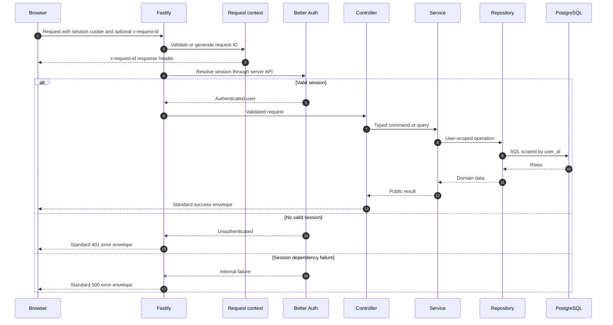
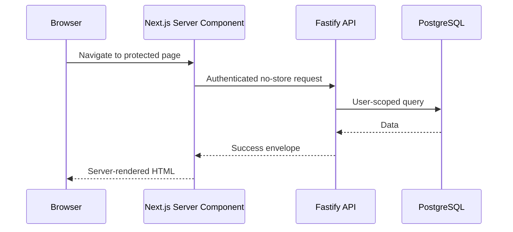
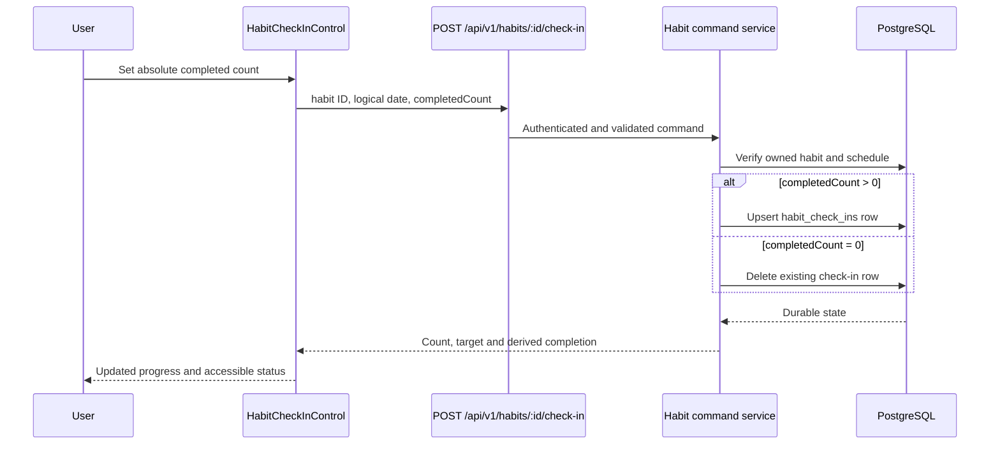
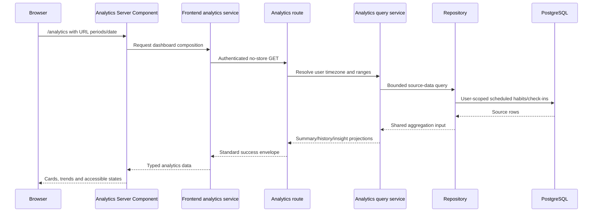
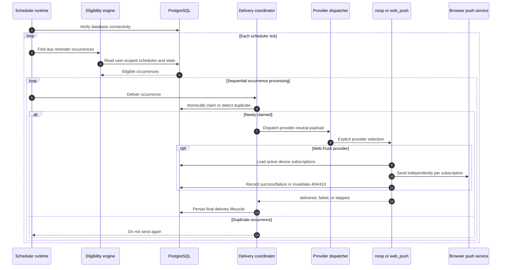
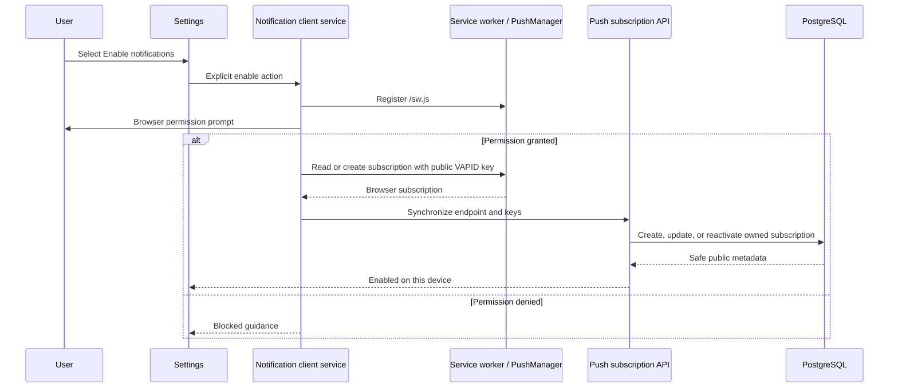
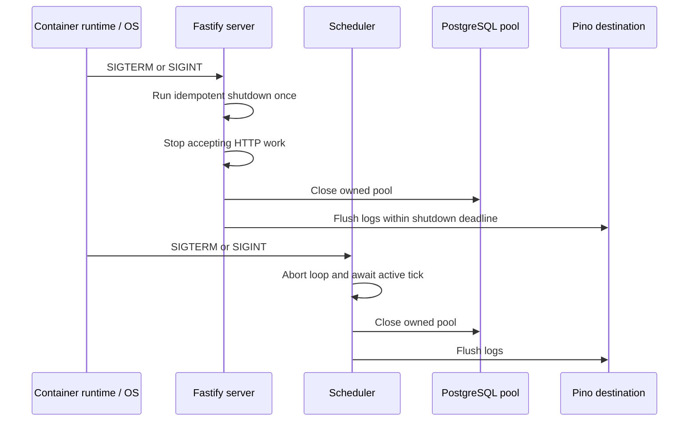

# Trackly Sequence Diagrams

## Purpose

Provide a compact interaction reference for the repository's implemented
request, authentication, mutation, analytics, scheduling, and notification
flows.

## Status

Completed

## Authenticated API Request

## Frontend Server-Rendered Read

Interactive Client Components submit mutations through the central Axios
client, then update focused UI state or refresh server-rendered data according
to the feature's existing behavior.

## Habit Check-in

## Analytics Dashboard Composition

## Reminder Scheduling and Delivery

## Browser Web Push Subscription

## Graceful Shutdown

## Related Documentation

- [Architecture diagrams](../01-design/architecture-diagram.md)
- [Authentication flow](../01-design/authentication-flow.md)
- [Backend architecture](../01-design/backend-architecture.md)
- [API reference](./api-reference.md)
- [Monitoring and incident response](../04-deployment/monitoring.md)
