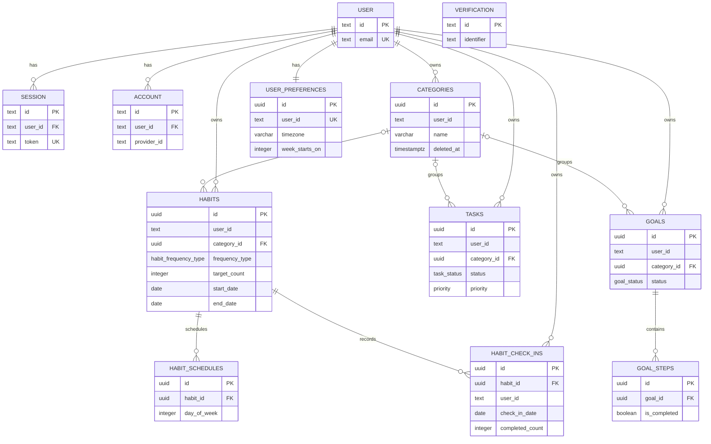

# Database domain design

Milestone 1.0 connects Trackly's application-owned PostgreSQL model to Better
Auth. It adds no seed users, business behavior, or derived analytics.

## Ownership and Better Auth boundary

Every user-owned table has a required `user_id text` foreign key to Better
Auth's generated `user.id`. Deleting a user cascades directly through
categories, habits, habit check-ins, tasks, goals, preferences, sessions, and
accounts. Schedules and goal steps cascade indirectly through their parents.
Better Auth exclusively owns users, sessions, accounts, and verification.

A Better Auth post-create database hook inserts default preferences with an
idempotent conflict guard. The unique user-preferences index guarantees exactly
one row per user.

## Tables

### `categories`

User-owned visual grouping for habits, tasks, and goals. Active category names
are unique per user through a partial unique index that excludes rows with
`deleted_at`. Physical category deletion sets references on habits, tasks, and
goals to null.

### `habits`

Defines a habit's identity, date range, frequency, target count, ordering, and
active state. `target_count` must be positive, `position` cannot be negative,
and `end_date` cannot precede `start_date`.

Frequency semantics:

- `daily`: expected every day; no schedule rows are needed.
- `weekly`: schedule rows identify expected ISO weekdays.
- `custom`: schedule rows identify selected ISO weekdays.
- `target_count`: required completions for an expected logical day. It is not a
  streak or percentage.

Soft deletion preserves history. A physical deletion cascades to schedules and
check-ins.

### `habit_schedules`

Maps habits to expected weekdays. `day_of_week` follows ISO-8601: Monday is 1
and Sunday is 7. Values outside 1–7 are rejected, and each habit/day pair is
unique.

### `habit_check_ins`

Stores a user's completion count for one habit on one logical calendar date.
There can be only one row per habit/date. `completed_count` is non-negative.
`check_in_date` is a PostgreSQL `date`, intentionally independent of a clock
time or UTC conversion.

### `tasks`

Stores non-recurring tasks with stable status and priority enums. Positions
cannot be negative. Application logic must keep `completed_at` consistent with
the `completed` status; this cross-field workflow is intentionally not encoded
as a database constraint because status transitions will be handled by the
future task service.

### `goals`

Stores goal identity, status, dates, optional category and cover image, and
ordering. `target_date` cannot precede `start_date` when both exist. Overall
progress is derived from goal steps and is never persisted.

### `goal_steps`

Ordered completion units belonging to a goal. Positions cannot be negative.
Physical goal deletion cascades to its steps. Steps are not soft-deleted.

### `user_preferences`

Stores one application preference row per user, separate from authentication
identity. The database defaults timezone to `UTC`, week start to ISO Monday
(`1`), and date format to `YYYY-MM-DD`. `week_starts_on` accepts ISO weekday
values 1–7. Theme remains browser-managed and notification preferences are out
of scope.

## Enums

- `habit_frequency_type`: `daily`, `weekly`, `custom`
- `task_status`: `todo`, `in_progress`, `completed`, `cancelled`
- `priority`: `low`, `medium`, `high`
- `goal_status`: `active`, `completed`, `paused`, `cancelled`

These sets represent stable domain states. Timezones, date formats, colors,
icons, and similar values remain ordinary columns because they may evolve.

## Date and timestamp semantics

- Logical user calendar days use PostgreSQL `date`: habit start/end dates,
  check-in dates, and goal start/target dates.
- Events and audit times use `timestamp with time zone`: due times,
  completion times, creation, updates, and deletion.
- `updated_at` is initialized by PostgreSQL and updated through the shared
  Drizzle column behavior. Future writes must not bypass this convention.

Timezone-aware conversion from user-local dates to instants belongs in future
application services and must use `user_preferences.timezone`.

## Soft deletion

Categories, habits, tasks, and goals support nullable `deleted_at`. Queries
should exclude soft-deleted rows unless explicitly retrieving history.
Schedules, check-ins, goal steps, and preferences do not use soft deletion.

Cascade rules apply to physical deletion only:

- habit → schedules and check-ins: cascade
- goal → goal steps: cascade
- category → habit/task/goal category reference: set null

## Derived values

Do not persist:

- habit streaks;
- habit completion percentages;
- derived habit completion status;
- goal progress percentages;
- dashboard or analytics aggregates.

These values must be calculated from schedules, targets, check-ins, and goal
steps.

The Today query layer derives habit completion and goal progress at read time.
It uses the authenticated user's timezone to translate a calendar date into
timestamp boundaries while comparing PostgreSQL `date` columns as date-only
values. Detailed query semantics are documented in
[`today-query.md`](today-query.md).

## Entity relationship diagram



## Migrations and development recovery

Committed forward migrations are the production mechanism:

```bash
pnpm db:generate
pnpm db:migrate
```

Never use `db:push` for production schema changes.

Shared environments must reverse a schema change with a reviewed compensating
migration. Drizzle does not automatically generate safe down migrations.

For a disposable local environment only, a full reset is possible:

```bash
docker compose down --volumes
docker compose up --build
pnpm db:migrate
```

This permanently deletes the local PostgreSQL volume. Back up anything needed
before running it. Never use this reset procedure against shared or production
data.

The integration suite creates a uniquely named temporary database, applies all
migrations, runs constraints and relationship tests, and drops that database:

```bash
pnpm test:database
```
