<!-- publication:prepend templates/cover.html -->

# Document Information {.unnumbered}

| Field          | Value                                                                    |
| -------------- | ------------------------------------------------------------------------ |
| Title          | Trackly Technical Documentation                                          |
| Subtitle       | Architecture, Development, Features, and Operations                      |
| Author         | Fahmy Akhmad Firdaus                                                     |
| Version        | 1.0                                                                      |
| Year           | 2026                                                                     |
| Language       | English                                                                  |
| Primary format | A4 portrait                                                              |
| Source         | Curated from the Trackly repository and canonical Markdown documentation |

This book describes the implementation present in the Trackly repository in 2026. It does not reconstruct undocumented project history, promise uncommitted
features, or replace the canonical engineering documents under `docs/`.

# Preface {.unnumbered}

Trackly is a personal productivity platform built around habits, goals,
reminders, and derived analytics. Its implementation pairs a server-rendered
Next.js application with a versioned Fastify API and PostgreSQL. The system is
designed around authenticated ownership, logical calendar dates, explicit
validation, and derived rather than persisted metrics.

This publication explains how those choices work together. Product chapters
show the user-facing behavior; design chapters describe the boundaries behind
it; engineering and operations chapters explain how to run, validate, and
deploy it safely.

Tasks and the standalone Insights route are intentionally identified as
unimplemented placeholders. Their navigation presence is not evidence of a
completed product module.

# How to Read This Document {.unnumbered}

- Read Parts I and II for architectural orientation.
- Use Part III to understand product workflows and business rules.
- Use Part IV while developing or reviewing changes.
- Use Part V before operating Trackly outside local development.
- Use Part VI for contracts, schema lookup, troubleshooting, and terminology.

The API and database chapters are compact publication references. The canonical
[API reference](../05-reference/api-reference.md) and
[database schema](../05-reference/database-schema.md) remain the exhaustive
sources.

<div class="callout note">
<p class="callout-title">Note</p>
<p>Markdown is the source of truth. Mermaid figures in this manuscript are
rendering inputs and must be converted to SVG before the final PDF or DOCX is
produced.</p>
</div>

# Table of Contents {.unnumbered}

The final PDF and DOCX pipeline will generate the table of contents to depth
three from this manuscript's headings. The six Parts move from product context
through design, implemented features, engineering practice, operations, and
reference material.

# Part I — Product and Architecture {.part-title .unnumbered}

# Project Overview {#chapter-project-overview}

Trackly combines habit tracking, task-oriented daily context, goal tracking,
reminders, preferences, notifications, and analytics in one authenticated
application. The implemented center of gravity is habit consistency: schedules
produce logical occurrences; check-ins record absolute progress; goals and
analytics derive meaning from those source records.

## Product Goals

- Give users a calm daily view of scheduled work.
- Make recurring progress explicit without retaining meaningless zero rows.
- Keep data isolated by authenticated ownership.
- Respect user-local calendar boundaries across Today, schedules, streaks,
  reminders, and analytics.
- Provide extension points without placing business logic in transport or UI
  infrastructure.

## Implemented Scope

Authentication, Today, categories, habits, goals, analytics, preferences,
reminders, durable notification delivery, and browser Web Push are implemented.
Tasks have a database/query foundation and placeholder page rather than a
completed workflow. Standalone Insights is also a placeholder; analytics
insights are implemented inside the Analytics dashboard.

## Current Status

The repository includes production build targets, database migrations,
structured logs, health/readiness checks, security controls, and extensive
unit/integration coverage. It does not include production orchestration, TLS
termination, automated backups, external monitoring, or deployment automation.

# System Architecture {#chapter-system-architecture}

Trackly separates browser concerns, server rendering, API transport, domain
services, repositories, and persistent data. Authentication is delegated to
Better Auth. Reminder processing runs as a separate backend runtime, while Web
Push remains behind a provider-neutral dispatcher.

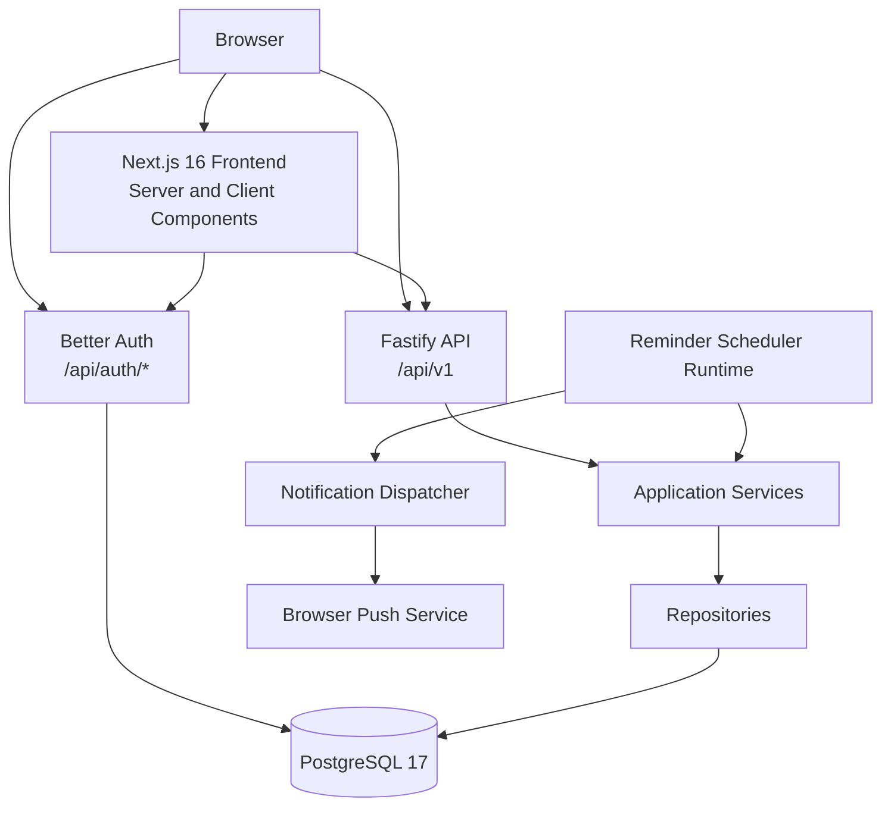
```mermaid
flowchart TB
    Browser["Browser"]
    Next["Next.js 16 Frontend<br/>Server and Client Components"]
    API["Fastify API<br/>/api/v1"]
    Auth["Better Auth<br/>/api/auth/*"]
    Services["Application Services"]
    Repositories["Repositories"]
    PostgreSQL[("PostgreSQL 17")]
    Scheduler["Reminder Scheduler Runtime"]
    Dispatcher["Notification Dispatcher"]
    Push["Browser Push Service"]

    Browser --> Next
    Browser --> API
    Browser --> Auth
    Next --> API
    Next --> Auth
    API --> Services
    Auth --> PostgreSQL
    Services --> Repositories
    Repositories --> PostgreSQL
    Scheduler --> Services
    Scheduler --> Dispatcher
    Dispatcher --> Push
```

_Figure 2.1 — Trackly System Context_

The frontend does not query PostgreSQL. The API does not place SQL in routes or
controllers. User-specific reads avoid shared static caches, and ownership
filters are applied in repositories.

# Technology Stack {#chapter-technology-stack}

| Area           | Technology                                                     | Role                                                       |
| -------------- | -------------------------------------------------------------- | ---------------------------------------------------------- |
| Frontend       | Next.js 16, React 19, TypeScript                               | App Router, server rendering, focused client interaction   |
| Styling        | Tailwind CSS 4, shadcn/ui conventions, Lucide                  | Responsive design system and icons                         |
| Forms          | React Hook Form, Zod                                           | Typed forms and validation                                 |
| HTTP           | Axios plus server request utility                              | Central authenticated frontend API access                  |
| Charts         | Recharts                                                       | Accessible analytics trends                                |
| Backend        | Fastify 5, TypeScript                                          | Plugin-oriented HTTP API                                   |
| Validation     | Zod                                                            | Params, query, body, environment, and public configuration |
| Database       | PostgreSQL 17                                                  | Relational ownership and logical-date storage              |
| ORM            | Drizzle ORM                                                    | Typed schema, queries, relations, and migrations           |
| Authentication | Better Auth                                                    | Users, accounts, sessions, verification, cookies           |
| Testing        | Vitest, Testing Library, Fastify injection, Playwright tooling | Unit, integration, UI, and publication capture             |
| Runtime        | Docker, Docker Compose, pnpm workspaces                        | Repeatable development and production build stages         |

The stack favors explicit TypeScript contracts and libraries that work in both
local development and containerized deployment.

# Repository Structure {#chapter-repository-structure}

```text
Trackely/
├── backend/                 Fastify API, scheduler, database, and tests
├── frontend/                Next.js application and UI tests
├── docs/                    Canonical and publication documentation
│   ├── 00-overview/
│   ├── 01-design/
│   ├── 02-features/
│   ├── 03-development/
│   ├── 04-deployment/
│   ├── 05-reference/
│   ├── assets/
│   └── publication/
├── scripts/docs-screenshots/
├── docker-compose.yml
├── package.json
├── pnpm-workspace.yaml
└── AGENTS.md
```

The workspace contains two application packages rather than an `apps/` or
shared `packages/` monorepo hierarchy. Database schema and migrations live
inside the backend. Repository-wide commands orchestrate both packages.

# Part II — Application Design {.part-title .unnumbered}

# Frontend Architecture {#chapter-frontend-architecture}

The frontend uses the Next.js App Router and defaults to React Server
Components. Protected route groups obtain the Better Auth session server-side,
fetch user-specific data with `no-store`, and render stable initial UI. Client
Components are limited to forms, mutations, theme control, check-ins, reminder
management, and browser Web Push.

## Routing and Layout

Public authentication pages use a dedicated layout. Authenticated routes share
an application shell with desktop sidebar, top bar, responsive content area,
and fixed mobile navigation. Route-level loading, error, and not-found files
provide localized recovery.

## Data and State

- Shareable list and analytics selections live in URL parameters.
- React Hook Form owns temporary form state.
- Focused component state manages pending and feedback behavior.
- No global client data cache or React Query layer is present.
- Server requests use a shared parser, timeout, cookie forwarding, and safe
  error mapping.

<div class="figure mobile">
  
  <p class="figure-caption">Figure 5.1 — Mobile Primary Navigation</p>
</div>

# Backend Architecture {#chapter-backend-architecture}

Fastify is assembled in `app.ts` without opening a port. `server.ts` owns
startup and graceful shutdown. Plugins register authentication, database
access, request context, security, CORS, rate limiting, Swagger, and centralized
errors.

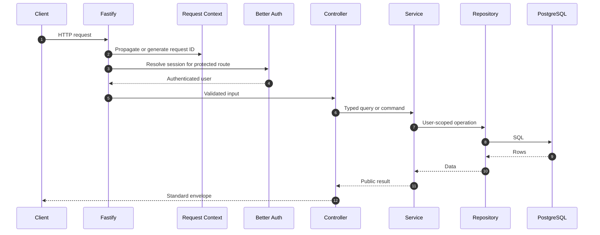
```mermaid
sequenceDiagram
    autonumber
    participant Client
    participant Fastify
    participant Context as Request Context
    participant Auth as Better Auth
    participant Controller
    participant Service
    participant Repository
    participant DB as PostgreSQL

    Client->>Fastify: HTTP request
    Fastify->>Context: Propagate or generate request ID
    Fastify->>Auth: Resolve session for protected route
    Auth-->>Fastify: Authenticated user
    Fastify->>Controller: Validated input
    Controller->>Service: Typed query or command
    Service->>Repository: User-scoped operation
    Repository->>DB: SQL
    DB-->>Repository: Rows
    Repository-->>Service: Data
    Service-->>Controller: Public result
    Controller-->>Client: Standard envelope
```

_Figure 6.1 — Authenticated Request Lifecycle_

Controllers translate HTTP input and output. Services enforce business,
schedule, and timezone rules. Repositories own database access. This lightweight
CQRS separation is most visible in the Habit read and command paths.

# Authentication and Authorization {#chapter-authentication}

Better Auth owns password hashing, accounts, sessions, verification records,
cookies, and `/api/auth/*`. Trackly resolves sessions through Better Auth's
server API rather than decoding cookies. Protected pages redirect to login;
protected API routes return the standard 401 error envelope.

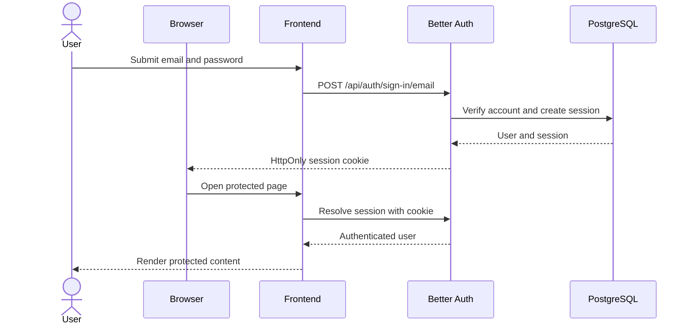
```mermaid
sequenceDiagram
    actor User
    participant Browser
    participant Frontend
    participant Auth as Better Auth
    participant DB as PostgreSQL

    User->>Frontend: Submit email and password
    Frontend->>Auth: POST /api/auth/sign-in/email
    Auth->>DB: Verify account and create session
    DB-->>Auth: User and session
    Auth-->>Browser: HttpOnly session cookie
    Browser->>Frontend: Open protected page
    Frontend->>Auth: Resolve session with cookie
    Auth-->>Frontend: Authenticated user
    Frontend-->>User: Render protected content
```

_Figure 7.3 — Email and Password Authentication Sequence_

Authorization is ownership-based. The authenticated user ID is passed into
services and repositories; public request bodies never choose an owner.
Deleted, missing, and foreign habit records intentionally share not-found
behavior.

<div class="figure desktop">
  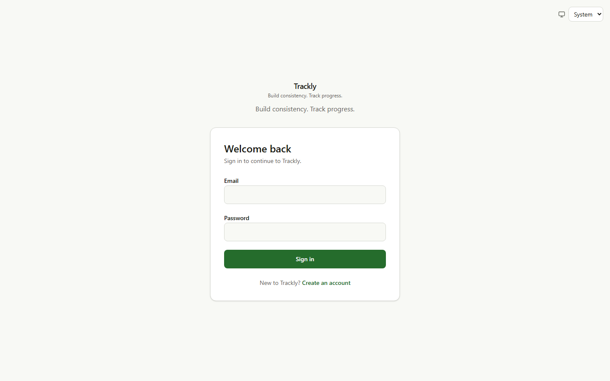
  <p class="figure-caption">Figure 7.1 — Trackly Sign-In Experience</p>
</div>

Registration uses the same authentication-owned contract and creates a default
preference row for the new user.

<div class="figure desktop">
  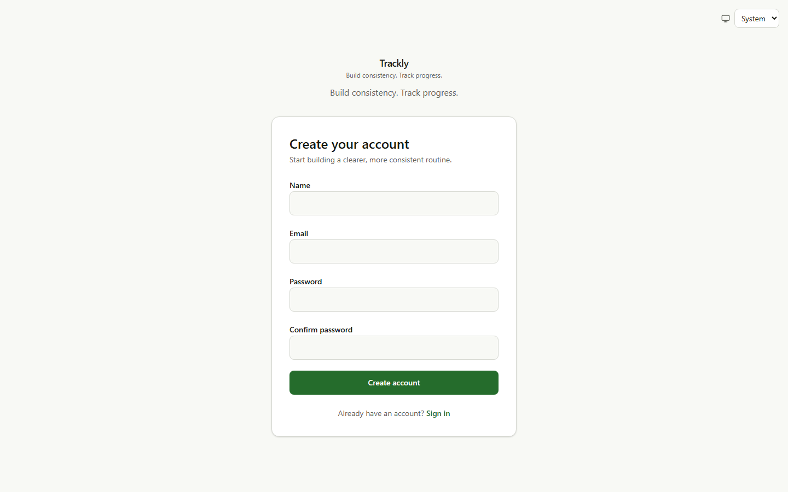
  <p class="figure-caption">Figure 7.2 — Account Registration</p>
</div>

# Database Design {#chapter-database-design}

PostgreSQL stores authentication records, user preferences, categories, habits,
schedules, check-ins, tasks, goals, goal steps, reminders, notification
deliveries, and browser push subscriptions. Drizzle defines tables, relations,
constraints, indexes, and migration snapshots.

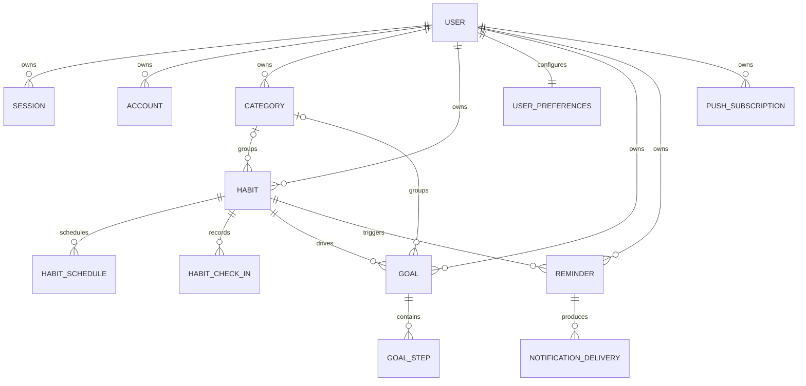
```mermaid
erDiagram
    USER ||--o{ SESSION : owns
    USER ||--o{ ACCOUNT : owns
    USER ||--o{ CATEGORY : owns
    USER ||--o{ HABIT : owns
    USER ||--|| USER_PREFERENCES : configures
    USER ||--o{ GOAL : owns
    USER ||--o{ REMINDER : owns
    USER ||--o{ PUSH_SUBSCRIPTION : owns
    HABIT ||--o{ HABIT_SCHEDULE : schedules
    HABIT ||--o{ HABIT_CHECK_IN : records
    HABIT ||--o{ GOAL : drives
    HABIT ||--o{ REMINDER : triggers
    GOAL ||--o{ GOAL_STEP : contains
    REMINDER ||--o{ NOTIFICATION_DELIVERY : produces
    CATEGORY o|--o{ HABIT : groups
    CATEGORY o|--o{ GOAL : groups
```

_Figure 8.1 — Trackly Entity Relationships_

Tables and columns use snake_case. UUIDs identify Trackly domain entities;
Better Auth retains its own text identifiers. Logical days use PostgreSQL
`date`, while instants use timezone-aware timestamps. Soft-deletable resources
carry nullable `deleted_at`.

Migrations are reviewed and forward-only. `db:push` is limited to local
development. Transactions protect dependent mutation steps, occurrence claims,
and other atomic workflows.

# API Design {#chapter-api-design}

Trackly application endpoints live under `/api/v1`. Better Auth owns
`/api/auth/*`; `/health`, `/ready`, and conditionally exposed `/docs` remain
unversioned infrastructure routes.

Success responses use:

```json
{
  "success": true,
  "data": {},
  "meta": {}
}
```

Errors use stable codes and JSON-safe optional details:

```json
{
  "success": false,
  "error": {
    "code": "VALIDATION_ERROR",
    "message": "Request validation failed.",
    "details": []
  }
}
```

Zod validates params, query strings, bodies, and configuration. The centralized
handler maps Zod, Fastify validation, malformed JSON, application errors,
missing routes, and unexpected failures without exposing stack traces or raw
database errors.

# Part III — Features {.part-title .unnumbered}

# Today Dashboard {#chapter-today}

Today is the user's local-calendar command center. It combines scheduled habits,
task group projections, active goals, and a daily summary. A URL date parameter
supports explicit date navigation without losing refresh or browser-history
state.

Habit progress uses the source check-in count for the selected date. Tasks are
represented only through their existing query foundation; no mutation UI is
present. Goal cards show step summaries, while detailed goal progress is
derived elsewhere from habit check-ins.

<div class="figure desktop">
  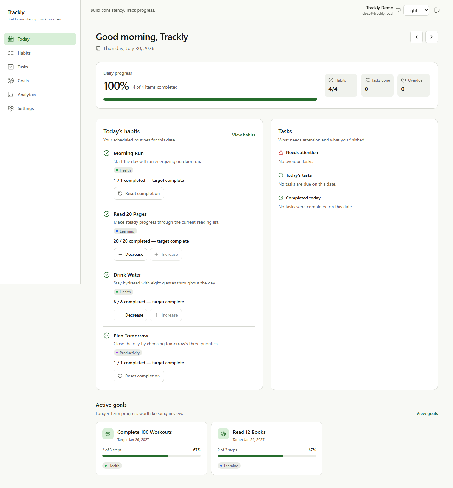
  <p class="figure-caption">Figure 10.1 — Today Dashboard with Daily Progress</p>
</div>

On narrow screens, cards stack and mobile navigation remains fixed without
horizontal overflow.

<div class="figure mobile">
  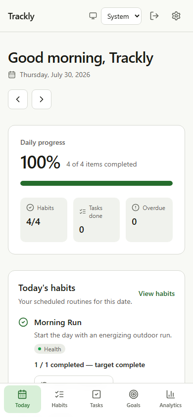
  <p class="figure-caption">Figure 10.2 — Today Dashboard on Mobile</p>
</div>

# Habits {#chapter-habits}

Habits support collection/detail reads, create, partial update, archive,
restore, soft deletion, check-in, streak, category association, schedule, and
reminder management. Collection controls are browser-native GET forms so view,
date, search, sort, order, and page survive refresh and sharing.

<div class="figure desktop">
  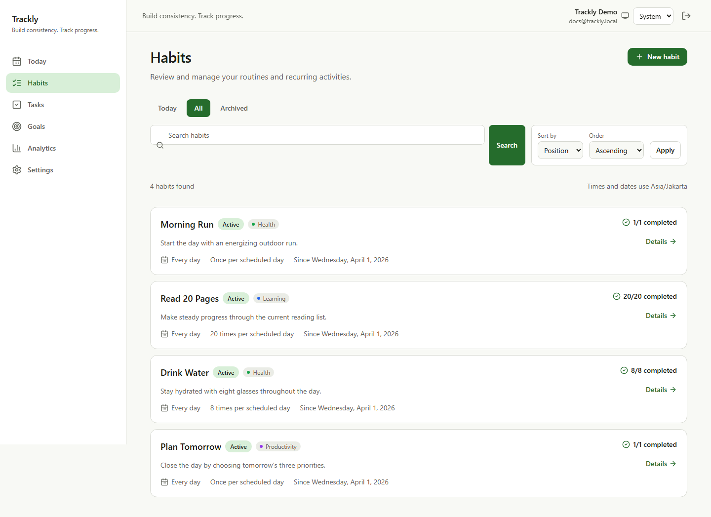
  <p class="figure-caption">Figure 11.1 — Habit Collection and URL-Based Controls</p>
</div>

Create and edit forms use Zod-backed React Hook Form validation. Daily, weekly,
and custom schedules share backend schedule utilities.

<div class="figure desktop">
  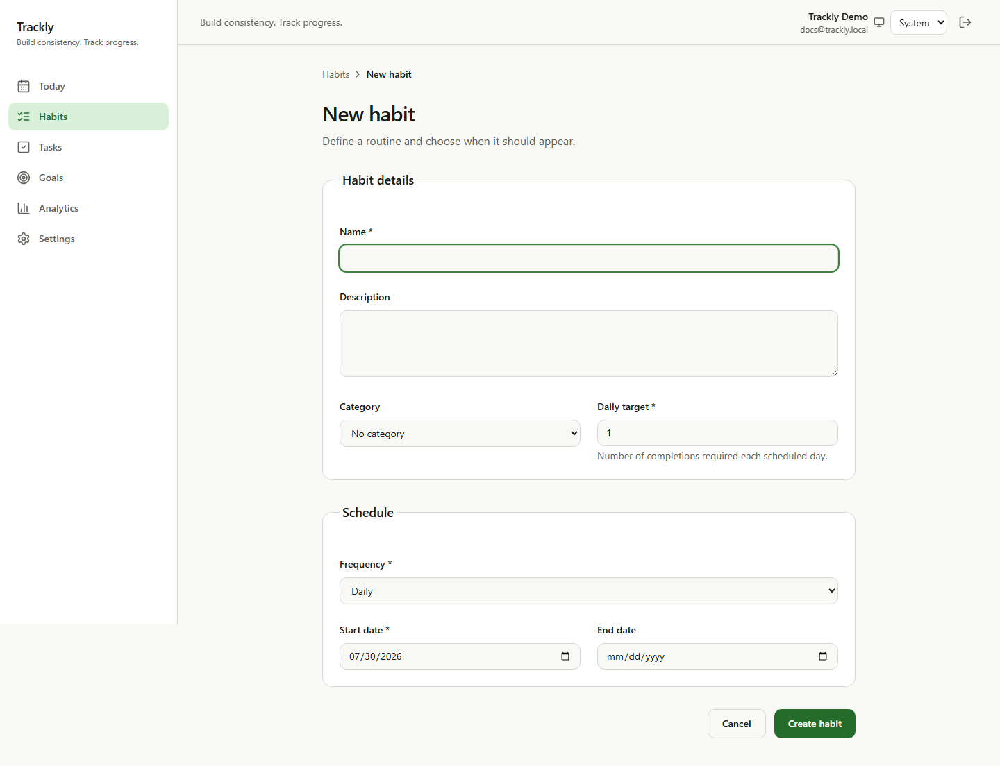
  <p class="figure-caption">Figure 11.2 — Habit Creation Form</p>
</div>

Check-ins send the final absolute `completedCount`, not an increment command.
Target-one habits toggle between one and zero; multi-target habits increment or
decrement within bounds. Zero removes the stored row.

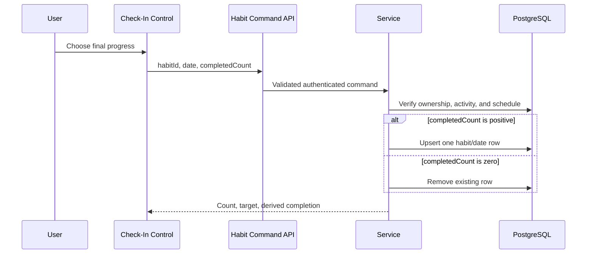
```mermaid
sequenceDiagram
    participant User
    participant Control as Check-In Control
    participant API as Habit Command API
    participant Service
    participant DB as PostgreSQL

    User->>Control: Choose final progress
    Control->>API: habitId, date, completedCount
    API->>Service: Validated authenticated command
    Service->>DB: Verify ownership, activity, and schedule
    alt completedCount is positive
        Service->>DB: Upsert one habit/date row
    else completedCount is zero
        Service->>DB: Remove existing row
    end
    Service-->>Control: Count, target, derived completion
```

_Figure 11.5 — Absolute Habit Check-In Flow_

<div class="figure desktop">
  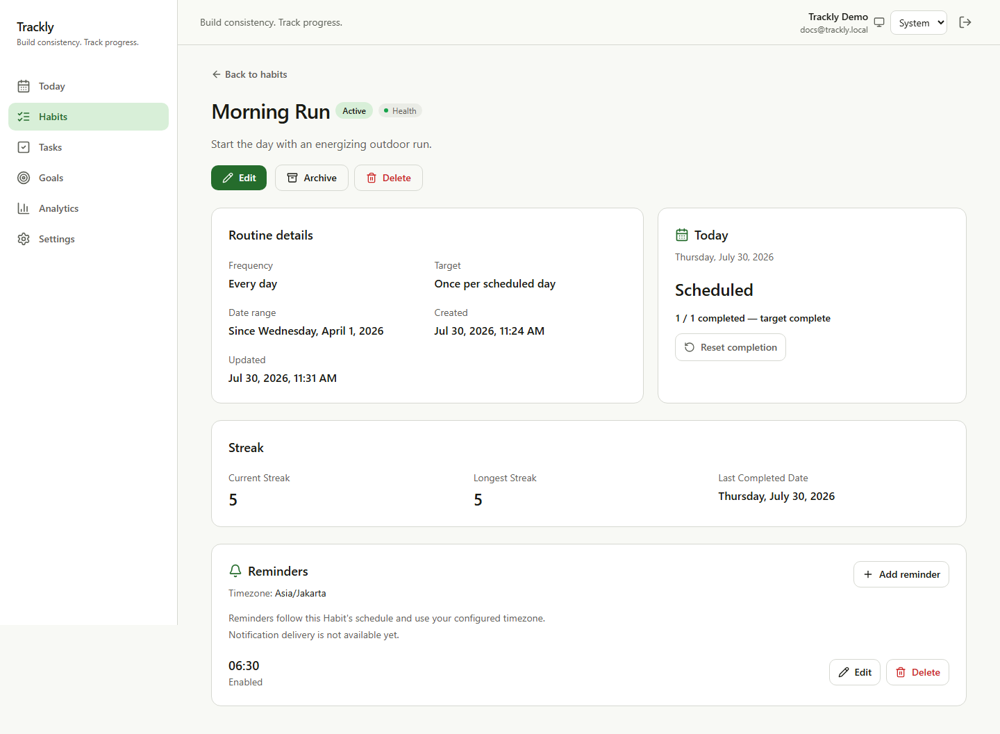
  <p class="figure-caption">Figure 11.3 — Habit Detail, Check-In, and Streak</p>
</div>

<div class="figure mobile">
  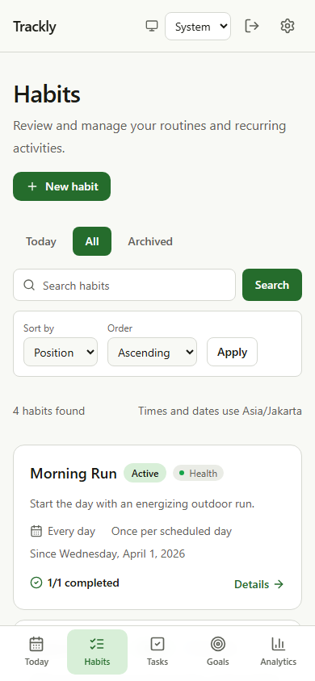
  <p class="figure-caption">Figure 11.4 — Habit Collection on Mobile</p>
</div>

# Goals {#chapter-goals}

Goals define finite accumulation targets linked to owned habits. Progress is
calculated from habit check-ins inside the goal date range and capped only where
the consuming metric requires it. The dashboard groups active goals by
progress, deadline, target achievement, and over-target state.

<div class="figure desktop">
  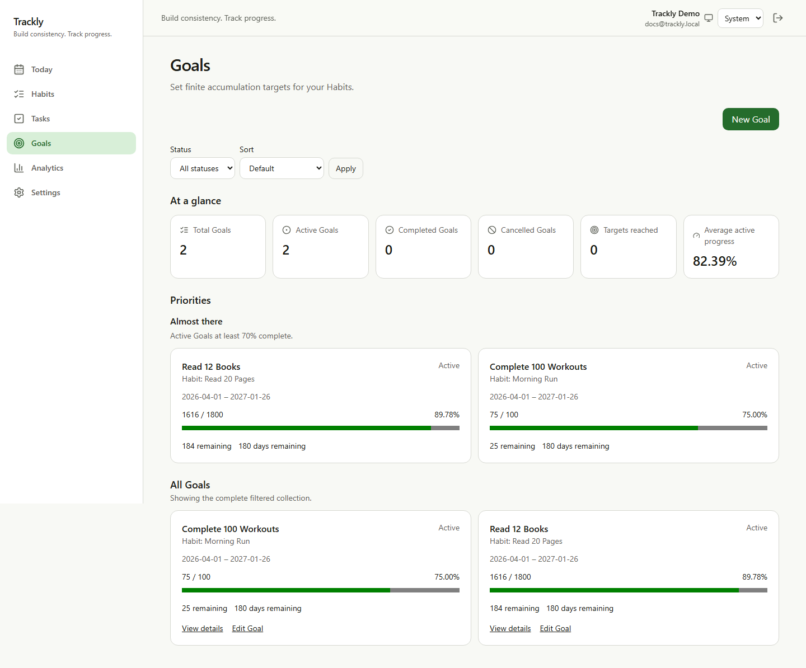
  <p class="figure-caption">Figure 12.1 — Goal Dashboard and Derived Progress</p>
</div>

Create, update, and delete operations verify that the linked habit and optional
category belong to the authenticated user. Goal steps provide a separate
checklist projection used by Today.

# Categories and Preferences {#chapter-categories-preferences}

Categories provide optional user-owned labels for habits and goals. The current
public API lists active categories; it does not expose category-management
commands.

Preferences store timezone, week start, date format, time format, and theme.
Timezone is a domain input, while other preferences primarily affect
presentation. Missing preference rows resolve documented defaults, and invalid
legacy timezones safely fall back to UTC in dependent services.

<div class="figure desktop">
  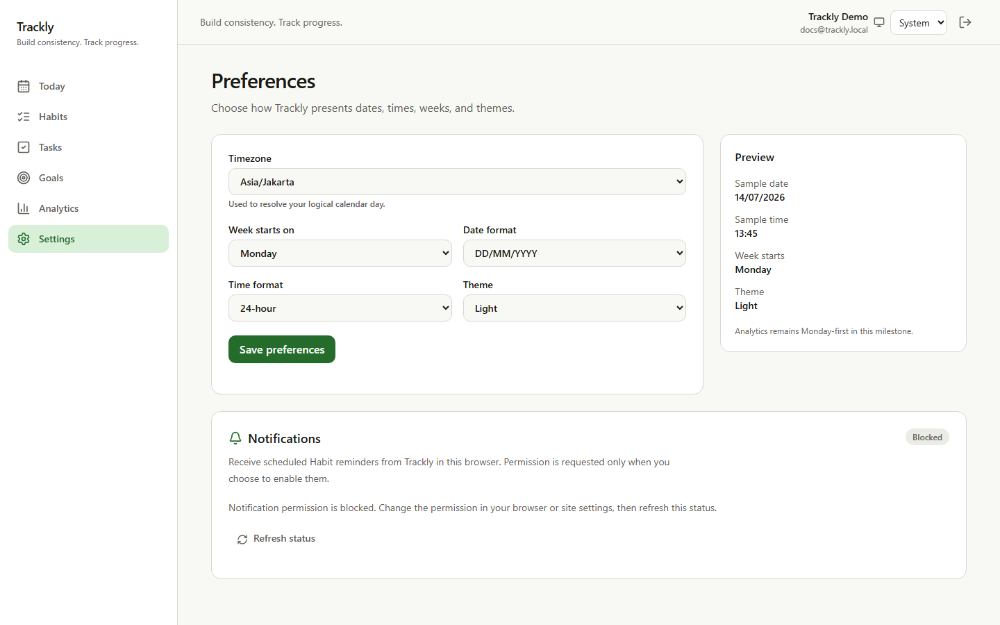
  <p class="figure-caption">Figure 13.1 — Preferences and Device Notification Settings</p>
</div>

# Analytics {#chapter-analytics}

Analytics is read-only and calculated on demand. It reuses a bounded repository
snapshot to serve summary, history, insights, heatmap, and rankings without six
overlapping database reads.

Completion rate answers whether scheduled occurrences reached their target.
Progress rate answers how much capped target volume was completed. These values
intentionally differ for partial multi-target habits.

<div class="figure desktop">
  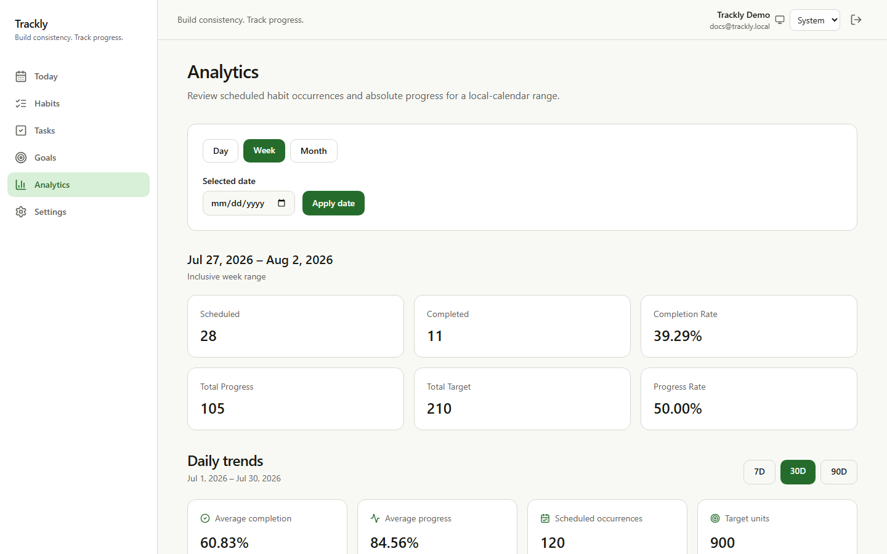
  <p class="figure-caption">Figure 14.1 — Analytics Summary and Daily Trends</p>
</div>

History includes every local date in its range, including zero-activity dates.
Insights exclude inactive days where required, use deterministic tie-breaking,
and compare equal recent/previous windows. The heatmap preserves the calendar
shape while rankings remain user-scoped.

<div class="figure desktop">
  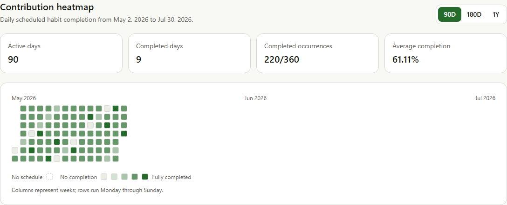
  <p class="figure-caption">Figure 14.2 — Contribution Heatmap</p>
</div>

# Reminders and Web Push {#chapter-reminders-web-push}

Reminders attach local times to habits. Eligibility considers authenticated
ownership, habit lifecycle, schedule, completion, date, timezone, and the
configured reminder time. A separate scheduler evaluates due occurrences.

<div class="figure desktop">
  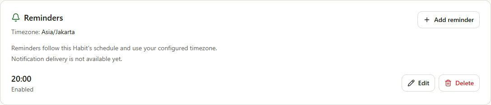
  <p class="figure-caption">Figure 15.1 — Reminder Management on Habit Detail</p>
</div>

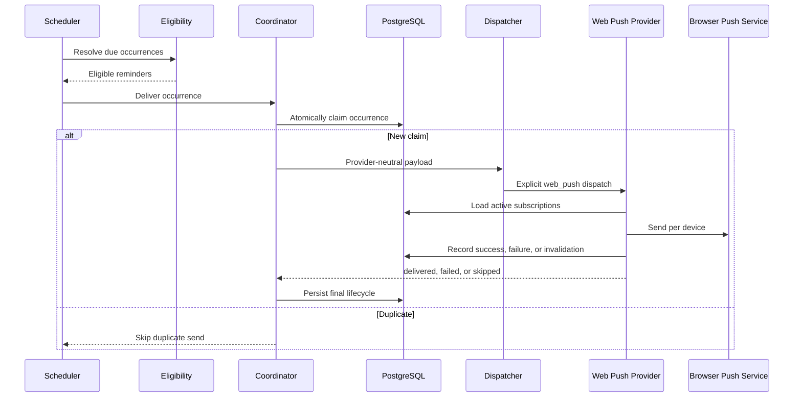
```mermaid
sequenceDiagram
    participant Scheduler
    participant Eligibility
    participant Coordinator
    participant DB as PostgreSQL
    participant Dispatcher
    participant Provider as Web Push Provider
    participant Push as Browser Push Service

    Scheduler->>Eligibility: Resolve due occurrences
    Eligibility-->>Scheduler: Eligible reminders
    Scheduler->>Coordinator: Deliver occurrence
    Coordinator->>DB: Atomically claim occurrence
    alt New claim
        Coordinator->>Dispatcher: Provider-neutral payload
        Dispatcher->>Provider: Explicit web_push dispatch
        Provider->>DB: Load active subscriptions
        Provider->>Push: Send per device
        Provider->>DB: Record success, failure, or invalidation
        Provider-->>Coordinator: delivered, failed, or skipped
        Coordinator->>DB: Persist final lifecycle
    else Duplicate
        Coordinator-->>Scheduler: Skip duplicate send
    end
```

_Figure 15.2 — Reminder Scheduling and Notification Delivery_

Browser subscriptions are device-specific. Permission is requested only after
an explicit action. The service worker displays minimal payloads and constructs
only known internal navigation targets. HTTP 404/410 invalidates expired
subscriptions; transient failures do not trigger automatic retry.

# Part IV — Engineering {.part-title .unnumbered}

# Local Development {#chapter-local-development}

Trackly uses pnpm workspaces. Node 24 matches the Docker build images, and pnpm
10.13.1 is declared by the root package.

```bash
corepack enable
pnpm install
Copy-Item .env.example .env
docker compose up --build
```

The frontend defaults to port 3000, backend to 4000, and PostgreSQL to 5432.
Host processes use `localhost`; containers use Compose service names.

# Environment Configuration {#chapter-environment}

Backend configuration is parsed and validated before startup. Production
requires HTTPS authentication/trusted origins, a non-placeholder Better Auth
secret, disabled diagnostics, and complete VAPID configuration when Web Push is
used.

Frontend public configuration is limited to browser-safe URLs and the VAPID
public key. `NEXT_PUBLIC_*` variables are visible to clients and must never
contain database credentials, private VAPID material, or authentication
secrets.

<div class="callout security">
<p class="callout-title">Security</p>
<p>Populate environment values through the deployment secret mechanism. Never
commit a populated <code>.env</code> file.</p>
</div>

# Testing {#chapter-testing}

Vitest covers backend services/routes, frontend components/services, and
PostgreSQL integration behavior. Fastify injection avoids opening network ports
for HTTP contract tests. External Web Push and browser APIs are mocked.

```bash
pnpm format:check
pnpm lint
pnpm typecheck
pnpm test:backend
pnpm test:frontend
pnpm test:database
pnpm build
docker compose config --quiet
git diff --check
```

The database suite remains separate from `pnpm validate` because it requires
PostgreSQL. Publication screenshots use a dedicated Playwright workflow and
reserved documentation account.

# Debugging {#chapter-debugging}

Begin with the smallest boundary:

1. Capture the failing command, route, response status, and request ID.
2. Compare `/health` with `/ready`.
3. Inspect the relevant frontend, backend, PostgreSQL, or scheduler logs.
4. Verify host-versus-container URLs.
5. Reproduce with a focused test.

Public errors remain generic. Server logs may contain stack traces for
unexpected failures, but redaction prevents credential and token fields from
being logged.

# Docker and Database Migrations {#chapter-docker-migrations}

Development Compose starts PostgreSQL, waits for its health check, starts the
backend, waits for backend readiness, and then starts the frontend.

```bash
pnpm db:generate
pnpm db:migrate
pnpm db:seed
pnpm test:database
```

Schema changes require reviewed migrations. The production backend image is not
a self-contained migration image because it does not copy the SQL migration
directory; a deployment must supply a release workspace or purpose-built
migration job.

# Part V — Deployment and Operations {.part-title .unnumbered}

# Production Deployment {#chapter-production}

The repository supplies multi-stage frontend and backend production Docker
targets. Both run as non-root users. The frontend uses Next.js standalone
output; the backend runs compiled JavaScript. PostgreSQL and the scheduler are
separate runtime responsibilities.

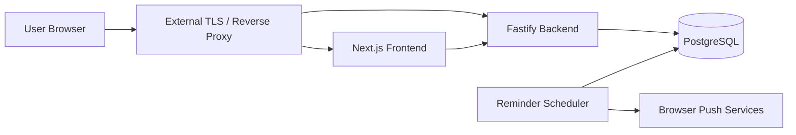
```mermaid
flowchart LR
    User["User Browser"] --> TLS["External TLS / Reverse Proxy"]
    TLS --> Frontend["Next.js Frontend"]
    TLS --> Backend["Fastify Backend"]
    Frontend --> Backend
    Backend --> DB[("PostgreSQL")]
    Scheduler["Reminder Scheduler"] --> DB
    Scheduler --> Push["Browser Push Services"]
```

_Figure 21.1 — Supported Deployment Topology and External Boundaries_

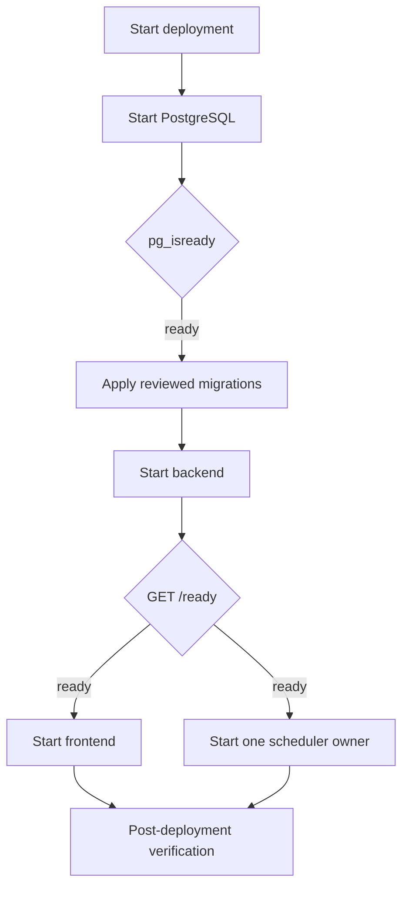
```mermaid
flowchart TD
    Start["Start deployment"] --> Postgres["Start PostgreSQL"]
    Postgres --> PgReady{"pg_isready"}
    PgReady -- ready --> Migrate["Apply reviewed migrations"]
    Migrate --> Backend["Start backend"]
    Backend --> ApiReady{"GET /ready"}
    ApiReady -- ready --> Frontend["Start frontend"]
    ApiReady -- ready --> Scheduler["Start one scheduler owner"]
    Frontend --> Verify["Post-deployment verification"]
    Scheduler --> Verify
```

_Figure 21.2 — Container Startup Dependencies_

# Reverse Proxy and Networking {#chapter-reverse-proxy}

No reverse proxy configuration is checked in. Production must supply TLS
termination, preserve the host/protocol needed by Better Auth, route frontend
and backend paths correctly, forward validated request IDs, and align CORS with
trusted origins.

Static Next.js assets may use immutable caching where filenames are content
addressed. Authenticated HTML and API responses must not enter shared caches.
`TRUST_PROXY` should be enabled only behind a known proxy topology.

# Monitoring and Logging {#chapter-monitoring}

Pino emits readable development logs and machine-readable production JSON.
Request completion records include timestamp, level, request ID, method, path,
status, duration, and authenticated user ID when available. Audit events record
actor, action, resource, outcome, and request ID.

Trackly provides `/health` for liveness and `/ready` for PostgreSQL readiness.
It does not ship an external log platform, metrics, tracing, dashboards, or
alerts. Operators must retain logs and alert on readiness failures, error
rates, scheduler failures, and notification delivery outcomes.

# Backup and Recovery {#chapter-backup}

The development `postgres_data` volume provides persistence, not backup. The
repository does not implement scheduled backups, retention, encryption,
point-in-time recovery, or restore automation.

Production requires an external PostgreSQL backup plan with tested restore
procedures. Recovery must restore schema and data coherently, apply only
reviewed forward migrations, and verify authentication, ownership, check-ins,
goals, reminders, and notification records.

# Security and Operational Readiness {#chapter-security-readiness}

Implemented controls include Helmet security headers and CSP, CORS allowlists,
HttpOnly Better Auth cookies, structured redaction, Zod validation,
environment hardening, request IDs, process-local rate limiting, authenticated
ownership, safe internal notification routing, and non-root production images.

<div class="callout limitation">
<p class="callout-title">Operational Limitations</p>
<p>Trackly does not include TLS/reverse proxy configuration, production
orchestration, distributed rate limits, scheduler leadership, automated
backups, external monitoring, CI/CD, or rollback automation.</p>
</div>

A production review must define secret rotation, proxy trust, cookie behavior,
database recovery objectives, migration ownership, one scheduler leader,
central log retention, alerts, and capacity budgets.

# Part VI — Reference {.part-title .unnumbered}

# API Reference {#chapter-api-reference}

The implemented API groups are:

| Group                      | Namespace                             | Authentication      |
| -------------------------- | ------------------------------------- | ------------------- |
| Health/readiness           | `/health`, `/ready`                   | Public              |
| Swagger                    | `/docs` when enabled                  | Public when exposed |
| Better Auth                | `/api/auth/*`                         | Framework-specific  |
| Current user               | `/api/v1/auth/me`                     | Required            |
| Today                      | `/api/v1/today`                       | Required            |
| Categories                 | `/api/v1/categories`                  | Required            |
| Habits and streak/check-in | `/api/v1/habits/*`                    | Required            |
| Goals                      | `/api/v1/goals/*`                     | Required            |
| Preferences                | `/api/v1/preferences`                 | Required            |
| Reminders                  | `/api/v1/habits/:habitId/reminders/*` | Required            |
| Push subscriptions         | `/api/v1/push-subscriptions`          | Required            |
| Analytics                  | `/api/v1/analytics/*`                 | Required            |

List endpoints document their own pagination, filtering, and deterministic
sorting. Rate-limited routes return the standard 429 envelope. Swagger is
generated from registered Fastify schemas and may be disabled in production.

For every request field, response model, error, and service mapping, use the
[canonical API reference](../05-reference/api-reference.md).

# Database Reference {#chapter-database-reference}

The schema contains fourteen implemented tables:

`user`, `session`, `account`, `verification`, `categories`, `habits`,
`habit_schedules`, `habit_check_ins`, `tasks`, `goals`, `goal_steps`,
`user_preferences`, `reminders`, `notification_deliveries`, and
`push_subscriptions`.

Better Auth owns the first four authentication tables. Domain tables use
database constraints, ownership indexes, and explicit cascade/set-null
behavior. The task table exists, but the product workflow remains incomplete.

The [canonical database reference](../05-reference/database-schema.md) lists
every column, type, default, foreign key, index, unique constraint, check
constraint, enumeration, relation, and lifecycle rule.

# Troubleshooting {#chapter-troubleshooting}

| Symptom                    | First checks                                                           |
| -------------------------- | ---------------------------------------------------------------------- |
| Stack does not start       | `docker compose config`, service status, port collisions, logs         |
| Healthy but not ready      | Database URL, PostgreSQL health, network, credentials, migrations      |
| Authentication loop        | Auth URLs, trusted origins, CORS, cookies, HTTPS                       |
| Frontend cannot call API   | Browser URL versus internal server URL                                 |
| HTTP 429                   | Configured window, duplicate submissions, trusted proxy                |
| Scheduler does not deliver | Separate process, database, eligibility, provider, singleton ownership |
| Web Push unavailable       | HTTPS/localhost, public/private VAPID config, browser permission       |
| Build/test failure         | Run formatting, lint, type, package tests, and build independently     |

Do not expose secrets in incident reports. Preserve timestamps, deployment
version, route, and sanitized request IDs. Full procedures are in
[Troubleshooting](../05-reference/troubleshooting.md).

# Frequently Asked Questions {#chapter-faq}

## Is analytics persisted?

No. Analytics, streaks, percentages, and goal progress are derived.

## Does the backend start the scheduler?

No. The scheduler is a separate runtime.

## Can a client choose a user ID?

No. Ownership always comes from the authenticated session.

## Can `db:push` deploy production schema?

No. Production uses reviewed migrations.

## Is a Compose volume a backup?

No. It is local persistence.

## Does Trackly use Firebase?

No. Browser notifications use standard Web Push with VAPID.

See the complete [FAQ](../05-reference/faq.md).

# Glossary {#chapter-glossary}

| Term            | Meaning                                                             |
| --------------- | ------------------------------------------------------------------- |
| Logical date    | A `YYYY-MM-DD` calendar date interpreted in the user's timezone     |
| Occurrence      | A derived scheduled habit instance for one logical date             |
| Check-in        | Absolute progress stored for one habit/date                         |
| Active day      | A date with at least one scheduled occurrence                       |
| Completion rate | Completed occurrences divided by scheduled occurrences              |
| Progress rate   | Capped completed volume divided by target volume                    |
| Soft delete     | Retention through nullable `deleted_at`                             |
| Request ID      | Correlation identifier returned in `x-request-id` and logs          |
| Provider        | Explicit notification delivery adapter such as `noop` or `web_push` |
| Readiness       | Ability to query PostgreSQL and serve database-dependent traffic    |

See the complete [Glossary](../05-reference/glossary.md).

# Decision Log {#chapter-decision-log}

Current repository-backed decisions include:

1. TypeScript across application code.
2. Versioned Trackly application endpoints.
3. Controller, service, and repository separation.
4. PostgreSQL and Drizzle with reviewed migrations.
5. Better Auth ownership of authentication data.
6. User-timezone logical dates.
7. Derived metrics rather than persisted aggregates.
8. Server-rendered reads with focused client boundaries.
9. Provider-neutral notification delivery.
10. Structured logs and audit events without a persisted audit table.
11. Development Compose plus production image targets.

The [Decision Log](../05-reference/decision-log.md) records context,
consequences, and evidence without inventing dates or authors.

# Appendices {.part-title .unnumbered}

# Appendix A — Useful Commands {#appendix-commands .unnumbered}

```bash
pnpm dev
pnpm validate
pnpm test:database
pnpm build
pnpm db:generate
pnpm db:migrate
pnpm db:seed
pnpm audit:security
pnpm docs:screenshots
docker compose up --build
docker compose config --quiet
git diff --check
```

# Appendix B — Known Limitations {#appendix-limitations .unnumbered}

- Tasks and standalone Insights remain placeholder-only.
- Category management has no public mutation workflow.
- Analytics uses fixed periods rather than arbitrary date ranges.
- Web Push is the only real notification provider.
- Notification delivery has no automatic retry queue or history UI.
- Scheduler leadership is not distributed.
- Rate limiting is process-local.
- Swagger exposure, TLS, backups, monitoring, and production orchestration are
  deployment responsibilities.
- The production backend image is not a migration runner.
- PDF/DOCX and Mermaid-SVG generation are not yet automated.

# Appendix C — Future Improvements {#appendix-future .unnumbered}

Repository-backed engineering needs include production deployment definition,
migration packaging, backup/restore drills, external log retention and alerts,
frontend health checks, scheduler ownership, distributed rate limiting for
multi-replica deployment, performance budgets, and documentation publication
automation.

No unimplemented product capability is presented as committed roadmap.

# Appendix D — Documentation Maintenance {#appendix-maintenance .unnumbered}

Canonical Markdown remains authoritative. When implementation changes:

1. Update the relevant canonical design, feature, development, deployment, API,
   or database document.
2. Update the publication chapter only when the change affects its narrative.
3. Regenerate deterministic screenshots when visible UI changes.
4. Update screenshot and figure manifests.
5. Validate relative paths, internal anchors, duplicate headings, fences,
   Mermaid rendering, CSS, and formatting.
6. Generate PDF and DOCX from reviewed Markdown.
7. Visually inspect every page before publication.

The [publication README](./README.md) and
[publication plan](./publication-plan.md) define the next rendering stage.
